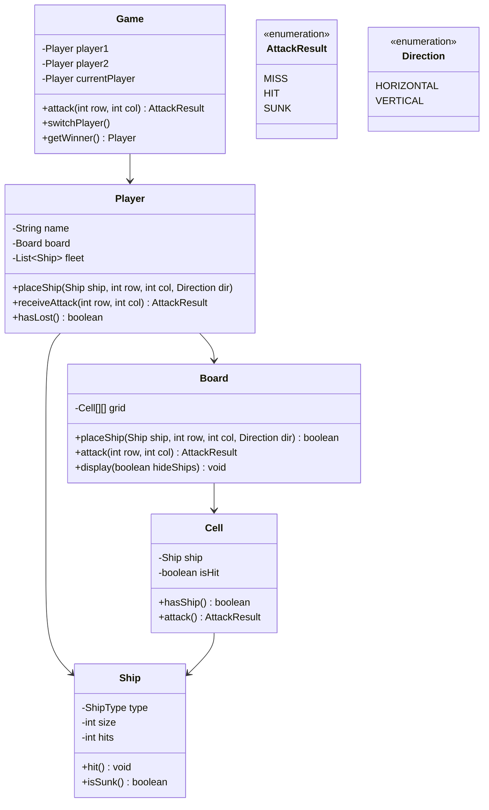

# Battleship - Low Level Design

## Problem Statement

Design a Battleship game where two players place ships on hidden grids and take turns guessing coordinates to sink opponent's fleet. The game involves ship placement, hit/miss tracking, and win detection.

---

## Requirements

### Functional Requirements
1. Initialize 10x10 grids for each player
2. Place ships (Carrier-5, Battleship-4, Cruiser-3, Submarine-3, Destroyer-2)
3. Validate ship placement (within bounds, no overlap, horizontal/vertical)
4. Attack opponent's grid
5. Track hits, misses, and sunk ships
6. Detect winner (all ships sunk)

---

## Class Diagram



---

## Key Implementation

```java
public enum ShipType {
    CARRIER(5), BATTLESHIP(4), CRUISER(3), SUBMARINE(3), DESTROYER(2);

    private final int size;
    ShipType(int size) { this.size = size; }
    public int getSize() { return size; }
}

public class Ship {
    private final ShipType type;
    private final int size;
    private int hits;

    public Ship(ShipType type) {
        this.type = type;
        this.size = type.getSize();
        this.hits = 0;
    }

    public void hit() {
        if (!isSunk()) hits++;
    }

    public boolean isSunk() {
        return hits >= size;
    }
}

public class Cell {
    private Ship ship;
    private boolean isHit;

    public AttackResult attack() {
        if (isHit) {
            throw new IllegalStateException("Cell already attacked");
        }
        isHit = true;

        if (ship == null) {
            return AttackResult.MISS;
        }

        ship.hit();
        return ship.isSunk() ? AttackResult.SUNK : AttackResult.HIT;
    }

    public void placeShip(Ship ship) {
        if (this.ship != null) {
            throw new IllegalStateException("Cell already occupied");
        }
        this.ship = ship;
    }
}

public class Board {
    private static final int SIZE = 10;
    private final Cell[][] grid;

    public Board() {
        grid = new Cell[SIZE][SIZE];
        for (int i = 0; i < SIZE; i++) {
            for (int j = 0; j < SIZE; j++) {
                grid[i][j] = new Cell();
            }
        }
    }

    public boolean placeShip(Ship ship, int row, int col, Direction dir) {
        int size = ship.getSize();

        // Validate placement
        if (!isValidPlacement(row, col, size, dir)) {
            return false;
        }

        // Place ship on cells
        for (int i = 0; i < size; i++) {
            int r = row + (dir == Direction.VERTICAL ? i : 0);
            int c = col + (dir == Direction.HORIZONTAL ? i : 0);
            grid[r][c].placeShip(ship);
        }

        return true;
    }

    private boolean isValidPlacement(int row, int col, int size, Direction dir) {
        for (int i = 0; i < size; i++) {
            int r = row + (dir == Direction.VERTICAL ? i : 0);
            int c = col + (dir == Direction.HORIZONTAL ? i : 0);

            if (r >= SIZE || c >= SIZE) return false;
            if (grid[r][c].hasShip()) return false;
        }
        return true;
    }

    public AttackResult attack(int row, int col) {
        if (row < 0 || row >= SIZE || col < 0 || col >= SIZE) {
            throw new IllegalArgumentException("Invalid coordinates");
        }
        return grid[row][col].attack();
    }

    public void display(boolean hideShips) {
        System.out.println("   0 1 2 3 4 5 6 7 8 9");
        for (int i = 0; i < SIZE; i++) {
            System.out.print(i + " |");
            for (int j = 0; j < SIZE; j++) {
                Cell cell = grid[i][j];
                if (cell.isHit()) {
                    System.out.print(cell.hasShip() ? "X " : "O ");
                } else {
                    System.out.print((!hideShips && cell.hasShip()) ? "S " : ". ");
                }
            }
            System.out.println("|");
        }
    }
}
```

---

## Design Decisions

### 1. **Cell-Based Ship Storage**
**Decision**: Each cell stores reference to ship (multiple cells → same ship)
**Reasoning**:
- Natural representation
- Easy hit detection
- Automatic sinking check when all cells hit

### 2. **Hidden Grid Display**
**Decision**: `display(boolean hideShips)` parameter
**Reasoning**:
- Same method for own and opponent's board
- Own board shows ships
- Opponent's board hides ships (only hits/misses shown)

### 3. **Attack Result Enum**
**Decision**: Return MISS, HIT, or SUNK
**Reasoning**:
- Provides feedback for each attack
- Caller knows if ship was sunk without additional checks
- Clean API design

---

## Summary

Battleship LLD demonstrates:
- **Hidden Information**: Two-player game with concealed state
- **Coordinate-Based Gameplay**: Grid attacks and tracking
- **Ship Lifecycle**: Placement → Hit → Sunk
- **Validation**: Placement rules and attack constraints
