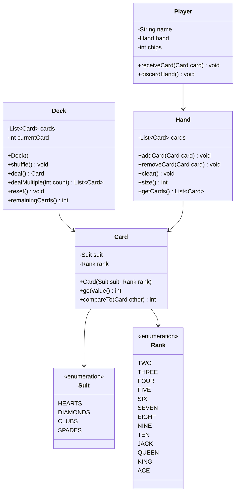

# Card Game Engine - Low Level Design

## Problem Statement

Design a flexible card game engine that can support multiple card games (Poker, Blackjack, Rummy, etc.) with deck management, card shuffling, dealing, and hand evaluation.

---

## Requirements

### Functional Requirements
1. Create standard 52-card deck
2. Shuffle deck randomly
3. Deal cards to players
4. Support multiple players and hands
5. Evaluate hand rankings (for Poker)
6. Reset and reshuffle deck
7. Track dealt and remaining cards

---

## Class Diagram



---

## Key Implementation

```java
// Suit enumeration
public enum Suit {
    HEARTS("♥"),
    DIAMONDS("♦"),
    CLUBS("♣"),
    SPADES("♠");

    private final String symbol;

    Suit(String symbol) {
        this.symbol = symbol;
    }

    public String getSymbol() {
        return symbol;
    }
}

// Rank enumeration
public enum Rank {
    TWO(2), THREE(3), FOUR(4), FIVE(5), SIX(6), SEVEN(7),
    EIGHT(8), NINE(9), TEN(10), JACK(11), QUEEN(12), KING(13), ACE(14);

    private final int value;

    Rank(int value) {
        this.value = value;
    }

    public int getValue() {
        return value;
    }
}

// Card class
public class Card implements Comparable<Card> {
    private final Suit suit;
    private final Rank rank;

    public Card(Suit suit, Rank rank) {
        this.suit = suit;
        this.rank = rank;
    }

    public Suit getSuit() {
        return suit;
    }

    public Rank getRank() {
        return rank;
    }

    public int getValue() {
        return rank.getValue();
    }

    @Override
    public int compareTo(Card other) {
        return Integer.compare(this.rank.getValue(), other.rank.getValue());
    }

    @Override
    public String toString() {
        return rank + " of " + suit;
    }

    @Override
    public boolean equals(Object obj) {
        if (!(obj instanceof Card)) return false;
        Card other = (Card) obj;
        return suit == other.suit && rank == other.rank;
    }

    @Override
    public int hashCode() {
        return suit.hashCode() * 31 + rank.hashCode();
    }
}

// Deck class
public class Deck {
    private List<Card> cards;
    private int currentCard;  // Index of next card to deal

    public Deck() {
        cards = new ArrayList<>();
        currentCard = 0;
        initializeDeck();
    }

    private void initializeDeck() {
        for (Suit suit : Suit.values()) {
            for (Rank rank : Rank.values()) {
                cards.add(new Card(suit, rank));
            }
        }
    }

    /**
     * Shuffle the deck using Fisher-Yates algorithm
     */
    public void shuffle() {
        Random random = new Random();

        for (int i = cards.size() - 1; i > 0; i--) {
            int j = random.nextInt(i + 1);
            // Swap cards[i] and cards[j]
            Card temp = cards.get(i);
            cards.set(i, cards.get(j));
            cards.set(j, temp);
        }

        currentCard = 0;
    }

    /**
     * Deal one card from the deck
     * @return next card, or null if deck is empty
     */
    public Card deal() {
        if (currentCard >= cards.size()) {
            throw new IllegalStateException("Deck is empty!");
        }
        return cards.get(currentCard++);
    }

    /**
     * Deal multiple cards
     */
    public List<Card> dealMultiple(int count) {
        if (count > remainingCards()) {
            throw new IllegalArgumentException("Not enough cards in deck");
        }

        List<Card> dealtCards = new ArrayList<>();
        for (int i = 0; i < count; i++) {
            dealtCards.add(deal());
        }
        return dealtCards;
    }

    /**
     * Reset deck to initial state
     */
    public void reset() {
        currentCard = 0;
    }

    /**
     * Reset and reshuffle
     */
    public void resetAndShuffle() {
        reset();
        shuffle();
    }

    public int remainingCards() {
        return cards.size() - currentCard;
    }

    public int size() {
        return cards.size();
    }
}

// Hand class
public class Hand {
    private final List<Card> cards;

    public Hand() {
        this.cards = new ArrayList<>();
    }

    public void addCard(Card card) {
        if (card == null) {
            throw new IllegalArgumentException("Card cannot be null");
        }
        cards.add(card);
    }

    public void addCards(List<Card> newCards) {
        cards.addAll(newCards);
    }

    public void removeCard(Card card) {
        cards.remove(card);
    }

    public void clear() {
        cards.clear();
    }

    public int size() {
        return cards.size();
    }

    public List<Card> getCards() {
        return new ArrayList<>(cards);  // Return copy for safety
    }

    public void sort() {
        Collections.sort(cards);
    }

    @Override
    public String toString() {
        return cards.toString();
    }
}

// Player class
public class Player {
    private final String name;
    private final Hand hand;
    private int chips;

    public Player(String name, int initialChips) {
        this.name = name;
        this.hand = new Hand();
        this.chips = initialChips;
    }

    public void receiveCard(Card card) {
        hand.addCard(card);
    }

    public void receiveCards(List<Card> cards) {
        hand.addCards(cards);
    }

    public void discardHand() {
        hand.clear();
    }

    public Hand getHand() {
        return hand;
    }

    public String getName() {
        return name;
    }

    public int getChips() {
        return chips;
    }

    public void addChips(int amount) {
        chips += amount;
    }

    public boolean removeChips(int amount) {
        if (chips < amount) {
            return false;
        }
        chips -= amount;
        return true;
    }

    @Override
    public String toString() {
        return name + " (Chips: " + chips + ")";
    }
}

// Hand Evaluator for Poker (example)
public class PokerHandEvaluator {
    public enum HandRank {
        HIGH_CARD(1),
        PAIR(2),
        TWO_PAIR(3),
        THREE_OF_KIND(4),
        STRAIGHT(5),
        FLUSH(6),
        FULL_HOUSE(7),
        FOUR_OF_KIND(8),
        STRAIGHT_FLUSH(9),
        ROYAL_FLUSH(10);

        private final int value;
        HandRank(int value) { this.value = value; }
        public int getValue() { return value; }
    }

    public static HandRank evaluateHand(Hand hand) {
        List<Card> cards = hand.getCards();
        if (cards.size() != 5) {
            throw new IllegalArgumentException("Poker hand must have 5 cards");
        }

        Collections.sort(cards);

        boolean isFlush = isFlush(cards);
        boolean isStraight = isStraight(cards);

        if (isFlush && isStraight) {
            if (cards.get(0).getRank() == Rank.TEN) {
                return HandRank.ROYAL_FLUSH;
            }
            return HandRank.STRAIGHT_FLUSH;
        }

        Map<Rank, Integer> rankCount = getRankCounts(cards);

        if (hasFourOfKind(rankCount)) return HandRank.FOUR_OF_KIND;
        if (hasFullHouse(rankCount)) return HandRank.FULL_HOUSE;
        if (isFlush) return HandRank.FLUSH;
        if (isStraight) return HandRank.STRAIGHT;
        if (hasThreeOfKind(rankCount)) return HandRank.THREE_OF_KIND;
        if (hasTwoPair(rankCount)) return HandRank.TWO_PAIR;
        if (hasPair(rankCount)) return HandRank.PAIR;

        return HandRank.HIGH_CARD;
    }

    private static boolean isFlush(List<Card> cards) {
        Suit firstSuit = cards.get(0).getSuit();
        return cards.stream().allMatch(card -> card.getSuit() == firstSuit);
    }

    private static boolean isStraight(List<Card> cards) {
        for (int i = 0; i < cards.size() - 1; i++) {
            if (cards.get(i + 1).getValue() != cards.get(i).getValue() + 1) {
                return false;
            }
        }
        return true;
    }

    private static Map<Rank, Integer> getRankCounts(List<Card> cards) {
        Map<Rank, Integer> counts = new HashMap<>();
        for (Card card : cards) {
            counts.put(card.getRank(), counts.getOrDefault(card.getRank(), 0) + 1);
        }
        return counts;
    }

    private static boolean hasFourOfKind(Map<Rank, Integer> counts) {
        return counts.containsValue(4);
    }

    private static boolean hasFullHouse(Map<Rank, Integer> counts) {
        return counts.containsValue(3) && counts.containsValue(2);
    }

    private static boolean hasThreeOfKind(Map<Rank, Integer> counts) {
        return counts.containsValue(3);
    }

    private static boolean hasTwoPair(Map<Rank, Integer> counts) {
        return counts.values().stream().filter(count -> count == 2).count() == 2;
    }

    private static boolean hasPair(Map<Rank, Integer> counts) {
        return counts.containsValue(2);
    }
}
```

---

## Design Decisions

### 1. **Fisher-Yates Shuffle**
**Decision**: Use Fisher-Yates algorithm for shuffling
**Reasoning**:
- O(n) time complexity
- Unbiased random shuffle
- Industry standard algorithm

### 2. **Current Card Index**
**Decision**: Track dealt cards with index instead of removing from list
**Reasoning**:
- O(1) deal operation
- Easy reset (just reset index)
- Preserves original deck order for debugging

### 3. **Immutable Card**
**Decision**: Make Card immutable with final fields
**Reasoning**:
- Cards don't change during game
- Thread-safe
- Can be safely shared

### 4. **Hand as Separate Class**
**Decision**: Separate Hand class instead of List in Player
**Reasoning**:
- Encapsulates hand logic
- Can add hand-specific methods (sort, evaluate)
- Reusable across different games

---

## Sample Usage

```java
public class CardGameDemo {
    public static void main(String[] args) {
        // Create and shuffle deck
        Deck deck = new Deck();
        deck.shuffle();

        // Create players
        Player alice = new Player("Alice", 1000);
        Player bob = new Player("Bob", 1000);

        // Deal 5 cards to each player
        alice.receiveCards(deck.dealMultiple(5));
        bob.receiveCards(deck.dealMultiple(5));

        // Evaluate hands
        PokerHandEvaluator.HandRank aliceRank =
            PokerHandEvaluator.evaluateHand(alice.getHand());
        PokerHandEvaluator.HandRank bobRank =
            PokerHandEvaluator.evaluateHand(bob.getHand());

        System.out.println("Alice: " + alice.getHand() + " -> " + aliceRank);
        System.out.println("Bob: " + bob.getHand() + " -> " + bobRank);

        // Determine winner
        if (aliceRank.getValue() > bobRank.getValue()) {
            System.out.println("Alice wins!");
        } else if (bobRank.getValue() > aliceRank.getValue()) {
            System.out.println("Bob wins!");
        } else {
            System.out.println("Tie!");
        }
    }
}
```

---

## Summary

Card Game Engine demonstrates:
- **Reusable Components**: Deck, Card, Hand work for any card game
- **Template Method Pattern**: Base classes extendable for specific games
- **Efficient Algorithms**: Fisher-Yates shuffle, O(1) dealing
- **Type Safety**: Enums for Suit and Rank
- **Hand Evaluation**: Poker example showcases ranking logic
