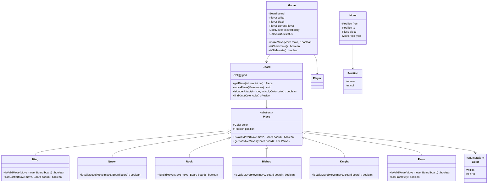

# Chess - Low Level Design

## Problem Statement

Design a Chess game supporting two players, piece movement validation, special moves (castling, en passant, pawn promotion), check/checkmate detection, and move history.

---

## Requirements

### Functional Requirements
1. Initialize 8x8 board with pieces in starting positions
2. Validate piece-specific movement rules
3. Detect and prevent illegal moves (leaving king in check)
4. Handle special moves: castling, en passant, pawn promotion
5. Detect check, checkmate, and stalemate
6. Track move history
7. Support player turns

---

## Class Diagram



---

## Key Implementation

```java
// Position class
public class Position {
    private final int row;
    private final int col;

    public Position(int row, int col) {
        this.row = row;
        this.col = col;
    }

    public boolean isValid() {
        return row >= 0 && row < 8 && col >= 0 && col < 8;
    }

    public int getRow() { return row; }
    public int getCol() { return col; }

    @Override
    public boolean equals(Object obj) {
        if (!(obj instanceof Position)) return false;
        Position other = (Position) obj;
        return row == other.row && col == other.col;
    }
}

// Abstract Piece class
public abstract class Piece {
    protected final Color color;
    protected Position position;
    protected boolean hasMoved;

    public Piece(Color color, Position position) {
        this.color = color;
        this.position = position;
        this.hasMoved = false;
    }

    public abstract boolean isValidMove(Move move, Board board);

    public abstract List<Move> getPossibleMoves(Board board);

    protected boolean isPathClear(Position from, Position to, Board board) {
        int rowDiff = to.getRow() - from.getRow();
        int colDiff = to.getCol() - from.getCol();

        int rowStep = Integer.compare(rowDiff, 0);
        int colStep = Integer.compare(colDiff, 0);

        int row = from.getRow() + rowStep;
        int col = from.getCol() + colStep;

        while (row != to.getRow() || col != to.getCol()) {
            if (board.getPiece(row, col) != null) {
                return false;
            }
            row += rowStep;
            col += colStep;
        }

        return true;
    }

    public Color getColor() { return color; }
    public Position getPosition() { return position; }
    public void setPosition(Position position) {
        this.position = position;
        this.hasMoved = true;
    }
    public boolean hasMoved() { return hasMoved; }
}

// King implementation
public class King extends Piece {
    public King(Color color, Position position) {
        super(color, position);
    }

    @Override
    public boolean isValidMove(Move move, Board board) {
        Position from = move.getFrom();
        Position to = move.getTo();

        int rowDiff = Math.abs(to.getRow() - from.getRow());
        int colDiff = Math.abs(to.getCol() - from.getCol());

        // Normal king move (one square in any direction)
        if (rowDiff <= 1 && colDiff <= 1) {
            Piece targetPiece = board.getPiece(to.getRow(), to.getCol());
            return targetPiece == null || targetPiece.getColor() != this.color;
        }

        // Castling (horizontal move of 2 squares)
        if (rowDiff == 0 && colDiff == 2 && !hasMoved) {
            return canCastle(move, board);
        }

        return false;
    }

    private boolean canCastle(Move move, Board board) {
        // King must not be in check
        if (board.isUnderAttack(position.getRow(), position.getCol(), color)) {
            return false;
        }

        Position to = move.getTo();
        int direction = to.getCol() > position.getCol() ? 1 : -1;
        int rookCol = direction == 1 ? 7 : 0;

        // Check rook exists and hasn't moved
        Piece rook = board.getPiece(position.getRow(), rookCol);
        if (!(rook instanceof Rook) || rook.hasMoved()) {
            return false;
        }

        // Path must be clear and not under attack
        for (int col = position.getCol() + direction;
             col != rookCol; col += direction) {
            if (board.getPiece(position.getRow(), col) != null) {
                return false;
            }
            if (board.isUnderAttack(position.getRow(), col, color)) {
                return false;
            }
        }

        return true;
    }

    @Override
    public List<Move> getPossibleMoves(Board board) {
        List<Move> moves = new ArrayList<>();
        int[] directions = {-1, 0, 1};

        for (int dRow : directions) {
            for (int dCol : directions) {
                if (dRow == 0 && dCol == 0) continue;

                Position to = new Position(position.getRow() + dRow,
                                         position.getCol() + dCol);
                if (to.isValid()) {
                    Move move = new Move(position, to, this);
                    if (isValidMove(move, board)) {
                        moves.add(move);
                    }
                }
            }
        }

        return moves;
    }
}

// Rook implementation
public class Rook extends Piece {
    public Rook(Color color, Position position) {
        super(color, position);
    }

    @Override
    public boolean isValidMove(Move move, Board board) {
        Position from = move.getFrom();
        Position to = move.getTo();

        // Must move in straight line (same row OR same column)
        if (from.getRow() != to.getRow() && from.getCol() != to.getCol()) {
            return false;
        }

        // Path must be clear
        if (!isPathClear(from, to, board)) {
            return false;
        }

        // Destination must be empty or have opponent piece
        Piece targetPiece = board.getPiece(to.getRow(), to.getCol());
        return targetPiece == null || targetPiece.getColor() != this.color;
    }

    @Override
    public List<Move> getPossibleMoves(Board board) {
        // Implementation: iterate through all horizontal and vertical positions
        // Similar to King's implementation but extended to full board
        return new ArrayList<>();
    }
}

// Bishop implementation
public class Bishop extends Piece {
    public Bishop(Color color, Position position) {
        super(color, position);
    }

    @Override
    public boolean isValidMove(Move move, Board board) {
        Position from = move.getFrom();
        Position to = move.getTo();

        int rowDiff = Math.abs(to.getRow() - from.getRow());
        int colDiff = Math.abs(to.getCol() - from.getCol());

        // Must move diagonally (equal row and column difference)
        if (rowDiff != colDiff) {
            return false;
        }

        if (!isPathClear(from, to, board)) {
            return false;
        }

        Piece targetPiece = board.getPiece(to.getRow(), to.getCol());
        return targetPiece == null || targetPiece.getColor() != this.color;
    }

    @Override
    public List<Move> getPossibleMoves(Board board) {
        return new ArrayList<>();
    }
}

// Knight implementation
public class Knight extends Piece {
    public Knight(Color color, Position position) {
        super(color, position);
    }

    @Override
    public boolean isValidMove(Move move, Board board) {
        Position from = move.getFrom();
        Position to = move.getTo();

        int rowDiff = Math.abs(to.getRow() - from.getRow());
        int colDiff = Math.abs(to.getCol() - from.getCol());

        // Knight moves in L-shape: (2,1) or (1,2)
        boolean isLShape = (rowDiff == 2 && colDiff == 1) ||
                          (rowDiff == 1 && colDiff == 2);

        if (!isLShape) {
            return false;
        }

        Piece targetPiece = board.getPiece(to.getRow(), to.getCol());
        return targetPiece == null || targetPiece.getColor() != this.color;
    }

    @Override
    public List<Move> getPossibleMoves(Board board) {
        List<Move> moves = new ArrayList<>();
        int[][] knightMoves = {{2,1},{2,-1},{-2,1},{-2,-1},
                              {1,2},{1,-2},{-1,2},{-1,-2}};

        for (int[] km : knightMoves) {
            Position to = new Position(position.getRow() + km[0],
                                     position.getCol() + km[1]);
            if (to.isValid()) {
                Move move = new Move(position, to, this);
                if (isValidMove(move, board)) {
                    moves.add(move);
                }
            }
        }

        return moves;
    }
}

// Pawn implementation
public class Pawn extends Piece {
    public Pawn(Color color, Position position) {
        super(color, position);
    }

    @Override
    public boolean isValidMove(Move move, Board board) {
        Position from = move.getFrom();
        Position to = move.getTo();

        int direction = color == Color.WHITE ? -1 : 1; // White moves up, black down
        int rowDiff = (to.getRow() - from.getRow()) * direction;
        int colDiff = Math.abs(to.getCol() - from.getCol());

        // Forward move
        if (colDiff == 0) {
            if (rowDiff == 1 && board.getPiece(to.getRow(), to.getCol()) == null) {
                return true;
            }
            // Initial two-square move
            if (rowDiff == 2 && !hasMoved &&
                board.getPiece(to.getRow(), to.getCol()) == null &&
                board.getPiece(from.getRow() + direction, from.getCol()) == null) {
                return true;
            }
        }

        // Diagonal capture
        if (colDiff == 1 && rowDiff == 1) {
            Piece targetPiece = board.getPiece(to.getRow(), to.getCol());
            return targetPiece != null && targetPiece.getColor() != this.color;
        }

        return false;
    }

    public boolean canPromote() {
        return (color == Color.WHITE && position.getRow() == 0) ||
               (color == Color.BLACK && position.getRow() == 7);
    }

    @Override
    public List<Move> getPossibleMoves(Board board) {
        return new ArrayList<>();
    }
}

// Queen (combines Rook + Bishop movement)
public class Queen extends Piece {
    public Queen(Color color, Position position) {
        super(color, position);
    }

    @Override
    public boolean isValidMove(Move move, Board board) {
        Position from = move.getFrom();
        Position to = move.getTo();

        int rowDiff = Math.abs(to.getRow() - from.getRow());
        int colDiff = Math.abs(to.getCol() - from.getCol());

        // Straight line (Rook-like) or diagonal (Bishop-like)
        boolean isStraight = (from.getRow() == to.getRow()) ||
                            (from.getCol() == to.getCol());
        boolean isDiagonal = (rowDiff == colDiff);

        if (!isStraight && !isDiagonal) {
            return false;
        }

        if (!isPathClear(from, to, board)) {
            return false;
        }

        Piece targetPiece = board.getPiece(to.getRow(), to.getCol());
        return targetPiece == null || targetPiece.getColor() != this.color;
    }

    @Override
    public List<Move> getPossibleMoves(Board board) {
        return new ArrayList<>();
    }
}
```

---

## Board Class

```java
public class Board {
    private final Cell[][] grid;
    private static final int SIZE = 8;

    public Board() {
        grid = new Cell[SIZE][SIZE];
        initializeBoard();
        setupPieces();
    }

    private void initializeBoard() {
        for (int i = 0; i < SIZE; i++) {
            for (int j = 0; j < SIZE; j++) {
                grid[i][j] = new Cell(new Position(i, j));
            }
        }
    }

    private void setupPieces() {
        // Setup pawns
        for (int col = 0; col < SIZE; col++) {
            setPiece(1, col, new Pawn(Color.BLACK, new Position(1, col)));
            setPiece(6, col, new Pawn(Color.WHITE, new Position(6, col)));
        }

        // Setup other pieces
        setupBackRow(0, Color.BLACK);
        setupBackRow(7, Color.WHITE);
    }

    private void setupBackRow(int row, Color color) {
        setPiece(row, 0, new Rook(color, new Position(row, 0)));
        setPiece(row, 1, new Knight(color, new Position(row, 1)));
        setPiece(row, 2, new Bishop(color, new Position(row, 2)));
        setPiece(row, 3, new Queen(color, new Position(row, 3)));
        setPiece(row, 4, new King(color, new Position(row, 4)));
        setPiece(row, 5, new Bishop(color, new Position(row, 5)));
        setPiece(row, 6, new Knight(color, new Position(row, 6)));
        setPiece(row, 7, new Rook(color, new Position(row, 7)));
    }

    public Piece getPiece(int row, int col) {
        if (row < 0 || row >= SIZE || col < 0 || col >= SIZE) {
            return null;
        }
        return grid[row][col].getPiece();
    }

    public void setPiece(int row, int col, Piece piece) {
        grid[row][col].setPiece(piece);
    }

    public void movePiece(Move move) {
        Position from = move.getFrom();
        Position to = move.getTo();

        Piece piece = getPiece(from.getRow(), from.getCol());
        setPiece(from.getRow(), from.getCol(), null);
        setPiece(to.getRow(), to.getCol(), piece);

        piece.setPosition(to);
    }

    /**
     * Check if position is under attack by opponent
     */
    public boolean isUnderAttack(int row, int col, Color defendingColor) {
        Color attackingColor = (defendingColor == Color.WHITE) ?
                               Color.BLACK : Color.WHITE;

        for (int r = 0; r < SIZE; r++) {
            for (int c = 0; c < SIZE; c++) {
                Piece piece = getPiece(r, c);
                if (piece != null && piece.getColor() == attackingColor) {
                    Move attackMove = new Move(piece.getPosition(),
                                              new Position(row, col), piece);
                    if (piece.isValidMove(attackMove, this)) {
                        return true;
                    }
                }
            }
        }

        return false;
    }

    public Position findKing(Color color) {
        for (int r = 0; r < SIZE; r++) {
            for (int c = 0; c < SIZE; c++) {
                Piece piece = getPiece(r, c);
                if (piece instanceof King && piece.getColor() == color) {
                    return new Position(r, c);
                }
            }
        }
        return null;
    }
}
```

---

## Design Decisions

### 1. **Abstract Piece Hierarchy**
**Decision**: Abstract Piece class with concrete subclasses for each piece type
**Reasoning**:
- Polymorphic move validation
- Each piece encapsulates its movement logic
- Easy to extend with new piece types

### 2. **Position Value Object**
**Decision**: Immutable Position class
**Reasoning**:
- Type-safe coordinates
- Encapsulates validation
- Prevents accidental modifications

### 3. **Path Clearing in Base Class**
**Decision**: `isPathClear()` in abstract Piece class
**Reasoning**:
- Common logic for Rook, Bishop, Queen
- Reusable across multiple pieces
- Avoids code duplication

### 4. **Check Detection via Simulation**
**Decision**: `isUnderAttack()` checks all opponent pieces
**Reasoning**:
- Accurate check detection
- Reusable for castling validation
- Handles complex attack patterns

---

## Summary

Chess LLD demonstrates:
- **Polymorphism**: Abstract piece hierarchy
- **Strategy Pattern**: Each piece has unique movement strategy
- **Complex Validation**: Check, checkmate, special moves
- **State Management**: Board state, move history, piece positions
