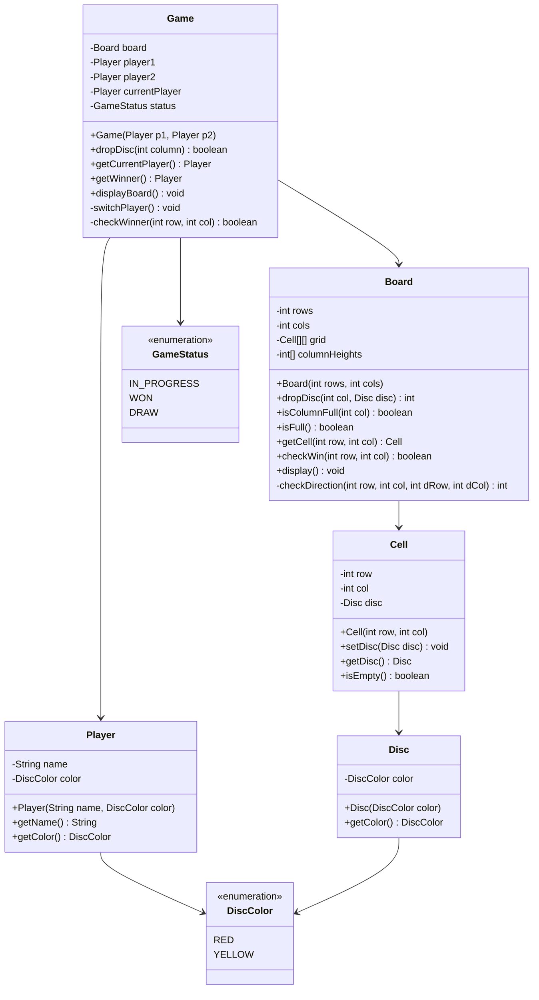

# Connect Four - Low Level Design

## Problem Statement

Design a Connect Four game where two players take turns dropping colored discs into a 7-column, 6-row vertically suspended grid. The objective is to be the first to form a horizontal, vertical, or diagonal line of four of one's own discs.

### Real-World Context
Connect Four is a two-player connection game with simple rules but complex strategy. This LLD focuses on gravity-based movement, win detection in multiple directions, and turn-based gameplay.

---

## Requirements

### Functional Requirements
1. **Initialize Game**: Create 6x7 grid with two players
2. **Drop Disc**: Player drops disc in a column (gravity pulls it down)
3. **Validate Move**: Ensure column is not full
4. **Detect Win**: Check horizontal, vertical, and diagonal connections of 4
5. **Detect Draw**: Board is full with no winner
6. **Display Board**: Show current state with colored discs
7. **Turn Management**: Alternate between players

### Non-Functional Requirements
1. **Performance**: O(1) move insertion, O(n) win detection
2. **Extensibility**: Support different board sizes and win lengths
3. **Maintainability**: Clear separation between board logic and game rules
4. **Visual Clarity**: Easy to understand board state

### Out of Scope
- AI opponent
- Network multiplayer
- Undo/Redo
- Timed moves
- Tournament mode

---

## Core Entities & Relationships

### Main Entities
1. **Game** - Orchestrates game flow
2. **Board** - Manages grid and gravity logic
3. **Player** - Represents each player with disc color
4. **Cell** - Single position on board
5. **Disc** - Represents player's piece

### Relationships
- Game HAS-ONE Board
- Game HAS-TWO Players
- Board HAS-MANY Cells (6x7=42)
- Cell HAS-ONE Disc (nullable)

---

## Class Diagram



---

## Design Patterns Used

### 1. **Strategy Pattern** (Extension)
**Why**: Different win-checking strategies (Connect 3, Connect 5, etc.)
**How**: `WinChecker` interface with different implementations
**Benefit**: Easy to change winning conditions

### 2. **Factory Pattern**
**Why**: Create different game modes (Classic, Custom sizes)
**How**: `GameFactory` creates games with different configurations
**Benefit**: Simplifies game creation

### 3. **Observer Pattern** (Extension)
**Why**: Notify UI or statistics when moves are made
**How**: `GameObserver` interface for move notifications
**Benefit**: Decouples game logic from display

---

## Detailed Class Design (Java)

### Enums

```java
/**
 * Disc colors for players
 */
public enum DiscColor {
    RED('R'),
    YELLOW('Y');

    private final char symbol;

    DiscColor(char symbol) {
        this.symbol = symbol;
    }

    public char getSymbol() {
        return symbol;
    }
}

/**
 * Game status enumeration
 */
public enum GameStatus {
    IN_PROGRESS,
    WON,
    DRAW
}
```

### Disc Class

```java
/**
 * Represents a game disc with color
 */
public class Disc {
    private final DiscColor color;

    public Disc(DiscColor color) {
        if (color == null) {
            throw new IllegalArgumentException("Disc color cannot be null");
        }
        this.color = color;
    }

    public DiscColor getColor() {
        return color;
    }

    @Override
    public String toString() {
        return String.valueOf(color.getSymbol());
    }

    @Override
    public boolean equals(Object obj) {
        if (this == obj) return true;
        if (obj == null || getClass() != obj.getClass()) return false;
        Disc disc = (Disc) obj;
        return color == disc.color;
    }

    @Override
    public int hashCode() {
        return color.hashCode();
    }
}
```

### Player Class

```java
/**
 * Represents a player with name and disc color
 */
public class Player {
    private final String name;
    private final DiscColor color;

    public Player(String name, DiscColor color) {
        if (name == null || name.trim().isEmpty()) {
            throw new IllegalArgumentException("Player name cannot be empty");
        }
        if (color == null) {
            throw new IllegalArgumentException("Disc color cannot be null");
        }
        this.name = name;
        this.color = color;
    }

    public String getName() {
        return name;
    }

    public DiscColor getColor() {
        return color;
    }

    public Disc createDisc() {
        return new Disc(color);
    }

    @Override
    public String toString() {
        return name + " (" + color + ")";
    }
}
```

### Cell Class

```java
/**
 * Represents a single cell in the grid
 */
public class Cell {
    private final int row;
    private final int col;
    private Disc disc;

    public Cell(int row, int col) {
        this.row = row;
        this.col = col;
        this.disc = null;
    }

    public boolean isEmpty() {
        return disc == null;
    }

    public void setDisc(Disc disc) {
        if (this.disc != null) {
            throw new IllegalStateException("Cell already occupied");
        }
        this.disc = disc;
    }

    public Disc getDisc() {
        return disc;
    }

    public int getRow() {
        return row;
    }

    public int getCol() {
        return col;
    }

    @Override
    public String toString() {
        return isEmpty() ? "." : disc.toString();
    }
}
```

### Board Class

```java
/**
 * Represents the Connect Four board with gravity-based disc placement
 */
public class Board {
    private final int rows;
    private final int cols;
    private final Cell[][] grid;
    private final int[] columnHeights;  // Track top position in each column
    private static final int WIN_LENGTH = 4;

    public Board(int rows, int cols) {
        if (rows < 4 || cols < 4) {
            throw new IllegalArgumentException("Board must be at least 4x4");
        }
        this.rows = rows;
        this.cols = cols;
        this.grid = new Cell[rows][cols];
        this.columnHeights = new int[cols];
        initializeBoard();
    }

    private void initializeBoard() {
        for (int i = 0; i < rows; i++) {
            for (int j = 0; j < cols; j++) {
                grid[i][j] = new Cell(i, j);
            }
        }
        // All columns start empty (height at bottom row)
        Arrays.fill(columnHeights, rows - 1);
    }

    /**
     * Drop disc in column using gravity
     * @return row where disc landed, or -1 if column full
     */
    public int dropDisc(int col, Disc disc) {
        if (!isValidColumn(col)) {
            throw new IllegalArgumentException("Invalid column: " + col);
        }

        if (isColumnFull(col)) {
            return -1;
        }

        int row = columnHeights[col];
        grid[row][col].setDisc(disc);
        columnHeights[col]--;  // Next disc will go one row higher

        return row;
    }

    public boolean isValidColumn(int col) {
        return col >= 0 && col < cols;
    }

    public boolean isColumnFull(int col) {
        return columnHeights[col] < 0;
    }

    public boolean isFull() {
        for (int col = 0; col < cols; col++) {
            if (!isColumnFull(col)) {
                return false;
            }
        }
        return true;
    }

    /**
     * Check if disc at [row, col] creates a winning line
     * Checks all 4 directions: horizontal, vertical, diagonal, anti-diagonal
     */
    public boolean checkWin(int row, int col) {
        Disc disc = grid[row][col].getDisc();
        if (disc == null) {
            return false;
        }

        // Check all 4 directions
        return checkDirection(row, col, 0, 1) >= WIN_LENGTH ||  // Horizontal
               checkDirection(row, col, 1, 0) >= WIN_LENGTH ||  // Vertical
               checkDirection(row, col, 1, 1) >= WIN_LENGTH ||  // Diagonal \
               checkDirection(row, col, 1, -1) >= WIN_LENGTH;   // Anti-diagonal /
    }

    /**
     * Count consecutive discs in both directions
     * @param dRow row direction (-1, 0, or 1)
     * @param dCol col direction (-1, 0, or 1)
     * @return total count including center disc
     */
    private int checkDirection(int row, int col, int dRow, int dCol) {
        Disc disc = grid[row][col].getDisc();
        int count = 1;  // Count the center disc

        // Check positive direction
        count += countConsecutive(row, col, dRow, dCol, disc);

        // Check negative direction
        count += countConsecutive(row, col, -dRow, -dCol, disc);

        return count;
    }

    /**
     * Count consecutive discs in one direction
     */
    private int countConsecutive(int row, int col, int dRow, int dCol, Disc disc) {
        int count = 0;
        int r = row + dRow;
        int c = col + dCol;

        while (isValidPosition(r, c) && !grid[r][c].isEmpty() &&
               grid[r][c].getDisc().equals(disc)) {
            count++;
            r += dRow;
            c += dCol;
        }

        return count;
    }

    private boolean isValidPosition(int row, int col) {
        return row >= 0 && row < rows && col >= 0 && col < cols;
    }

    public Cell getCell(int row, int col) {
        if (!isValidPosition(row, col)) {
            throw new IllegalArgumentException("Invalid position: [" + row + "][" + col + "]");
        }
        return grid[row][col];
    }

    public void display() {
        System.out.println("\n  0 1 2 3 4 5 6");
        System.out.println("  -------------");

        for (int i = 0; i < rows; i++) {
            System.out.print(i + "|");
            for (int j = 0; j < cols; j++) {
                System.out.print(grid[i][j] + " ");
            }
            System.out.println("|");
        }
        System.out.println("  -------------\n");
    }

    public int getRows() {
        return rows;
    }

    public int getCols() {
        return cols;
    }
}
```

### Game Class

```java
/**
 * Main game controller for Connect Four
 */
public class Game {
    private final Board board;
    private final Player player1;
    private final Player player2;
    private Player currentPlayer;
    private GameStatus status;
    private Player winner;

    public Game(Player player1, Player player2) {
        this(player1, player2, 6, 7);  // Standard board
    }

    public Game(Player player1, Player player2, int rows, int cols) {
        if (player1 == null || player2 == null) {
            throw new IllegalArgumentException("Players cannot be null");
        }
        if (player1.getColor() == player2.getColor()) {
            throw new IllegalArgumentException("Players must have different colors");
        }

        this.board = new Board(rows, cols);
        this.player1 = player1;
        this.player2 = player2;
        this.currentPlayer = player1;
        this.status = GameStatus.IN_PROGRESS;
        this.winner = null;
    }

    /**
     * Drop disc in specified column
     * @return true if move successful, false otherwise
     */
    public boolean dropDisc(int column) {
        if (status != GameStatus.IN_PROGRESS) {
            System.out.println("Game is over!");
            return false;
        }

        if (!board.isValidColumn(column)) {
            System.out.println("Invalid column: " + column);
            return false;
        }

        if (board.isColumnFull(column)) {
            System.out.println("Column " + column + " is full!");
            return false;
        }

        // Drop the disc
        Disc disc = currentPlayer.createDisc();
        int row = board.dropDisc(column, disc);

        if (row == -1) {
            System.out.println("Failed to drop disc");
            return false;
        }

        System.out.println(currentPlayer.getName() + " dropped disc at column " + column);

        // Check for win
        if (board.checkWin(row, column)) {
            status = GameStatus.WON;
            winner = currentPlayer;
            return true;
        }

        // Check for draw
        if (board.isFull()) {
            status = GameStatus.DRAW;
            return true;
        }

        // Switch player
        switchPlayer();
        return true;
    }

    private void switchPlayer() {
        currentPlayer = (currentPlayer == player1) ? player2 : player1;
    }

    public Player getCurrentPlayer() {
        return currentPlayer;
    }

    public GameStatus getStatus() {
        return status;
    }

    public Player getWinner() {
        return winner;
    }

    public void displayBoard() {
        board.display();
    }

    public void displayStatus() {
        switch (status) {
            case IN_PROGRESS:
                System.out.println("Current player: " + currentPlayer);
                break;
            case WON:
                System.out.println("\n*** " + winner.getName() + " WINS! ***\n");
                break;
            case DRAW:
                System.out.println("\n*** GAME DRAW! ***\n");
                break;
        }
    }
}
```

---

## Design Decisions & Reasoning

### 1. **Column Height Tracking**
**Decision**: Maintain array of column heights for O(1) disc placement
**Reasoning**:
- Gravity-based placement requires finding lowest empty cell
- Without tracking: O(rows) search per move
- With tracking: O(1) insertion
**Trade-off**: Extra O(cols) space for significant time savings

### 2. **Bi-directional Win Checking**
**Decision**: Check both directions from placed disc
**Reasoning**:
- Only the last placed disc can create a new win
- Check 4 directions: horizontal, vertical, 2 diagonals
- Count consecutive discs in both positive and negative directions
**Alternative**: Check entire board after each move
**Why Not**: O(rows * cols) vs O(max(rows, cols))

### 3. **Immutable Disc Color**
**Decision**: Disc color is final and immutable
**Reasoning**:
- Discs don't change color during game
- Thread-safe
- Simplifies equality checks

### 4. **Separate Cell and Disc**
**Decision**: Cell contains optional Disc rather than storing color directly
**Reasoning**:
- Clear distinction between position and piece
- Null pattern for empty cells
- Can add properties to Disc if needed (special powers, etc.)

---

## Complexity Analysis

### Time Complexity

| Operation | Complexity | Explanation |
|-----------|-----------|-------------|
| Initialize Board | O(rows × cols) | Create all cells |
| Drop Disc | O(1) | Direct placement using column heights |
| Check Win | O(max(rows, cols)) | Check 4 directions bi-directionally |
| Check Draw | O(cols) | Check column full flags |

### Space Complexity
- **Board**: O(rows × cols)
- **Column Heights**: O(cols)
- **Total**: O(rows × cols)

---

## Sample Usage

```java
public class ConnectFourDemo {
    public static void main(String[] args) {
        Player alice = new Player("Alice", DiscColor.RED);
        Player bob = new Player("Bob", DiscColor.YELLOW);

        Game game = new Game(alice, bob);
        Scanner scanner = new Scanner(System.in);

        while (game.getStatus() == GameStatus.IN_PROGRESS) {
            game.displayBoard();
            System.out.println(game.getCurrentPlayer() + "'s turn");
            System.out.print("Enter column (0-6): ");

            int col = scanner.nextInt();
            game.dropDisc(col);
        }

        game.displayBoard();
        game.displayStatus();
        scanner.close();
    }
}
```

---

## Summary

This Connect Four design showcases:
- **Gravity Simulation**: Efficient column-based disc placement
- **Optimized Win Detection**: O(n) instead of O(n²)
- **Clean Architecture**: Clear separation of game, board, and entities
- **SOLID Principles**: Each class has single responsibility
- **Extensibility**: Easy to modify board size and win conditions
