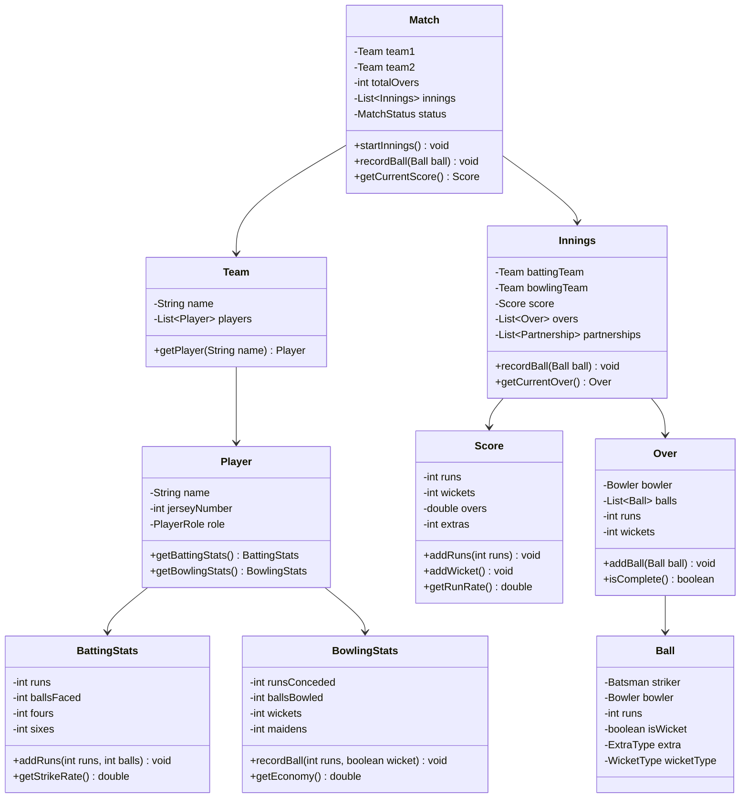

# Cricket Scoreboard System - Low Level Design

## Problem Statement

Design a cricket scoreboard system that tracks runs, wickets, overs, player statistics, partnerships, and match progression in real-time.

---

## Requirements

### Functional Requirements
1. Track runs scored (runs, extras, total)
2. Track wickets fallen
3. Track overs bowled (balls, maidens)
4. Player statistics (batsman, bowler)
5. Current partnership
6. Match status (innings, result)
7. Ball-by-ball commentary
8. Run rate calculations

---

## Class Diagram



---

## Key Implementation

```java
public class Ball {
    private final Batsman striker;
    private final Bowler bowler;
    private final int runs;          // Runs scored off this ball
    private final boolean isWicket;
    private final ExtraType extra;   // WIDE, NO_BALL, BYE, LEG_BYE, null
    private final WicketType wicketType;  // BOWLED, CAUGHT, LBW, etc.

    public Ball(Batsman striker, Bowler bowler, int runs,
                ExtraType extra, boolean isWicket, WicketType wicketType) {
        this.striker = striker;
        this.bowler = bowler;
        this.runs = runs;
        this.extra = extra;
        this.isWicket = isWicket;
        this.wicketType = wicketType;
    }

    public boolean isLegalDelivery() {
        return extra != ExtraType.WIDE && extra != ExtraType.NO_BALL;
    }

    public int getTotalRuns() {
        int total = runs;
        if (extra == ExtraType.WIDE || extra == ExtraType.NO_BALL) {
            total += 1;  // Extra run for wide/no-ball
        }
        return total;
    }
}

public enum ExtraType {
    WIDE,
    NO_BALL,
    BYE,
    LEG_BYE
}

public enum WicketType {
    BOWLED,
    CAUGHT,
    LBW,
    RUN_OUT,
    STUMPED,
    HIT_WICKET
}

public class Score {
    private int runs;
    private int wickets;
    private int balls;
    private int extras;

    public void addRuns(int runsScored) {
        runs += runsScored;
    }

    public void addExtras(int extraRuns) {
        extras += extraRuns;
        runs += extraRuns;
    }

    public void addWicket() {
        wickets++;
    }

    public void addBall() {
        balls++;
    }

    public double getOvers() {
        int completedOvers = balls / 6;
        int remainingBalls = balls % 6;
        return completedOvers + (remainingBalls / 10.0);
    }

    public double getRunRate() {
        if (balls == 0) return 0.0;
        return (runs * 6.0) / balls;
    }

    public String getScoreString() {
        return runs + "/" + wickets + " (" + getOvers() + " overs)";
    }
}

public class Over {
    private final Bowler bowler;
    private final List<Ball> balls;
    private int runs;
    private int wickets;
    private static final int BALLS_PER_OVER = 6;

    public Over(Bowler bowler) {
        this.bowler = bowler;
        this.balls = new ArrayList<>();
        this.runs = 0;
        this.wickets = 0;
    }

    public void addBall(Ball ball) {
        balls.add(ball);
        runs += ball.getTotalRuns();

        if (ball.isWicket()) {
            wickets++;
        }
    }

    public boolean isComplete() {
        // Count only legal deliveries
        long legalBalls = balls.stream()
            .filter(Ball::isLegalDelivery)
            .count();
        return legalBalls >= BALLS_PER_OVER;
    }

    public boolean isMaiden() {
        return isComplete() && runs == 0 && wickets == 0;
    }

    public int getRuns() {
        return runs;
    }

    public int getWickets() {
        return wickets;
    }

    public List<Ball> getBalls() {
        return Collections.unmodifiableList(balls);
    }
}

public class BattingStats {
    private int runs;
    private int ballsFaced;
    private int fours;
    private int sixes;
    private boolean isOut;

    public void recordBall(int runsScored) {
        ballsFaced++;
        runs += runsScored;

        if (runsScored == 4) fours++;
        if (runsScored == 6) sixes++;
    }

    public void recordOut() {
        isOut = true;
    }

    public double getStrikeRate() {
        if (ballsFaced == 0) return 0.0;
        return (runs * 100.0) / ballsFaced;
    }

    @Override
    public String toString() {
        String status = isOut ? "" : "*";
        return runs + status + " (" + ballsFaced + ") [4s: " + fours + ", 6s: " + sixes + "]";
    }
}

public class BowlingStats {
    private int runsConceded;
    private int ballsBowled;
    private int wickets;
    private int maidens;

    public void recordBall(int runs, boolean wicket) {
        ballsBowled++;
        runsConceded += runs;
        if (wicket) wickets++;
    }

    public void recordMaiden() {
        maidens++;
    }

    public double getOvers() {
        int completedOvers = ballsBowled / 6;
        int remainingBalls = ballsBowled % 6;
        return completedOvers + (remainingBalls / 10.0);
    }

    public double getEconomy() {
        if (ballsBowled == 0) return 0.0;
        return (runsConceded * 6.0) / ballsBowled;
    }

    @Override
    public String toString() {
        return getOvers() + " overs, " + runsConceded + " runs, " +
               wickets + " wickets, " + maidens + " maidens (Econ: " +
               String.format("%.2f", getEconomy()) + ")";
    }
}

public class Innings {
    private final Team battingTeam;
    private final Team bowlingTeam;
    private final Score score;
    private final List<Over> overs;
    private Batsman striker;
    private Batsman nonStriker;
    private Bowler currentBowler;

    public Innings(Team battingTeam, Team bowlingTeam) {
        this.battingTeam = battingTeam;
        this.bowlingTeam = bowlingTeam;
        this.score = new Score();
        this.overs = new ArrayList<>();
    }

    public void recordBall(Ball ball) {
        // Update score
        score.addRuns(ball.getTotalRuns());
        score.addBall();

        if (ball.isWicket()) {
            score.addWicket();
            striker.getBattingStats().recordOut();
            // Next batsman comes in
            striker = getNextBatsman();
        }

        // Update player stats
        striker.getBattingStats().recordBall(ball.getRuns());
        currentBowler.getBowlingStats().recordBall(ball.getTotalRuns(), ball.isWicket());

        // Add ball to current over
        Over currentOver = getCurrentOver();
        currentOver.addBall(ball);

        // Check if over is complete
        if (currentOver.isComplete()) {
            if (currentOver.isMaiden()) {
                currentBowler.getBowlingStats().recordMaiden();
            }
            // Swap strike
            swapStrike();
            // Start new over with new bowler
            overs.add(new Over(getNextBowler()));
        }

        // Swap strike on odd runs
        if (ball.getRuns() % 2 == 1) {
            swapStrike();
        }
    }

    private void swapStrike() {
        Batsman temp = striker;
        striker = nonStriker;
        nonStriker = temp;
    }

    private Over getCurrentOver() {
        if (overs.isEmpty() || overs.get(overs.size() - 1).isComplete()) {
            overs.add(new Over(currentBowler));
        }
        return overs.get(overs.size() - 1);
    }

    private Batsman getNextBatsman() {
        // Logic to get next batsman from team
        return null;  // Simplified
    }

    private Bowler getNextBowler() {
        // Logic to rotate bowlers
        return null;  // Simplified
    }

    public Score getScore() {
        return score;
    }
}

public class Match {
    private final Team team1;
    private final Team team2;
    private final int totalOvers;
    private final List<Innings> innings;
    private MatchStatus status;

    public Match(Team team1, Team team2, int totalOvers) {
        this.team1 = team1;
        this.team2 = team2;
        this.totalOvers = totalOvers;
        this.innings = new ArrayList<>();
        this.status = MatchStatus.NOT_STARTED;
    }

    public void startFirstInnings() {
        Innings firstInnings = new Innings(team1, team2);
        innings.add(firstInnings);
        status = MatchStatus.FIRST_INNINGS;
    }

    public void startSecondInnings() {
        Innings secondInnings = new Innings(team2, team1);
        innings.add(secondInnings);
        status = MatchStatus.SECOND_INNINGS;
    }

    public Innings getCurrentInnings() {
        return innings.get(innings.size() - 1);
    }

    public void displayScoreboard() {
        Innings current = getCurrentInnings();
        System.out.println("\n=== SCOREBOARD ===");
        System.out.println("Score: " + current.getScore().getScoreString());
        System.out.println("Run Rate: " + String.format("%.2f",
                           current.getScore().getRunRate()));
        // Display batsmen, bowler, etc.
    }
}

public enum MatchStatus {
    NOT_STARTED,
    FIRST_INNINGS,
    INNINGS_BREAK,
    SECOND_INNINGS,
    COMPLETED
}
```

---

## Design Decisions

### 1. **Ball as Atomic Unit**
**Decision**: Ball class captures all information about single delivery
**Reasoning**:
- Immutable record of what happened
- Easy to store for ball-by-ball history
- Simplifies statistics calculation

### 2. **Overs Track Legal Deliveries**
**Decision**: Over completion based on legal deliveries only
**Reasoning**:
- Wides and no-balls don't count toward over
- Matches real cricket rules
- Over can have more than 6 total balls

### 3. **Statistics Embedded in Player**
**Decision**: BattingStats and BowlingStats as part of Player
**Reasoning**:
- Natural association
- Easy to query player performance
- Encapsulates stat calculations

### 4. **Run Rate Calculation**
**Decision**: Calculate on-the-fly from balls and runs
**Reasoning**:
- Always accurate
- No need to maintain separate counter
- Simple formula: (runs × 6) / balls

---

## Summary

Cricket Scoreboard demonstrates:
- **Event-Driven Design**: Ball-by-ball recording
- **Statistics Tracking**: Real-time calculations
- **Complex Rules**: Extras, strike rotation, overs
- **Hierarchical Structure**: Match → Innings → Over → Ball
- **Performance Metrics**: Strike rate, economy, run rate
