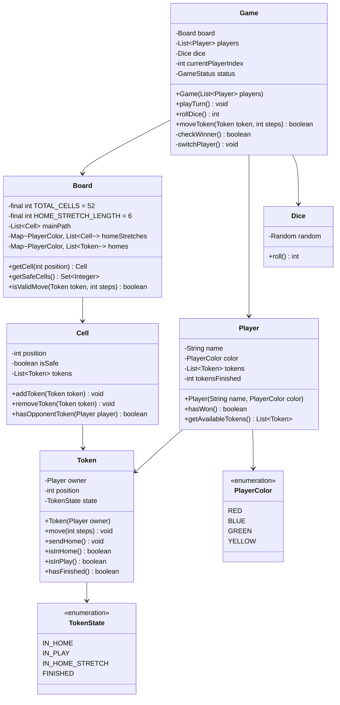

# Ludo - Low Level Design

## Problem Statement

Design a Ludo board game supporting 2-4 players, dice rolling, token movement, safe spots, capturing, and winning conditions. Players race their tokens from home to the finish following game rules.

### Real-World Context
Ludo is a strategy board game for 2-4 players where tokens race around the board. This LLD focuses on turn management, position tracking, game rules, and state transitions.

---

## Requirements

### Functional Requirements
1. **Initialize Game**: Setup board with 2-4 players
2. **Roll Dice**: Generate random number (1-6)
3. **Move Token**: Move player's token based on dice roll
4. **Enter Board**: Require 6 to bring token out of home
5. **Safe Spots**: Tokens can't be captured on safe spots
6. **Capture**: Send opponent's token back to home
7. **Home Stretch**: Final colored path to finish
8. **Detect Winner**: First to get all 4 tokens to finish wins
9. **Extra Turn**: Rolling 6 grants extra turn

### Non-Functional Requirements
1. **Fairness**: Random dice, equal opportunities
2. **Rule Enforcement**: Strict adherence to Ludo rules
3. **Extensibility**: Support variations (different board sizes)
4. **State Consistency**: Track all tokens accurately

### Out of Scope
- Network multiplayer
- AI opponents
- Animations and graphics
- Custom rules (stacking, etc.)

---

## Core Entities & Relationships

### Main Entities
1. **Game** - Game controller
2. **Board** - Track positions and paths
3. **Player** - Has 4 tokens and color
4. **Token** - Game piece with position
5. **Dice** - Random number generator
6. **Cell** - Board position

---

## Class Diagram



---

## Detailed Class Design (Java)

### Enums

```java
public enum PlayerColor {
    RED(0),
    BLUE(13),
    GREEN(26),
    YELLOW(39);

    private final int startPosition;  // Starting position on main path

    PlayerColor(int startPosition) {
        this.startPosition = startPosition;
    }

    public int getStartPosition() {
        return startPosition;
    }
}

public enum TokenState {
    IN_HOME,           // Not yet entered the board
    IN_PLAY,           // On main path
    IN_HOME_STRETCH,   // In colored final path
    FINISHED           // Reached the end
}

public enum GameStatus {
    IN_PROGRESS,
    COMPLETED
}
```

### Token Class

```java
/**
 * Represents a single token/piece in Ludo
 */
public class Token {
    private final Player owner;
    private int position;           // Position on main path
    private TokenState state;
    private int homeStretchPosition; // Position in home stretch (0-5)

    public Token(Player owner) {
        this.owner = owner;
        this.position = -1;  // -1 means in home
        this.state = TokenState.IN_HOME;
        this.homeStretchPosition = -1;
    }

    public void enterBoard(int startPosition) {
        if (state != TokenState.IN_HOME) {
            throw new IllegalStateException("Token already on board");
        }
        this.position = startPosition;
        this.state = TokenState.IN_PLAY;
    }

    public void move(int steps) {
        position = (position + steps) % 52;  // 52 cells in main path
    }

    public void enterHomeStretch() {
        this.state = TokenState.IN_HOME_STRETCH;
        this.homeStretchPosition = 0;
    }

    public void moveInHomeStretch(int steps) {
        homeStretchPosition += steps;
        if (homeStretchPosition >= 6) {
            this.state = TokenState.FINISHED;
            homeStretchPosition = 6;
        }
    }

    public void sendHome() {
        this.state = TokenState.IN_HOME;
        this.position = -1;
        this.homeStretchPosition = -1;
    }

    public boolean isInHome() {
        return state == TokenState.IN_HOME;
    }

    public boolean isInPlay() {
        return state == TokenState.IN_PLAY;
    }

    public boolean isInHomeStretch() {
        return state == TokenState.IN_HOME_STRETCH;
    }

    public boolean hasFinished() {
        return state == TokenState.FINISHED;
    }

    public Player getOwner() {
        return owner;
    }

    public int getPosition() {
        return position;
    }

    public TokenState getState() {
        return state;
    }

    public int getHomeStretchPosition() {
        return homeStretchPosition;
    }

    @Override
    public String toString() {
        return owner.getColor() + "_Token(State: " + state + ", Pos: " + position + ")";
    }
}
```

### Player Class

```java
import java.util.*;

/**
 * Represents a player in Ludo with 4 tokens
 */
public class Player {
    private final String name;
    private final PlayerColor color;
    private final List<Token> tokens;
    private int tokensFinished;
    private static final int TOKENS_PER_PLAYER = 4;

    public Player(String name, PlayerColor color) {
        this.name = name;
        this.color = color;
        this.tokens = new ArrayList<>();
        this.tokensFinished = 0;

        for (int i = 0; i < TOKENS_PER_PLAYER; i++) {
            tokens.add(new Token(this));
        }
    }

    public List<Token> getAvailableTokens(int diceValue) {
        List<Token> available = new ArrayList<>();

        for (Token token : tokens) {
            if (token.isInHome() && diceValue == 6) {
                available.add(token);
            } else if (token.isInPlay() || token.isInHomeStretch()) {
                available.add(token);
            }
        }

        return available;
    }

    public void finishToken() {
        tokensFinished++;
    }

    public boolean hasWon() {
        return tokensFinished == TOKENS_PER_PLAYER;
    }

    public String getName() {
        return name;
    }

    public PlayerColor getColor() {
        return color;
    }

    public List<Token> getTokens() {
        return Collections.unmodifiableList(tokens);
    }

    @Override
    public String toString() {
        return name + " (" + color + ")";
    }
}
```

### Cell Class

```java
import java.util.*;

/**
 * Represents a cell on the board
 */
public class Cell {
    private final int position;
    private final boolean isSafe;
    private final List<Token> tokens;

    public Cell(int position, boolean isSafe) {
        this.position = position;
        this.isSafe = isSafe;
        this.tokens = new ArrayList<>();
    }

    public void addToken(Token token) {
        tokens.add(token);
    }

    public void removeToken(Token token) {
        tokens.remove(token);
    }

    public boolean hasOpponentToken(Player player) {
        for (Token token : tokens) {
            if (token.getOwner() != player) {
                return true;
            }
        }
        return false;
    }

    public Token getOpponentToken(Player player) {
        for (Token token : tokens) {
            if (token.getOwner() != player) {
                return token;
            }
        }
        return null;
    }

    public boolean isSafe() {
        return isSafe;
    }

    public int getPosition() {
        return position;
    }

    public boolean isEmpty() {
        return tokens.isEmpty();
    }
}
```

### Dice Class

```java
import java.util.Random;

/**
 * Six-sided dice for Ludo
 */
public class Dice {
    private final Random random;

    public Dice() {
        this.random = new Random();
    }

    public int roll() {
        return random.nextInt(6) + 1;  // 1-6
    }
}
```

### Board Class

```java
import java.util.*;

/**
 * Ludo board with main path, safe spots, and home stretches
 */
public class Board {
    private static final int TOTAL_CELLS = 52;
    private static final int HOME_STRETCH_LENGTH = 6;
    private static final Set<Integer> SAFE_POSITIONS = Set.of(0, 8, 13, 21, 26, 34, 39, 47);

    private final List<Cell> mainPath;
    private final Map<PlayerColor, Integer> homeStretchEntry;

    public Board() {
        this.mainPath = new ArrayList<>();
        this.homeStretchEntry = new HashMap<>();

        initializeMainPath();
        initializeHomeStretches();
    }

    private void initializeMainPath() {
        for (int i = 0; i < TOTAL_CELLS; i++) {
            boolean isSafe = SAFE_POSITIONS.contains(i);
            mainPath.add(new Cell(i, isSafe));
        }
    }

    private void initializeHomeStretches() {
        homeStretchEntry.put(PlayerColor.RED, 50);
        homeStretchEntry.put(PlayerColor.BLUE, 11);
        homeStretchEntry.put(PlayerColor.GREEN, 24);
        homeStretchEntry.put(PlayerColor.YELLOW, 37);
    }

    public Cell getCell(int position) {
        if (position < 0 || position >= TOTAL_CELLS) {
            throw new IllegalArgumentException("Invalid position: " + position);
        }
        return mainPath.get(position);
    }

    public boolean isHomeStretchEntry(PlayerColor color, int position) {
        return homeStretchEntry.get(color) == position;
    }

    /**
     * Check if token can move specified steps
     */
    public boolean canMove(Token token, int steps) {
        if (token.hasFinished()) {
            return false;
        }

        if (token.isInHome()) {
            return steps == 6;
        }

        if (token.isInHomeStretch()) {
            return token.getHomeStretchPosition() + steps <= HOME_STRETCH_LENGTH;
        }

        return true;  // Tokens in play can always move
    }

    /**
     * Handle capturing logic
     */
    public void handleCapture(Token token) {
        if (token.isInPlay()) {
            Cell cell = getCell(token.getPosition());

            if (!cell.isSafe() && cell.hasOpponentToken(token.getOwner())) {
                Token opponent = cell.getOpponentToken(token.getOwner());
                opponent.sendHome();
                cell.removeToken(opponent);
                System.out.println("  Captured " + opponent + "!");
            }

            cell.addToken(token);
        }
    }

    public int getTotalCells() {
        return TOTAL_CELLS;
    }
}
```

### Game Class

```java
import java.util.*;

/**
 * Main Ludo game controller
 */
public class Game {
    private final Board board;
    private final List<Player> players;
    private final Dice dice;
    private int currentPlayerIndex;
    private GameStatus status;

    public Game(List<Player> players) {
        if (players.size() < 2 || players.size() > 4) {
            throw new IllegalArgumentException("Ludo requires 2-4 players");
        }

        this.board = new Board();
        this.players = new ArrayList<>(players);
        this.dice = new Dice();
        this.currentPlayerIndex = 0;
        this.status = GameStatus.IN_PROGRESS;
    }

    /**
     * Play one turn for current player
     */
    public void playTurn(Scanner scanner) {
        Player currentPlayer = players.get(currentPlayerIndex);
        System.out.println("\n" + currentPlayer + "'s turn");

        int diceValue = dice.roll();
        System.out.println("  Rolled: " + diceValue);

        List<Token> availableTokens = currentPlayer.getAvailableTokens(diceValue);

        if (availableTokens.isEmpty()) {
            System.out.println("  No valid moves!");
            if (diceValue != 6) {
                switchPlayer();
            }
            return;
        }

        // Choose token to move
        System.out.println("  Available tokens:");
        for (int i = 0; i < availableTokens.size(); i++) {
            System.out.println("    " + i + ": " + availableTokens.get(i));
        }

        System.out.print("  Select token (0-" + (availableTokens.size() - 1) + "): ");
        int choice = scanner.nextInt();

        if (choice < 0 || choice >= availableTokens.size()) {
            System.out.println("  Invalid choice!");
            return;
        }

        Token selectedToken = availableTokens.get(choice);
        moveToken(selectedToken, diceValue);

        // Check winner
        if (currentPlayer.hasWon()) {
            status = GameStatus.COMPLETED;
            System.out.println("\n*** " + currentPlayer + " WINS! ***");
            return;
        }

        // Extra turn for rolling 6
        if (diceValue != 6) {
            switchPlayer();
        } else {
            System.out.println("  Rolled 6! Extra turn!");
        }
    }

    private void moveToken(Token token, int steps) {
        if (token.isInHome()) {
            // Enter board (only with 6)
            int startPos = token.getOwner().getColor().getStartPosition();
            token.enterBoard(startPos);
            System.out.println("  Token entered board at position " + startPos);
            board.handleCapture(token);

        } else if (token.isInHomeStretch()) {
            // Move in home stretch
            token.moveInHomeStretch(steps);
            System.out.println("  Moved in home stretch to position " + token.getHomeStretchPosition());

            if (token.hasFinished()) {
                token.getOwner().finishToken();
                System.out.println("  Token finished!");
            }

        } else {
            // Move on main path
            int newPosition = (token.getPosition() + steps) % board.getTotalCells();

            // Check if entering home stretch
            PlayerColor color = token.getOwner().getColor();
            int homeEntry = (color.getStartPosition() + 50) % board.getTotalCells();

            if (willEnterHomeStretch(token, steps, homeEntry)) {
                token.enterHomeStretch();
                int remaining = steps - (homeEntry - token.getPosition());
                token.moveInHomeStretch(remaining);
                System.out.println("  Entered home stretch!");
            } else {
                Cell oldCell = board.getCell(token.getPosition());
                oldCell.removeToken(token);

                token.move(steps);
                System.out.println("  Moved to position " + token.getPosition());

                board.handleCapture(token);
            }
        }
    }

    private boolean willEnterHomeStretch(Token token, int steps, int homeEntry) {
        int current = token.getPosition();
        int destination = (current + steps) % board.getTotalCells();

        // Check if path crosses home stretch entry
        if (current < homeEntry && destination >= homeEntry) {
            return true;
        }

        return false;
    }

    private void switchPlayer() {
        currentPlayerIndex = (currentPlayerIndex + 1) % players.size();
    }

    public GameStatus getStatus() {
        return status;
    }
}
```

---

## Design Decisions & Reasoning

### 1. **Token State Machine**
**Decision**: Use enum to track token state (IN_HOME, IN_PLAY, IN_HOME_STRETCH, FINISHED)
**Reasoning**:
- Clear state transitions
- Easy validation of legal moves
- Prevents invalid operations

### 2. **Circular Path with Modulo**
**Decision**: Use modulo arithmetic for main path (52 cells)
**Reasoning**:
- Elegant wraparound logic
- Simplifies position calculations
- No special cases for board edges

### 3. **Safe Spot Set**
**Decision**: Predefined Set of safe positions
**Reasoning**:
- O(1) lookup for safety checks
- Immutable configuration
- Clear and maintainable

### 4. **Extra Turn for Six**
**Decision**: Don't switch player when 6 is rolled
**Reasoning**:
- Traditional Ludo rule
- Balanced gameplay
- Implemented by conditional switchPlayer()

---

## Summary

This Ludo design demonstrates:
- **State Management**: Token states and transitions
- **Turn-Based Flow**: Player switching with extra turns
- **Rule Enforcement**: Captures, safe spots, home stretch
- **Clear Structure**: Separation of board, tokens, and game logic
