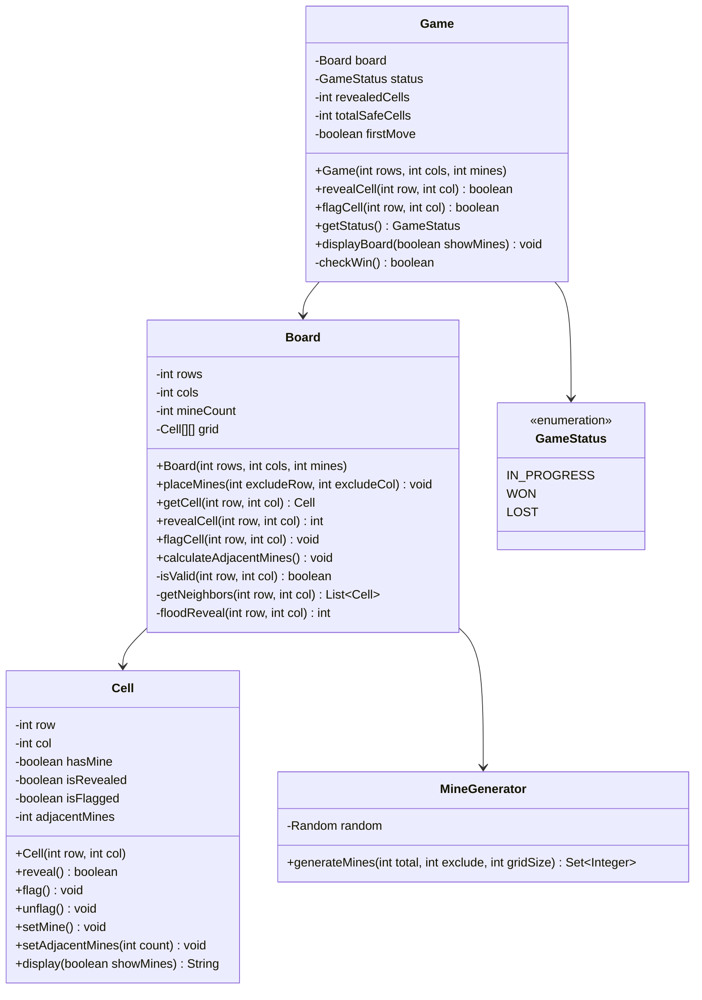

# Minesweeper - Low Level Design

## Problem Statement

Design a Minesweeper game where players reveal cells on a grid, avoiding hidden mines. When a cell without adjacent mines is revealed, neighboring cells are automatically revealed. The game is won when all non-mine cells are revealed.

### Real-World Context
Minesweeper is a logic puzzle game that tests deduction skills and pattern recognition. This LLD focuses on recursive cell revelation, mine placement, and neighbor counting algorithms.

---

## Requirements

### Functional Requirements
1. **Initialize Game**: Create grid with specified dimensions and mine count
2. **Place Mines**: Randomly place mines ensuring first click is safe
3. **Reveal Cell**: Uncover cell and auto-reveal neighbors if count is zero
4. **Flag Cell**: Mark suspected mine locations
5. **Calculate Adjacent Mines**: Show count of neighboring mines
6. **Detect Win**: All non-mine cells revealed
7. **Detect Loss**: Mine cell revealed
8. **Display Board**: Show revealed, flagged, and hidden cells

### Non-Functional Requirements
1. **Performance**: Efficient flood-fill algorithm for auto-reveal
2. **Fairness**: First click never hits a mine
3. **Configurability**: Variable board size and mine density
4. **User Safety**: Prevent revealing flagged cells accidentally

### Out of Scope
- Timer and scoring
- Difficulty levels (handled via configuration)
- Hints or solver
- Multiplayer mode

---

## Core Entities & Relationships

### Main Entities
1. **Game** - Game controller
2. **Board** - Grid with cells and mines
3. **Cell** - Single position with mine/revealed/flagged state
4. **MineGenerator** - Random mine placement logic

### Relationships
- Game HAS-ONE Board
- Board HAS-MANY Cells
- Cell knows neighbor count

---

## Class Diagram



---

## Detailed Class Design (Java)

### GameStatus Enum

```java
public enum GameStatus {
    IN_PROGRESS,
    WON,
    LOST
}
```

### Cell Class

```java
/**
 * Represents a single cell in the Minesweeper grid
 */
public class Cell {
    private final int row;
    private final int col;
    private boolean hasMine;
    private boolean isRevealed;
    private boolean isFlagged;
    private int adjacentMines;

    public Cell(int row, int col) {
        this.row = row;
        this.col = col;
        this.hasMine = false;
        this.isRevealed = false;
        this.isFlagged = false;
        this.adjacentMines = 0;
    }

    /**
     * Reveal this cell
     * @return true if safe, false if mine
     */
    public boolean reveal() {
        if (isRevealed || isFlagged) {
            return true;  // Already revealed or protected
        }
        isRevealed = true;
        return !hasMine;
    }

    public void flag() {
        if (!isRevealed) {
            isFlagged = true;
        }
    }

    public void unflag() {
        isFlagged = false;
    }

    public void setMine() {
        this.hasMine = true;
    }

    public void setAdjacentMines(int count) {
        this.adjacentMines = count;
    }

    public boolean hasMine() {
        return hasMine;
    }

    public boolean isRevealed() {
        return isRevealed;
    }

    public boolean isFlagged() {
        return isFlagged;
    }

    public int getAdjacentMines() {
        return adjacentMines;
    }

    public int getRow() {
        return row;
    }

    public int getCol() {
        return col;
    }

    /**
     * Display cell state
     * @param showMines true to reveal mine locations (for game over)
     */
    public String display(boolean showMines) {
        if (isFlagged) {
            return "F";
        }
        if (!isRevealed && !showMines) {
            return ".";
        }
        if (hasMine) {
            return "*";
        }
        if (adjacentMines == 0) {
            return " ";
        }
        return String.valueOf(adjacentMines);
    }
}
```

### MineGenerator Class

```java
import java.util.*;

/**
 * Handles random mine placement
 */
public class MineGenerator {
    private final Random random;

    public MineGenerator() {
        this.random = new Random();
    }

    /**
     * Generate random mine positions excluding first click
     * @param totalMines number of mines to place
     * @param excludeIndex cell index to exclude (first click)
     * @param gridSize total grid size
     * @return set of mine indices
     */
    public Set<Integer> generateMines(int totalMines, int excludeIndex, int gridSize) {
        if (totalMines >= gridSize) {
            throw new IllegalArgumentException("Too many mines for grid size");
        }

        Set<Integer> mineIndices = new HashSet<>();

        while (mineIndices.size() < totalMines) {
            int index = random.nextInt(gridSize);
            if (index != excludeIndex) {
                mineIndices.add(index);
            }
        }

        return mineIndices;
    }
}
```

### Board Class

```java
import java.util.*;

/**
 * Minesweeper board with mine placement and reveal logic
 */
public class Board {
    private final int rows;
    private final int cols;
    private final int mineCount;
    private final Cell[][] grid;
    private boolean minesPlaced;

    // Directions for 8 neighbors (including diagonals)
    private static final int[][] DIRECTIONS = {
        {-1, -1}, {-1, 0}, {-1, 1},
        {0, -1},           {0, 1},
        {1, -1},  {1, 0},  {1, 1}
    };

    public Board(int rows, int cols, int mineCount) {
        if (rows < 2 || cols < 2) {
            throw new IllegalArgumentException("Board must be at least 2x2");
        }
        if (mineCount >= rows * cols) {
            throw new IllegalArgumentException("Too many mines");
        }

        this.rows = rows;
        this.cols = cols;
        this.mineCount = mineCount;
        this.grid = new Cell[rows][cols];
        this.minesPlaced = false;

        initializeGrid();
    }

    private void initializeGrid() {
        for (int i = 0; i < rows; i++) {
            for (int j = 0; j < cols; j++) {
                grid[i][j] = new Cell(i, j);
            }
        }
    }

    /**
     * Place mines after first click to ensure safety
     * @param excludeRow first click row
     * @param excludeCol first click column
     */
    public void placeMines(int excludeRow, int excludeCol) {
        if (minesPlaced) {
            return;
        }

        MineGenerator generator = new MineGenerator();
        int excludeIndex = excludeRow * cols + excludeCol;
        Set<Integer> mineIndices = generator.generateMines(mineCount, excludeIndex, rows * cols);

        for (int index : mineIndices) {
            int row = index / cols;
            int col = index % cols;
            grid[row][col].setMine();
        }

        calculateAdjacentMines();
        minesPlaced = true;
    }

    /**
     * Calculate adjacent mine counts for all cells
     */
    private void calculateAdjacentMines() {
        for (int i = 0; i < rows; i++) {
            for (int j = 0; j < cols; j++) {
                if (!grid[i][j].hasMine()) {
                    int count = countAdjacentMines(i, j);
                    grid[i][j].setAdjacentMines(count);
                }
            }
        }
    }

    private int countAdjacentMines(int row, int col) {
        int count = 0;
        for (int[] dir : DIRECTIONS) {
            int newRow = row + dir[0];
            int newCol = col + dir[1];
            if (isValid(newRow, newCol) && grid[newRow][newCol].hasMine()) {
                count++;
            }
        }
        return count;
    }

    /**
     * Reveal cell and flood reveal if adjacent mines = 0
     * @return number of cells revealed, -1 if mine hit
     */
    public int revealCell(int row, int col) {
        if (!isValid(row, col)) {
            return 0;
        }

        Cell cell = grid[row][col];

        if (cell.isRevealed() || cell.isFlagged()) {
            return 0;
        }

        boolean safe = cell.reveal();

        if (!safe) {
            return -1;  // Mine hit
        }

        int revealed = 1;

        // Flood reveal if no adjacent mines
        if (cell.getAdjacentMines() == 0) {
            revealed += floodReveal(row, col);
        }

        return revealed;
    }

    /**
     * Recursively reveal neighboring cells
     */
    private int floodReveal(int row, int col) {
        int revealed = 0;

        for (int[] dir : DIRECTIONS) {
            int newRow = row + dir[0];
            int newCol = col + dir[1];

            if (isValid(newRow, newCol)) {
                Cell neighbor = grid[newRow][newCol];

                if (!neighbor.isRevealed() && !neighbor.isFlagged()) {
                    neighbor.reveal();
                    revealed++;

                    // Continue flood if neighbor also has no adjacent mines
                    if (neighbor.getAdjacentMines() == 0) {
                        revealed += floodReveal(newRow, newCol);
                    }
                }
            }
        }

        return revealed;
    }

    public void flagCell(int row, int col) {
        if (isValid(row, col)) {
            Cell cell = grid[row][col];
            if (cell.isFlagged()) {
                cell.unflag();
            } else {
                cell.flag();
            }
        }
    }

    private boolean isValid(int row, int col) {
        return row >= 0 && row < rows && col >= 0 && col < cols;
    }

    public Cell getCell(int row, int col) {
        if (!isValid(row, col)) {
            throw new IllegalArgumentException("Invalid position");
        }
        return grid[row][col];
    }

    public void display(boolean showMines) {
        System.out.println("\n   " + getColumnHeaders());
        System.out.println("  +" + "-".repeat(cols * 2 - 1) + "+");

        for (int i = 0; i < rows; i++) {
            System.out.print(String.format("%2d", i) + "|");
            for (int j = 0; j < cols; j++) {
                System.out.print(grid[i][j].display(showMines));
                if (j < cols - 1) System.out.print(" ");
            }
            System.out.println("|");
        }

        System.out.println("  +" + "-".repeat(cols * 2 - 1) + "+\n");
    }

    private String getColumnHeaders() {
        StringBuilder sb = new StringBuilder();
        for (int i = 0; i < cols; i++) {
            sb.append(i % 10);
            if (i < cols - 1) sb.append(" ");
        }
        return sb.toString();
    }

    public int getRows() {
        return rows;
    }

    public int getCols() {
        return cols;
    }

    public int getMineCount() {
        return mineCount;
    }
}
```

### Game Class

```java
/**
 * Main Minesweeper game controller
 */
public class Game {
    private final Board board;
    private GameStatus status;
    private int revealedCells;
    private int totalSafeCells;
    private boolean firstMove;

    public Game(int rows, int cols, int mineCount) {
        this.board = new Board(rows, cols, mineCount);
        this.status = GameStatus.IN_PROGRESS;
        this.revealedCells = 0;
        this.totalSafeCells = rows * cols - mineCount;
        this.firstMove = true;
    }

    /**
     * Reveal cell at specified position
     * @return true if successful, false if invalid
     */
    public boolean revealCell(int row, int col) {
        if (status != GameStatus.IN_PROGRESS) {
            System.out.println("Game is over!");
            return false;
        }

        // Place mines after first click
        if (firstMove) {
            board.placeMines(row, col);
            firstMove = false;
        }

        int result = board.revealCell(row, col);

        if (result == -1) {
            // Mine hit - game over
            status = GameStatus.LOST;
            System.out.println("BOOM! You hit a mine!");
            return true;
        }

        if (result == 0) {
            System.out.println("Cell already revealed or flagged");
            return false;
        }

        revealedCells += result;

        if (checkWin()) {
            status = GameStatus.WON;
            System.out.println("Congratulations! You won!");
        }

        return true;
    }

    /**
     * Toggle flag on cell
     */
    public boolean flagCell(int row, int col) {
        if (status != GameStatus.IN_PROGRESS) {
            return false;
        }

        board.flagCell(row, col);
        return true;
    }

    private boolean checkWin() {
        return revealedCells == totalSafeCells;
    }

    public GameStatus getStatus() {
        return status;
    }

    public void displayBoard(boolean showMines) {
        board.display(showMines);
    }

    public void displayStatus() {
        System.out.println("Status: " + status);
        System.out.println("Revealed: " + revealedCells + "/" + totalSafeCells);
    }
}
```

---

## Design Decisions & Reasoning

### 1. **Lazy Mine Placement**
**Decision**: Place mines after first click, excluding that cell
**Reasoning**:
- Ensures first click never hits a mine (fair gameplay)
- Traditional Minesweeper behavior
- Doesn't affect randomness of mine distribution

### 2. **Flood Fill Algorithm**
**Decision**: Recursive reveal for cells with 0 adjacent mines
**Reasoning**:
- Natural user experience (auto-reveal obvious safe areas)
- DFS-based recursion is elegant and correct
- Stops at numbered cells (adjacentMines > 0)

**Alternative**: Iterative with stack/queue
**Why Current**: Recursion depth limited by board size (safe)

### 3. **8-Directional Neighbors**
**Decision**: Count all 8 surrounding cells (including diagonals)
**Reasoning**:
- Standard Minesweeper rules
- Stored as constant direction array for reusability
- Used for both mine counting and flood reveal

### 4. **Flag Protection**
**Decision**: Cannot reveal flagged cells
**Reasoning**:
- Prevents accidental clicks on suspected mines
- Standard game behavior
- Can unflag if needed

---

## Complexity Analysis

### Time Complexity

| Operation | Complexity | Explanation |
|-----------|-----------|-------------|
| Initialize Board | O(rows × cols) | Create all cells |
| Place Mines | O(mines × log(total)) | Random selection with set |
| Calculate Adjacent | O(rows × cols) | Visit each cell once |
| Reveal Cell | O(rows × cols) worst | Flood fill can touch all cells |
| Flag Cell | O(1) | Direct access |

### Space Complexity
- **Board**: O(rows × cols)
- **Recursion Stack**: O(rows × cols) worst case for flood fill
- **Total**: O(rows × cols)

---

## Sample Usage

```java
public class MinesweeperDemo {
    public static void main(String[] args) {
        Game game = new Game(10, 10, 15);  // 10x10 with 15 mines
        Scanner scanner = new Scanner(System.in);

        while (game.getStatus() == GameStatus.IN_PROGRESS) {
            game.displayBoard(false);
            game.displayStatus();

            System.out.println("Enter (R)eveal or (F)lag: ");
            String action = scanner.next();

            System.out.print("Row: ");
            int row = scanner.nextInt();

            System.out.print("Col: ");
            int col = scanner.nextInt();

            if (action.equalsIgnoreCase("R")) {
                game.revealCell(row, col);
            } else if (action.equalsIgnoreCase("F")) {
                game.flagCell(row, col);
            }
        }

        game.displayBoard(true);  // Show all mines
        game.displayStatus();
        scanner.close();
    }
}
```

---

## Summary

This Minesweeper design demonstrates:
- **Recursive Algorithms**: Elegant flood-fill implementation
- **Fair Randomness**: First-click-safe mine placement
- **State Management**: Cell states (revealed, flagged, mined)
- **Efficient Neighbor Checking**: Direction array pattern
- **User Safety**: Flag protection and validation
