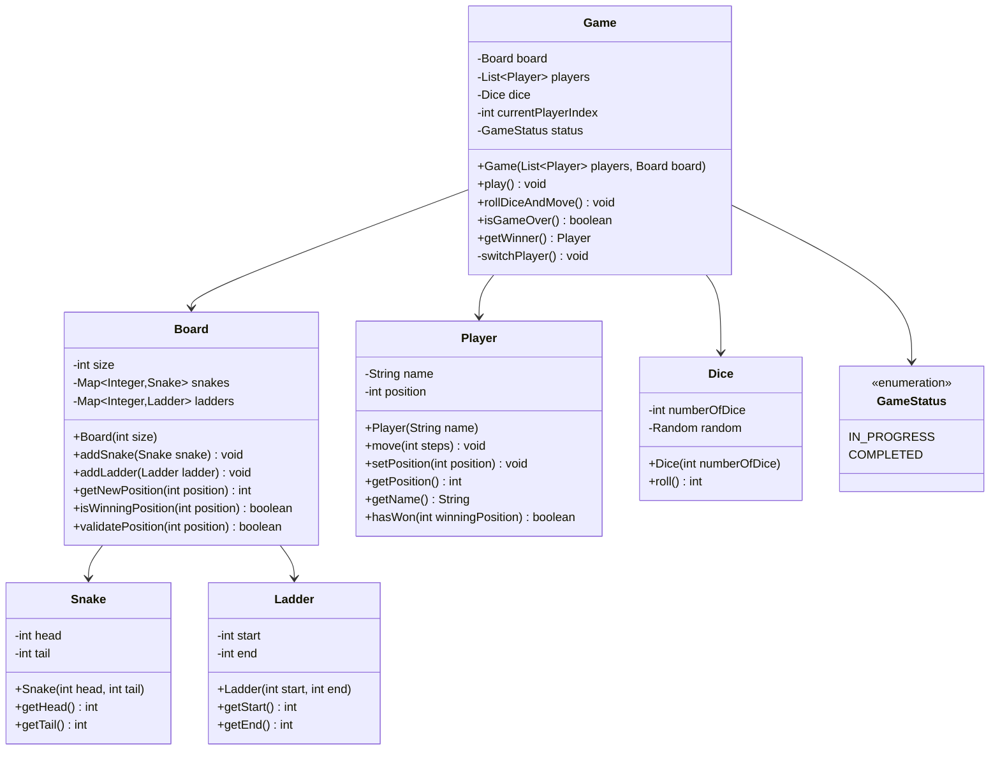
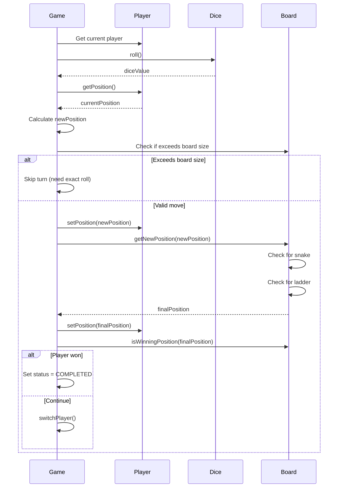

# Snake and Ladder - Low Level Design

## Problem Statement

Design a Snake and Ladder board game that supports multiple players, random dice rolls, snakes and ladders on the board, and automatic player movement based on dice outcomes.

### Real-World Context
Snake and Ladder is a classic board game teaching probability, consequences, and patience. The LLD focuses on modeling game entities, random events, and rule-based movement.

---

## Requirements

### Functional Requirements
1. **Initialize Game**: Create board with configurable snakes and ladders
2. **Roll Dice**: Generate random number (1-6)
3. **Move Player**: Move player based on dice roll
4. **Handle Snakes**: If landing on snake head, move to tail
5. **Handle Ladders**: If landing on ladder bottom, climb to top
6. **Detect Winner**: First player to reach position 100 wins
7. **Multiple Players**: Support 2-4 players with turn management
8. **Display Board**: Show current positions of all players

### Non-Functional Requirements
1. **Extensibility**: Support different board sizes, custom snakes/ladders
2. **Randomness**: Fair dice rolling mechanism
3. **Maintainability**: Clean separation between game logic and entities
4. **Configurability**: Easy to add/remove snakes and ladders

### Out of Scope
- Graphical interface
- Network multiplayer
- Custom dice (always 6-sided)
- Power-ups or special cells
- Save/Load game state

---

## Core Entities & Relationships

### Main Entities
1. **Board** - Contains cells, snakes, and ladders
2. **Player** - Represents each player with current position
3. **Snake** - Has head and tail positions
4. **Ladder** - Has start and end positions
5. **Dice** - Generates random numbers
6. **Game** - Orchestrates game flow

### Relationships
- Board HAS-MANY Snakes
- Board HAS-MANY Ladders
- Game HAS-ONE Board
- Game HAS-MANY Players
- Game HAS-ONE Dice

---

## Class Diagram



---

## Design Patterns Used

### 1. **Factory Pattern** (Extension)
**Why**: To create different types of boards (Classic, Custom, Themed)
**How**: `BoardFactory` can create boards with predefined snake/ladder configurations
**Benefit**: Simplifies board creation with different game modes

### 2. **Strategy Pattern**
**Why**: Different dice rolling strategies (single die, multiple dice, weighted dice)
**How**: `DiceStrategy` interface with implementations
**Benefit**: Easy to change dice behavior without modifying game logic

### 3. **Builder Pattern** (Extension)
**Why**: Complex board construction with many optional configurations
**How**: `BoardBuilder` with fluent API for adding snakes and ladders
**Benefit**: Readable and flexible board creation

---

## Detailed Class Design (Java)

### GameStatus Enum
```java
/**
 * Represents the current status of the game
 */
public enum GameStatus {
    IN_PROGRESS,
    COMPLETED
}
```

### Snake Class
```java
/**
 * Represents a snake on the board with head and tail positions
 */
public class Snake {
    private final int head;
    private final int tail;

    public Snake(int head, int tail) {
        if (head <= tail) {
            throw new IllegalArgumentException(
                "Snake head must be greater than tail. Head: " + head + ", Tail: " + tail
            );
        }
        if (head < 1 || tail < 1) {
            throw new IllegalArgumentException("Snake positions must be positive");
        }
        this.head = head;
        this.tail = tail;
    }

    public int getHead() {
        return head;
    }

    public int getTail() {
        return tail;
    }

    @Override
    public String toString() {
        return "Snake[" + head + " -> " + tail + "]";
    }
}
```

### Ladder Class
```java
/**
 * Represents a ladder on the board with start and end positions
 */
public class Ladder {
    private final int start;
    private final int end;

    public Ladder(int start, int end) {
        if (end <= start) {
            throw new IllegalArgumentException(
                "Ladder end must be greater than start. Start: " + start + ", End: " + end
            );
        }
        if (start < 1 || end < 1) {
            throw new IllegalArgumentException("Ladder positions must be positive");
        }
        this.start = start;
        this.end = end;
    }

    public int getStart() {
        return start;
    }

    public int getEnd() {
        return end;
    }

    @Override
    public String toString() {
        return "Ladder[" + start + " -> " + end + "]";
    }
}
```

### Dice Class
```java
import java.util.Random;

/**
 * Represents a dice that can be rolled to generate random numbers
 */
public class Dice {
    private final int numberOfDice;
    private final Random random;
    private static final int MIN_FACE_VALUE = 1;
    private static final int MAX_FACE_VALUE = 6;

    public Dice(int numberOfDice) {
        if (numberOfDice < 1) {
            throw new IllegalArgumentException("Number of dice must be at least 1");
        }
        this.numberOfDice = numberOfDice;
        this.random = new Random();
    }

    /**
     * Roll the dice and return the sum
     * @return Sum of all dice rolls (numberOfDice to numberOfDice * 6)
     */
    public int roll() {
        int sum = 0;
        for (int i = 0; i < numberOfDice; i++) {
            sum += random.nextInt(MAX_FACE_VALUE) + MIN_FACE_VALUE;
        }
        return sum;
    }

    public int getNumberOfDice() {
        return numberOfDice;
    }
}
```

### Player Class
```java
/**
 * Represents a player in the game
 */
public class Player {
    private final String name;
    private int position;

    public Player(String name) {
        if (name == null || name.trim().isEmpty()) {
            throw new IllegalArgumentException("Player name cannot be empty");
        }
        this.name = name;
        this.position = 0;  // Start position
    }

    public void move(int steps) {
        this.position += steps;
    }

    public void setPosition(int position) {
        if (position < 0) {
            throw new IllegalArgumentException("Position cannot be negative");
        }
        this.position = position;
    }

    public int getPosition() {
        return position;
    }

    public String getName() {
        return name;
    }

    public boolean hasWon(int winningPosition) {
        return position >= winningPosition;
    }

    @Override
    public String toString() {
        return name + " (Position: " + position + ")";
    }
}
```

### Board Class
```java
import java.util.*;

/**
 * Represents the game board with snakes and ladders
 */
public class Board {
    private final int size;
    private final Map<Integer, Snake> snakes;    // Key: head position
    private final Map<Integer, Ladder> ladders;  // Key: start position

    public Board(int size) {
        if (size < 10) {
            throw new IllegalArgumentException("Board size must be at least 10");
        }
        this.size = size;
        this.snakes = new HashMap<>();
        this.ladders = new HashMap<>();
    }

    public void addSnake(Snake snake) {
        if (snake.getHead() > size) {
            throw new IllegalArgumentException(
                "Snake head position " + snake.getHead() + " exceeds board size " + size
            );
        }
        if (snakes.containsKey(snake.getHead())) {
            throw new IllegalArgumentException(
                "A snake already exists at position " + snake.getHead()
            );
        }
        if (ladders.containsKey(snake.getHead())) {
            throw new IllegalArgumentException(
                "Cannot place snake at position " + snake.getHead() + " - ladder exists there"
            );
        }
        snakes.put(snake.getHead(), snake);
    }

    public void addLadder(Ladder ladder) {
        if (ladder.getEnd() > size) {
            throw new IllegalArgumentException(
                "Ladder end position " + ladder.getEnd() + " exceeds board size " + size
            );
        }
        if (ladders.containsKey(ladder.getStart())) {
            throw new IllegalArgumentException(
                "A ladder already exists at position " + ladder.getStart()
            );
        }
        if (snakes.containsKey(ladder.getStart())) {
            throw new IllegalArgumentException(
                "Cannot place ladder at position " + ladder.getStart() + " - snake exists there"
            );
        }
        ladders.put(ladder.getStart(), ladder);
    }

    /**
     * Get the final position after applying snakes and ladders
     * @param position Current position
     * @return Final position after applying all transformations
     */
    public int getNewPosition(int position) {
        int previousPosition;

        // Keep applying snakes and ladders until no more transformations
        do {
            previousPosition = position;

            // Check for snake
            if (snakes.containsKey(position)) {
                Snake snake = snakes.get(position);
                System.out.println("  Bitten by snake at " + position + "! Going down to " + snake.getTail());
                position = snake.getTail();
            }

            // Check for ladder
            if (ladders.containsKey(position)) {
                Ladder ladder = ladders.get(position);
                System.out.println("  Climbing ladder at " + position + "! Going up to " + ladder.getEnd());
                position = ladder.getEnd();
            }

        } while (position != previousPosition);  // Continue if position changed

        return position;
    }

    public boolean isWinningPosition(int position) {
        return position >= size;
    }

    public boolean validatePosition(int position) {
        return position >= 0 && position <= size;
    }

    public int getSize() {
        return size;
    }

    public Map<Integer, Snake> getSnakes() {
        return Collections.unmodifiableMap(snakes);
    }

    public Map<Integer, Ladder> getLadders() {
        return Collections.unmodifiableMap(ladders);
    }

    public void displayBoard() {
        System.out.println("\n=== Board Configuration ===");
        System.out.println("Size: " + size);
        System.out.println("Snakes: " + snakes.size());
        snakes.values().forEach(System.out::println);
        System.out.println("Ladders: " + ladders.size());
        ladders.values().forEach(System.out::println);
        System.out.println("===========================\n");
    }
}
```

### Game Class
```java
import java.util.*;

/**
 * Main game controller for Snake and Ladder
 */
public class Game {
    private final Board board;
    private final List<Player> players;
    private final Dice dice;
    private int currentPlayerIndex;
    private GameStatus status;

    public Game(List<Player> players, Board board) {
        this(players, board, new Dice(1));  // Default: single die
    }

    public Game(List<Player> players, Board board, Dice dice) {
        if (players == null || players.size() < 2) {
            throw new IllegalArgumentException("At least 2 players required");
        }
        if (players.size() > 4) {
            throw new IllegalArgumentException("Maximum 4 players allowed");
        }
        if (board == null) {
            throw new IllegalArgumentException("Board cannot be null");
        }
        if (dice == null) {
            throw new IllegalArgumentException("Dice cannot be null");
        }

        this.players = new ArrayList<>(players);
        this.board = board;
        this.dice = dice;
        this.currentPlayerIndex = 0;
        this.status = GameStatus.IN_PROGRESS;
    }

    /**
     * Main game loop
     */
    public void play() {
        System.out.println("=== Snake and Ladder Game Started ===\n");
        board.displayBoard();

        while (!isGameOver()) {
            rollDiceAndMove();
        }

        displayWinner();
    }

    /**
     * Current player rolls dice and moves
     */
    public void rollDiceAndMove() {
        Player currentPlayer = players.get(currentPlayerIndex);

        System.out.println("\n" + currentPlayer.getName() + "'s turn (Current position: " +
                         currentPlayer.getPosition() + ")");

        // Roll dice
        int diceValue = dice.roll();
        System.out.println("  Rolled: " + diceValue);

        // Calculate new position
        int newPosition = currentPlayer.getPosition() + diceValue;

        // Check if move is valid (doesn't exceed board size exactly)
        if (newPosition > board.getSize()) {
            System.out.println("  Cannot move - would exceed board size. Need exact roll to win!");
            switchPlayer();
            return;
        }

        // Move player
        currentPlayer.setPosition(newPosition);
        System.out.println("  Moved to position: " + newPosition);

        // Check for snakes and ladders
        int finalPosition = board.getNewPosition(newPosition);
        currentPlayer.setPosition(finalPosition);

        if (finalPosition != newPosition) {
            System.out.println("  Final position: " + finalPosition);
        }

        // Check if player won
        if (board.isWinningPosition(finalPosition)) {
            status = GameStatus.COMPLETED;
            return;
        }

        // Switch to next player
        switchPlayer();
    }

    private void switchPlayer() {
        currentPlayerIndex = (currentPlayerIndex + 1) % players.size();
    }

    public boolean isGameOver() {
        return status == GameStatus.COMPLETED;
    }

    public Player getWinner() {
        if (status != GameStatus.COMPLETED) {
            return null;
        }
        return players.get(currentPlayerIndex);
    }

    private void displayWinner() {
        Player winner = getWinner();
        if (winner != null) {
            System.out.println("\n========================================");
            System.out.println("  " + winner.getName() + " WINS!");
            System.out.println("  Final position: " + winner.getPosition());
            System.out.println("========================================\n");
        }
    }

    public void displayPlayerPositions() {
        System.out.println("\n=== Current Positions ===");
        players.forEach(System.out::println);
        System.out.println("=========================\n");
    }

    public GameStatus getStatus() {
        return status;
    }
}
```

---

## Key Workflows

### Player Turn Workflow



---

## Design Decisions & Reasoning

### 1. **Exact Roll to Win Rule**
**Decision**: Player must land exactly on position 100 to win
**Reasoning**:
- Traditional game rule adds challenge
- Prevents winning by overshooting
- Makes endgame more strategic

**Alternative**: Allow overshooting
**Why Not**: Less engaging, reduces skill element

### 2. **Cascade Snakes and Ladders**
**Decision**: After landing on a snake/ladder, check again for another snake/ladder
**Reasoning**:
- Realistic - could have ladder at snake tail
- More dynamic gameplay
- Prevents infinite loops with do-while check

**Alternative**: Single transformation only
**Why Not**: Less flexible for complex board designs

### 3. **Map-based Storage for Snakes and Ladders**
**Decision**: Use `Map<Integer, Snake>` instead of arrays
**Reasoning**:
- O(1) lookup time
- Sparse data structure - snakes/ladders don't exist at every position
- Easy to add/remove dynamically

**Alternative**: Array of size 100
**Why Not**: Wastes memory, doesn't support variable board sizes

### 4. **Immutable Snake and Ladder**
**Decision**: Make head/tail and start/end final
**Reasoning**:
- Snakes and ladders don't change during game
- Thread-safe by design
- Prevents accidental modifications

### 5. **Validation in Constructors**
**Decision**: Validate all inputs in constructors
**Reasoning**:
- Fail fast - catch errors early
- Ensures objects are always in valid state
- Clear error messages for debugging

---

## SOLID Principles Application

### Single Responsibility Principle (SRP)
- **Game**: Orchestrates game flow
- **Board**: Manages board state and transformations
- **Player**: Manages player state
- **Dice**: Handles randomness
- **Snake/Ladder**: Represent entities

### Open/Closed Principle (OCP)
- Can extend `Dice` for different rolling strategies
- Can create `BoardFactory` for different board types
- Can add new rules without modifying existing classes

### Liskov Substitution Principle (LSP)
- If we create `WeightedDice` extends `Dice`, it works seamlessly
- Any `Dice` implementation can be used interchangeably

### Interface Segregation Principle (ISP)
- Classes have minimal, focused interfaces
- No class depends on methods it doesn't use

### Dependency Inversion Principle (DIP)
- Game depends on abstractions (could use `IDice`, `IBoard` interfaces)
- High-level game logic doesn't depend on low-level implementations

---

## Extensibility & Future Enhancements

### 1. **Different Board Sizes**
```java
Board customBoard = new Board(150);  // 150-cell board
```

### 2. **Multiple Dice**
```java
Dice twoDice = new Dice(2);  // Roll 2-12 instead of 1-6
```

### 3. **Special Cells**
```java
public class PowerUpCell {
    private int position;
    private PowerUp powerUp;  // Extra turn, immunity, etc.
}
```

### 4. **Board Factory**
```java
public class BoardFactory {
    public static Board createClassicBoard() {
        Board board = new Board(100);
        // Add standard snakes and ladders
        board.addSnake(new Snake(99, 54));
        board.addLadder(new Ladder(4, 14));
        // ... more
        return board;
    }

    public static Board createEasyBoard() {
        // More ladders, fewer snakes
    }

    public static Board createHardBoard() {
        // More snakes, fewer ladders
    }
}
```

### 5. **Statistics Tracking**
```java
public class GameStatistics {
    private int totalDiceRolls;
    private Map<Player, Integer> playerMoves;
    private Map<Player, Integer> snakesHit;
    private Map<Player, Integer> laddersClimbed;

    public void recordMove(Player player, int diceValue) {
        // Track statistics
    }

    public void displayStatistics() {
        // Show game analytics
    }
}
```

### 6. **Save/Load Game State**
```java
public class GameSerializer {
    public String serialize(Game game) {
        // Convert game state to JSON
    }

    public Game deserialize(String json) {
        // Restore game from JSON
    }
}
```

---

## Complexity Analysis

### Time Complexity

| Operation | Complexity | Explanation |
|-----------|-----------|-------------|
| Initialize Game | O(n + m) | n = # snakes, m = # ladders |
| Roll Dice | O(1) | Random number generation |
| Move Player | O(k) | k = # of cascaded transformations (usually 1-2) |
| Check Win | O(1) | Simple position comparison |
| Switch Player | O(1) | Index increment |

### Space Complexity

| Component | Complexity | Explanation |
|-----------|-----------|-------------|
| Board | O(n + m) | n snakes + m ladders |
| Players | O(p) | p = number of players |
| Total | O(n + m + p) | All components combined |

---

## Testing Strategy

### Unit Tests

```java
@Test
public void testSnakeValidation() {
    assertThrows(IllegalArgumentException.class, () -> {
        new Snake(5, 10);  // Tail > Head
    });
}

@Test
public void testLadderValidation() {
    assertThrows(IllegalArgumentException.class, () -> {
        new Ladder(10, 5);  // End < Start
    });
}

@Test
public void testDiceRoll() {
    Dice dice = new Dice(1);
    for (int i = 0; i < 100; i++) {
        int roll = dice.roll();
        assertTrue(roll >= 1 && roll <= 6);
    }
}

@Test
public void testPlayerMovement() {
    Player player = new Player("Test");
    assertEquals(0, player.getPosition());

    player.move(5);
    assertEquals(5, player.getPosition());
}

@Test
public void testBoardTransformation() {
    Board board = new Board(100);
    board.addSnake(new Snake(95, 13));

    assertEquals(13, board.getNewPosition(95));
}

@Test
public void testExactWinRule() {
    Board board = new Board(100);
    Player player = new Player("Test");
    player.setPosition(98);

    Game game = new Game(Arrays.asList(player, new Player("Dummy")), board);

    // Rolling 3 should fail (would go to 101)
    // This needs mock dice
}

@Test
public void testCascadingSnakesAndLadders() {
    Board board = new Board(100);
    board.addLadder(new Ladder(5, 20));
    board.addSnake(new Snake(20, 7));

    // Landing on 5 -> climb to 20 -> bitten to 7
    assertEquals(7, board.getNewPosition(5));
}
```

### Edge Cases
1. **Snake head = 100**: Can't place snake at winning position
2. **Ladder end = 100**: Should allow direct win
3. **Overlapping snakes and ladders**: Validation prevents this
4. **Exact roll to win**: Must land exactly on 100
5. **Single player**: Should throw exception
6. **Too many players**: Should throw exception

---

## Sample Usage

```java
public class SnakeAndLadderDemo {
    public static void main(String[] args) {
        // Create board
        Board board = new Board(100);

        // Add snakes
        board.addSnake(new Snake(99, 54));
        board.addSnake(new Snake(70, 55));
        board.addSnake(new Snake(52, 42));
        board.addSnake(new Snake(25, 2));
        board.addSnake(new Snake(95, 72));

        // Add ladders
        board.addLadder(new Ladder(6, 25));
        board.addLadder(new Ladder(11, 40));
        board.addLadder(new Ladder(60, 85));
        board.addLadder(new Ladder(46, 90));
        board.addLadder(new Ladder(17, 69));

        // Create players
        List<Player> players = Arrays.asList(
            new Player("Alice"),
            new Player("Bob"),
            new Player("Charlie")
        );

        // Create and play game
        Game game = new Game(players, board);
        game.play();
    }
}
```

---

## Summary

This Snake and Ladder design demonstrates:

- **Entity Modeling**: Clear representation of game components
- **Rule Implementation**: Proper handling of game rules (exact win, cascading)
- **Validation**: Comprehensive input validation
- **Extensibility**: Easy to add new features (power-ups, different dice)
- **SOLID Principles**: Clean separation of concerns
- **Edge Case Handling**: Covers unusual scenarios

The design is production-ready and can serve as a foundation for more complex board games.
