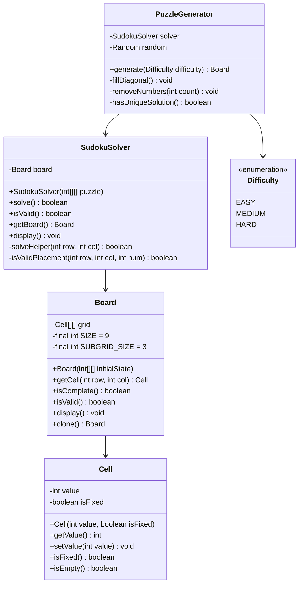

# Sudoku Solver - Low Level Design

## Problem Statement

Design a Sudoku puzzle system that can validate puzzles, solve them using backtracking, and generate new puzzles with varying difficulty levels. The system should ensure unique solutions and provide hints.

### Real-World Context
Sudoku is a logic-based number-placement puzzle testing constraint satisfaction and backtracking algorithms. This LLD demonstrates algorithmic thinking and optimization techniques.

---

## Requirements

### Functional Requirements
1. **Load Puzzle**: Initialize 9x9 grid with given numbers
2. **Validate Puzzle**: Check if current state is valid
3. **Solve Puzzle**: Find solution using backtracking
4. **Check Unique**: Verify puzzle has exactly one solution
5. **Generate Puzzle**: Create new valid puzzles
6. **Get Hint**: Suggest next valid move
7. **Display Board**: Show current state

### Non-Functional Requirements
1. **Performance**: Solve within reasonable time (< 1 second for standard puzzles)
2. **Correctness**: Always find solution if it exists
3. **Difficulty Levels**: Easy, Medium, Hard based on clues
4. **Validation**: Ensure generated puzzles are valid and unique

### Out of Scope
- Multiple puzzle sizes (always 9x9)
- Advanced solving techniques (X-Wing, Swordfish)
- Timed challenges
- Multiplayer

---

## Class Diagram



---

## Detailed Class Design (Java)

### Difficulty Enum

```java
public enum Difficulty {
    EASY(35),      // 35 empty cells
    MEDIUM(45),    // 45 empty cells
    HARD(55);      // 55 empty cells

    private final int emptyCells;

    Difficulty(int emptyCells) {
        this.emptyCells = emptyCells;
    }

    public int getEmptyCells() {
        return emptyCells;
    }
}
```

### Cell Class

```java
/**
 * Represents a single cell in Sudoku grid
 */
public class Cell {
    private int value;       // 0 means empty, 1-9 are values
    private boolean isFixed; // True for initial puzzle clues

    public Cell(int value, boolean isFixed) {
        if (value < 0 || value > 9) {
            throw new IllegalArgumentException("Value must be 0-9");
        }
        this.value = value;
        this.isFixed = isFixed;
    }

    public Cell(int value) {
        this(value, value != 0);
    }

    public int getValue() {
        return value;
    }

    public void setValue(int value) {
        if (isFixed) {
            throw new IllegalStateException("Cannot modify fixed cell");
        }
        if (value < 0 || value > 9) {
            throw new IllegalArgumentException("Value must be 0-9");
        }
        this.value = value;
    }

    public boolean isFixed() {
        return isFixed;
    }

    public boolean isEmpty() {
        return value == 0;
    }

    public Cell clone() {
        return new Cell(value, isFixed);
    }

    @Override
    public String toString() {
        return isEmpty() ? "." : String.valueOf(value);
    }
}
```

### Board Class

```java
/**
 * Represents the 9x9 Sudoku board
 */
public class Board {
    private final Cell[][] grid;
    private static final int SIZE = 9;
    private static final int SUBGRID_SIZE = 3;

    public Board(int[][] initialState) {
        if (initialState.length != SIZE || initialState[0].length != SIZE) {
            throw new IllegalArgumentException("Board must be 9x9");
        }

        this.grid = new Cell[SIZE][SIZE];

        for (int i = 0; i < SIZE; i++) {
            for (int j = 0; j < SIZE; j++) {
                grid[i][j] = new Cell(initialState[i][j]);
            }
        }
    }

    public Board() {
        this.grid = new Cell[SIZE][SIZE];
        for (int i = 0; i < SIZE; i++) {
            for (int j = 0; j < SIZE; j++) {
                grid[i][j] = new Cell(0, false);
            }
        }
    }

    public Cell getCell(int row, int col) {
        validatePosition(row, col);
        return grid[row][col];
    }

    public void setCell(int row, int col, int value) {
        validatePosition(row, col);
        grid[row][col].setValue(value);
    }

    private void validatePosition(int row, int col) {
        if (row < 0 || row >= SIZE || col < 0 || col >= SIZE) {
            throw new IllegalArgumentException("Invalid position: [" + row + "][" + col + "]");
        }
    }

    /**
     * Check if board is completely filled
     */
    public boolean isComplete() {
        for (int i = 0; i < SIZE; i++) {
            for (int j = 0; j < SIZE; j++) {
                if (grid[i][j].isEmpty()) {
                    return false;
                }
            }
        }
        return true;
    }

    /**
     * Validate entire board follows Sudoku rules
     */
    public boolean isValid() {
        // Check all rows
        for (int row = 0; row < SIZE; row++) {
            if (!isRowValid(row)) return false;
        }

        // Check all columns
        for (int col = 0; col < SIZE; col++) {
            if (!isColValid(col)) return false;
        }

        // Check all 3x3 subgrids
        for (int row = 0; row < SIZE; row += SUBGRID_SIZE) {
            for (int col = 0; col < SIZE; col += SUBGRID_SIZE) {
                if (!isSubgridValid(row, col)) return false;
            }
        }

        return true;
    }

    private boolean isRowValid(int row) {
        boolean[] seen = new boolean[SIZE + 1];
        for (int col = 0; col < SIZE; col++) {
            int value = grid[row][col].getValue();
            if (value != 0) {
                if (seen[value]) return false;
                seen[value] = true;
            }
        }
        return true;
    }

    private boolean isColValid(int col) {
        boolean[] seen = new boolean[SIZE + 1];
        for (int row = 0; row < SIZE; row++) {
            int value = grid[row][col].getValue();
            if (value != 0) {
                if (seen[value]) return false;
                seen[value] = true;
            }
        }
        return true;
    }

    private boolean isSubgridValid(int startRow, int startCol) {
        boolean[] seen = new boolean[SIZE + 1];
        for (int row = 0; row < SUBGRID_SIZE; row++) {
            for (int col = 0; col < SUBGRID_SIZE; col++) {
                int value = grid[startRow + row][startCol + col].getValue();
                if (value != 0) {
                    if (seen[value]) return false;
                    seen[value] = true;
                }
            }
        }
        return true;
    }

    public void display() {
        System.out.println("\n+-------+-------+-------+");
        for (int i = 0; i < SIZE; i++) {
            System.out.print("| ");
            for (int j = 0; j < SIZE; j++) {
                System.out.print(grid[i][j] + " ");
                if ((j + 1) % SUBGRID_SIZE == 0) {
                    System.out.print("| ");
                }
            }
            System.out.println();
            if ((i + 1) % SUBGRID_SIZE == 0) {
                System.out.println("+-------+-------+-------+");
            }
        }
    }

    public Board clone() {
        int[][] state = new int[SIZE][SIZE];
        for (int i = 0; i < SIZE; i++) {
            for (int j = 0; j < SIZE; j++) {
                state[i][j] = grid[i][j].getValue();
            }
        }
        return new Board(state);
    }

    public static int getSize() {
        return SIZE;
    }

    public static int getSubgridSize() {
        return SUBGRID_SIZE;
    }
}
```

### SudokuSolver Class

```java
/**
 * Solves Sudoku puzzles using backtracking algorithm
 */
public class SudokuSolver {
    private final Board board;

    public SudokuSolver(int[][] puzzle) {
        this.board = new Board(puzzle);
    }

    public SudokuSolver(Board board) {
        this.board = board;
    }

    /**
     * Solve the Sudoku puzzle using backtracking
     * @return true if solution found, false otherwise
     */
    public boolean solve() {
        if (!board.isValid()) {
            System.out.println("Initial board is invalid!");
            return false;
        }
        return solveHelper(0, 0);
    }

    /**
     * Recursive backtracking solver
     */
    private boolean solveHelper(int row, int col) {
        // Move to next row if we've finished current row
        if (col == Board.getSize()) {
            row++;
            col = 0;
        }

        // Base case: reached end of board
        if (row == Board.getSize()) {
            return true;  // Solution found
        }

        Cell cell = board.getCell(row, col);

        // Skip fixed cells (original clues)
        if (cell.isFixed() || !cell.isEmpty()) {
            return solveHelper(row, col + 1);
        }

        // Try numbers 1-9
        for (int num = 1; num <= 9; num++) {
            if (isValidPlacement(row, col, num)) {
                cell.setValue(num);

                // Recurse
                if (solveHelper(row, col + 1)) {
                    return true;  // Solution found
                }

                // Backtrack
                cell.setValue(0);
            }
        }

        return false;  // No valid number found, backtrack
    }

    /**
     * Check if placing num at [row, col] is valid
     */
    private boolean isValidPlacement(int row, int col, int num) {
        // Check row
        for (int c = 0; c < Board.getSize(); c++) {
            if (board.getCell(row, c).getValue() == num) {
                return false;
            }
        }

        // Check column
        for (int r = 0; r < Board.getSize(); r++) {
            if (board.getCell(r, col).getValue() == num) {
                return false;
            }
        }

        // Check 3x3 subgrid
        int subgridSize = Board.getSubgridSize();
        int subgridRowStart = (row / subgridSize) * subgridSize;
        int subgridColStart = (col / subgridSize) * subgridSize;

        for (int r = 0; r < subgridSize; r++) {
            for (int c = 0; c < subgridSize; c++) {
                if (board.getCell(subgridRowStart + r, subgridColStart + c).getValue() == num) {
                    return false;
                }
            }
        }

        return true;
    }

    public boolean isValid() {
        return board.isValid();
    }

    public Board getBoard() {
        return board;
    }

    public void display() {
        board.display();
    }
}
```

### PuzzleGenerator Class

```java
import java.util.*;

/**
 * Generates valid Sudoku puzzles with unique solutions
 */
public class PuzzleGenerator {
    private final Random random;

    public PuzzleGenerator() {
        this.random = new Random();
    }

    /**
     * Generate a new Sudoku puzzle
     * @param difficulty determines number of empty cells
     * @return generated board
     */
    public Board generate(Difficulty difficulty) {
        Board board = new Board();

        // Fill diagonal 3x3 subgrids (they don't affect each other)
        fillDiagonal(board);

        // Solve the rest using backtracking
        SudokuSolver solver = new SudokuSolver(board);
        solver.solve();

        // Remove numbers based on difficulty
        removeNumbers(board, difficulty.getEmptyCells());

        return board;
    }

    /**
     * Fill the three diagonal 3x3 subgrids
     * These are independent and can be filled randomly
     */
    private void fillDiagonal(Board board) {
        int subgridSize = Board.getSubgridSize();

        for (int i = 0; i < Board.getSize(); i += subgridSize) {
            fillSubgrid(board, i, i);
        }
    }

    private void fillSubgrid(Board board, int row, int col) {
        int subgridSize = Board.getSubgridSize();
        List<Integer> numbers = new ArrayList<>();
        for (int i = 1; i <= 9; i++) {
            numbers.add(i);
        }
        Collections.shuffle(numbers, random);

        int index = 0;
        for (int r = 0; r < subgridSize; r++) {
            for (int c = 0; c < subgridSize; c++) {
                board.setCell(row + r, col + c, numbers.get(index++));
            }
        }
    }

    /**
     * Remove numbers while maintaining unique solution
     */
    private void removeNumbers(Board board, int count) {
        int removed = 0;
        int attempts = 0;
        int maxAttempts = count * 3;

        while (removed < count && attempts < maxAttempts) {
            int row = random.nextInt(Board.getSize());
            int col = random.nextInt(Board.getSize());

            Cell cell = board.getCell(row, col);

            if (!cell.isEmpty()) {
                int backup = cell.getValue();
                cell.setValue(0);

                // Check if still has unique solution
                if (hasUniqueSolution(board)) {
                    removed++;
                } else {
                    // Restore the number
                    cell.setValue(backup);
                }
            }

            attempts++;
        }
    }

    /**
     * Check if puzzle has exactly one solution
     */
    private boolean hasUniqueSolution(Board board) {
        Board cloned = board.clone();
        SudokuSolver solver = new SudokuSolver(cloned);

        int[] solutionCount = {0};
        countSolutions(cloned, 0, 0, solutionCount);

        return solutionCount[0] == 1;
    }

    private boolean countSolutions(Board board, int row, int col, int[] count) {
        if (count[0] > 1) {
            return true;  // Already found multiple solutions
        }

        if (col == Board.getSize()) {
            row++;
            col = 0;
        }

        if (row == Board.getSize()) {
            count[0]++;
            return count[0] > 1;
        }

        Cell cell = board.getCell(row, col);

        if (!cell.isEmpty()) {
            return countSolutions(board, row, col + 1, count);
        }

        for (int num = 1; num <= 9; num++) {
            if (isValidPlacement(board, row, col, num)) {
                cell.setValue(num);

                if (countSolutions(board, row, col + 1, count)) {
                    cell.setValue(0);
                    return true;
                }

                cell.setValue(0);
            }
        }

        return false;
    }

    private boolean isValidPlacement(Board board, int row, int col, int num) {
        for (int c = 0; c < Board.getSize(); c++) {
            if (board.getCell(row, c).getValue() == num) return false;
        }

        for (int r = 0; r < Board.getSize(); r++) {
            if (board.getCell(r, col).getValue() == num) return false;
        }

        int subgridSize = Board.getSubgridSize();
        int startRow = (row / subgridSize) * subgridSize;
        int startCol = (col / subgridSize) * subgridSize;

        for (int r = 0; r < subgridSize; r++) {
            for (int c = 0; c < subgridSize; c++) {
                if (board.getCell(startRow + r, startCol + c).getValue() == num) {
                    return false;
                }
            }
        }

        return true;
    }
}
```

---

## Design Decisions & Reasoning

### 1. **Backtracking Algorithm**
**Decision**: Use recursive backtracking for solving
**Reasoning**:
- Guaranteed to find solution if exists
- Natural fit for constraint satisfaction problems
- Easy to understand and implement
**Complexity**: O(9^(empty cells)) worst case, but prunes heavily

### 2. **Fixed Cell Tracking**
**Decision**: Mark original clues as fixed
**Reasoning**:
- Prevents accidentally modifying puzzle clues
- Distinguishes user input from initial state
- Essential for validation

### 3. **Diagonal-First Generation**
**Decision**: Fill diagonal 3x3 subgrids first when generating
**Reasoning**:
- Diagonal subgrids are independent (no shared row/col)
- Can fill randomly without constraint checking
- Speeds up generation significantly

### 4. **Unique Solution Validation**
**Decision**: Verify puzzles have exactly one solution
**Reasoning**:
- Quality requirement for good Sudoku puzzles
- Prevents ambiguous or unsolvable puzzles
- Ensures fair gameplay

---

## Complexity Analysis

| Operation | Time Complexity | Space Complexity |
|-----------|----------------|------------------|
| Validate Board | O(81) | O(9) |
| Solve | O(9^n) where n = empty cells | O(n) recursion stack |
| Generate | O(9^81) worst case | O(81) |
| Check Unique | O(9^n × 2) | O(n) |

---

## Sample Usage

```java
public class SudokuDemo {
    public static void main(String[] args) {
        // Easy puzzle
        int[][] puzzle = {
            {5, 3, 0, 0, 7, 0, 0, 0, 0},
            {6, 0, 0, 1, 9, 5, 0, 0, 0},
            {0, 9, 8, 0, 0, 0, 0, 6, 0},
            {8, 0, 0, 0, 6, 0, 0, 0, 3},
            {4, 0, 0, 8, 0, 3, 0, 0, 1},
            {7, 0, 0, 0, 2, 0, 0, 0, 6},
            {0, 6, 0, 0, 0, 0, 2, 8, 0},
            {0, 0, 0, 4, 1, 9, 0, 0, 5},
            {0, 0, 0, 0, 8, 0, 0, 7, 9}
        };

        SudokuSolver solver = new SudokuSolver(puzzle);

        System.out.println("Initial Puzzle:");
        solver.display();

        if (solver.solve()) {
            System.out.println("\nSolved!");
            solver.display();
        } else {
            System.out.println("No solution exists!");
        }

        // Generate new puzzle
        System.out.println("\nGenerating new puzzle...");
        PuzzleGenerator generator = new PuzzleGenerator();
        Board newPuzzle = generator.generate(Difficulty.MEDIUM);
        newPuzzle.display();
    }
}
```

---

## Summary

This Sudoku design demonstrates:
- **Backtracking Algorithm**: Classic constraint satisfaction
- **Puzzle Generation**: Creating valid puzzles with unique solutions
- **Validation**: Comprehensive rule checking
- **Optimization**: Diagonal-first generation, early pruning
- **Quality Assurance**: Unique solution verification
