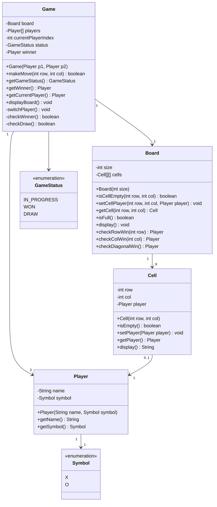
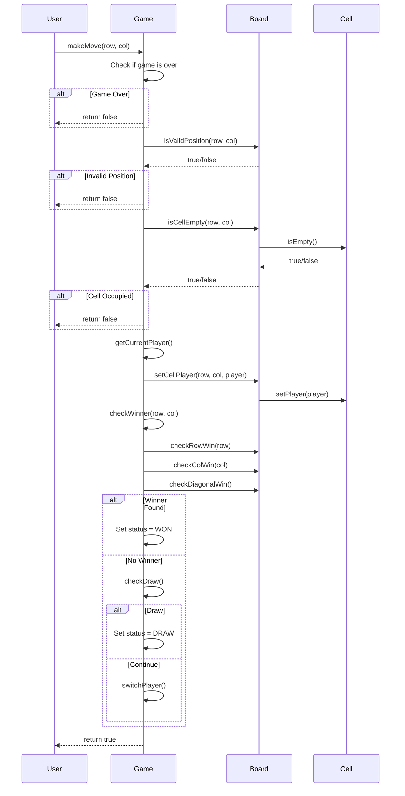

# Tic Tac Toe - Low Level Design

## Problem Statement

Design a Tic Tac Toe game that supports two players playing on a 3x3 grid. The system should validate moves, detect wins/draws, and support extensibility for different board sizes and win conditions.

### Real-World Context
Tic Tac Toe is a classic game used to teach basic game theory, strategy, and programming concepts. This LLD focuses on clean object-oriented design that can be extended to similar grid-based games.

---

## Requirements

### Functional Requirements
1. **Initialize Game**: Create a new game with two players and an empty 3x3 board
2. **Make Move**: Players take turns placing their symbol (X or O) on an empty cell
3. **Validate Move**: Ensure moves are valid (within bounds, cell is empty)
4. **Detect Win**: Check if a player has won after each move
5. **Detect Draw**: Identify when the board is full with no winner
6. **Display Board**: Show the current state of the board
7. **Switch Turns**: Alternate between players automatically

### Non-Functional Requirements
1. **Extensibility**: Should support different board sizes (4x4, 5x5)
2. **Maintainability**: Clean separation of concerns
3. **Testability**: Each component should be independently testable
4. **Performance**: Win detection should be O(1) or O(n) where n is board size

### Out of Scope
- AI opponent (computer player)
- Multiplayer over network
- Undo/Redo functionality
- Persistent game state (save/load)
- GUI implementation (focus on logic)

---

## Core Entities & Relationships

### Main Entities
1. **Player** - Represents a player with name and symbol (X or O)
2. **Board** - Manages the grid and cell states
3. **Cell** - Represents a single position on the board
4. **Game** - Orchestrates the game flow and rules
5. **GameStatus** - Enum for game states (IN_PROGRESS, WON, DRAW)

### Relationships
- Game HAS-A Board
- Game HAS-MANY (2) Players
- Board HAS-MANY Cells (3x3 = 9)
- Cell HAS-A Player (nullable - empty cell)

---

## Class Diagram



---

## Design Patterns Used

### 1. **Strategy Pattern** (Potential Extension)
**Why**: To support different win-checking strategies for different board sizes or game variants
**How**: Can create WinStrategy interface with implementations like StandardWinStrategy, ConnectFourStrategy
**Benefit**: Makes the game extensible to different winning conditions

### 2. **Factory Pattern** (Potential Extension)
**Why**: To create different types of players (Human, AI) in the future
**How**: PlayerFactory can create appropriate player types
**Benefit**: Decouples player creation from game logic

### 3. **Encapsulation**
**Why**: Hide internal state and expose only necessary operations
**How**: Private fields with public methods for controlled access
**Benefit**: Maintains data integrity and reduces coupling

---

## Detailed Class Design (Java)

### GameStatus Enum
```java
/**
 * Represents the current status of the game
 */
public enum GameStatus {
    IN_PROGRESS,  // Game is still ongoing
    WON,          // A player has won
    DRAW          // Board is full with no winner
}
```

### Symbol Enum
```java
/**
 * Represents the symbols used by players
 */
public enum Symbol {
    X('X'),
    O('O');

    private final char displayChar;

    Symbol(char displayChar) {
        this.displayChar = displayChar;
    }

    public char getDisplayChar() {
        return displayChar;
    }
}
```

### Player Class
```java
/**
 * Represents a player in the game
 */
public class Player {
    private final String name;
    private final Symbol symbol;

    public Player(String name, Symbol symbol) {
        if (name == null || name.trim().isEmpty()) {
            throw new IllegalArgumentException("Player name cannot be empty");
        }
        if (symbol == null) {
            throw new IllegalArgumentException("Player symbol cannot be null");
        }
        this.name = name;
        this.symbol = symbol;
    }

    public String getName() {
        return name;
    }

    public Symbol getSymbol() {
        return symbol;
    }

    @Override
    public String toString() {
        return name + " (" + symbol.getDisplayChar() + ")";
    }

    @Override
    public boolean equals(Object obj) {
        if (this == obj) return true;
        if (obj == null || getClass() != obj.getClass()) return false;
        Player player = (Player) obj;
        return symbol == player.symbol;
    }

    @Override
    public int hashCode() {
        return symbol.hashCode();
    }
}
```

### Cell Class
```java
/**
 * Represents a single cell on the board
 */
public class Cell {
    private final int row;
    private final int col;
    private Player player;  // null if empty

    public Cell(int row, int col) {
        this.row = row;
        this.col = col;
        this.player = null;
    }

    public boolean isEmpty() {
        return player == null;
    }

    public void setPlayer(Player player) {
        if (this.player != null) {
            throw new IllegalStateException(
                "Cell [" + row + "][" + col + "] is already occupied"
            );
        }
        this.player = player;
    }

    public Player getPlayer() {
        return player;
    }

    public int getRow() {
        return row;
    }

    public int getCol() {
        return col;
    }

    public String display() {
        return isEmpty() ? "-" : String.valueOf(player.getSymbol().getDisplayChar());
    }

    // Reset cell (useful for game restart)
    public void reset() {
        this.player = null;
    }
}
```

### Board Class
```java
/**
 * Represents the game board with win-checking logic
 */
public class Board {
    private final int size;
    private final Cell[][] cells;

    public Board(int size) {
        if (size < 3) {
            throw new IllegalArgumentException("Board size must be at least 3");
        }
        this.size = size;
        this.cells = new Cell[size][size];
        initializeBoard();
    }

    private void initializeBoard() {
        for (int i = 0; i < size; i++) {
            for (int j = 0; j < size; j++) {
                cells[i][j] = new Cell(i, j);
            }
        }
    }

    public boolean isValidPosition(int row, int col) {
        return row >= 0 && row < size && col >= 0 && col < size;
    }

    public boolean isCellEmpty(int row, int col) {
        if (!isValidPosition(row, col)) {
            return false;
        }
        return cells[row][col].isEmpty();
    }

    public void setCellPlayer(int row, int col, Player player) {
        if (!isValidPosition(row, col)) {
            throw new IllegalArgumentException(
                "Invalid position: [" + row + "][" + col + "]"
            );
        }
        cells[row][col].setPlayer(player);
    }

    public Cell getCell(int row, int col) {
        if (!isValidPosition(row, col)) {
            throw new IllegalArgumentException(
                "Invalid position: [" + row + "][" + col + "]"
            );
        }
        return cells[row][col];
    }

    public boolean isFull() {
        for (int i = 0; i < size; i++) {
            for (int j = 0; j < size; j++) {
                if (cells[i][j].isEmpty()) {
                    return false;
                }
            }
        }
        return true;
    }

    /**
     * Check if there's a winner in the specified row
     * @return Player who won, or null if no winner in this row
     */
    public Player checkRowWin(int row) {
        Player firstPlayer = cells[row][0].getPlayer();
        if (firstPlayer == null) {
            return null;
        }

        for (int col = 1; col < size; col++) {
            if (!firstPlayer.equals(cells[row][col].getPlayer())) {
                return null;
            }
        }
        return firstPlayer;
    }

    /**
     * Check if there's a winner in the specified column
     * @return Player who won, or null if no winner in this column
     */
    public Player checkColWin(int col) {
        Player firstPlayer = cells[0][col].getPlayer();
        if (firstPlayer == null) {
            return null;
        }

        for (int row = 1; row < size; row++) {
            if (!firstPlayer.equals(cells[row][col].getPlayer())) {
                return null;
            }
        }
        return firstPlayer;
    }

    /**
     * Check both diagonals for a winner
     * @return Player who won, or null if no winner in diagonals
     */
    public Player checkDiagonalWin() {
        // Check main diagonal (top-left to bottom-right)
        Player mainDiagPlayer = cells[0][0].getPlayer();
        if (mainDiagPlayer != null) {
            boolean mainDiagWin = true;
            for (int i = 1; i < size; i++) {
                if (!mainDiagPlayer.equals(cells[i][i].getPlayer())) {
                    mainDiagWin = false;
                    break;
                }
            }
            if (mainDiagWin) {
                return mainDiagPlayer;
            }
        }

        // Check anti-diagonal (top-right to bottom-left)
        Player antiDiagPlayer = cells[0][size - 1].getPlayer();
        if (antiDiagPlayer != null) {
            boolean antiDiagWin = true;
            for (int i = 1; i < size; i++) {
                if (!antiDiagPlayer.equals(cells[i][size - 1 - i].getPlayer())) {
                    antiDiagWin = false;
                    break;
                }
            }
            if (antiDiagWin) {
                return antiDiagPlayer;
            }
        }

        return null;
    }

    public void display() {
        System.out.println("\nCurrent Board:");

        // Print column headers
        System.out.print("   ");
        for (int col = 0; col < size; col++) {
            System.out.print(" " + col + " ");
        }
        System.out.println();

        // Print rows with row numbers
        for (int row = 0; row < size; row++) {
            System.out.print(" " + row + " ");
            for (int col = 0; col < size; col++) {
                System.out.print(" " + cells[row][col].display() + " ");
            }
            System.out.println();
        }
        System.out.println();
    }

    public int getSize() {
        return size;
    }
}
```

### Game Class
```java
/**
 * Main game controller that manages game flow and rules
 */
public class Game {
    private final Board board;
    private final Player[] players;
    private int currentPlayerIndex;
    private GameStatus status;
    private Player winner;

    public Game(Player player1, Player player2) {
        this(player1, player2, 3);  // Default 3x3 board
    }

    public Game(Player player1, Player player2, int boardSize) {
        if (player1 == null || player2 == null) {
            throw new IllegalArgumentException("Players cannot be null");
        }
        if (player1.getSymbol() == player2.getSymbol()) {
            throw new IllegalArgumentException("Players must have different symbols");
        }

        this.board = new Board(boardSize);
        this.players = new Player[]{player1, player2};
        this.currentPlayerIndex = 0;
        this.status = GameStatus.IN_PROGRESS;
        this.winner = null;
    }

    /**
     * Attempt to make a move at the specified position
     * @return true if move was successful, false otherwise
     */
    public boolean makeMove(int row, int col) {
        if (status != GameStatus.IN_PROGRESS) {
            System.out.println("Game is already over!");
            return false;
        }

        if (!board.isValidPosition(row, col)) {
            System.out.println("Invalid position: [" + row + "][" + col + "]");
            return false;
        }

        if (!board.isCellEmpty(row, col)) {
            System.out.println("Cell is already occupied!");
            return false;
        }

        // Make the move
        Player currentPlayer = getCurrentPlayer();
        board.setCellPlayer(row, col, currentPlayer);

        // Check for winner or draw
        if (checkWinner(row, col)) {
            status = GameStatus.WON;
            winner = currentPlayer;
            return true;
        }

        if (checkDraw()) {
            status = GameStatus.DRAW;
            return true;
        }

        // Switch to next player
        switchPlayer();
        return true;
    }

    /**
     * Optimized win check - only check the row, column, and diagonals
     * affected by the last move
     */
    private boolean checkWinner(int lastRow, int lastCol) {
        // Check row
        if (board.checkRowWin(lastRow) != null) {
            return true;
        }

        // Check column
        if (board.checkColWin(lastCol) != null) {
            return true;
        }

        // Check diagonals only if the move is on a diagonal
        int size = board.getSize();
        boolean isOnMainDiag = (lastRow == lastCol);
        boolean isOnAntiDiag = (lastRow + lastCol == size - 1);

        if (isOnMainDiag || isOnAntiDiag) {
            if (board.checkDiagonalWin() != null) {
                return true;
            }
        }

        return false;
    }

    private boolean checkDraw() {
        return board.isFull();
    }

    private void switchPlayer() {
        currentPlayerIndex = (currentPlayerIndex + 1) % players.length;
    }

    public Player getCurrentPlayer() {
        return players[currentPlayerIndex];
    }

    public GameStatus getGameStatus() {
        return status;
    }

    public Player getWinner() {
        return winner;
    }

    public void displayBoard() {
        board.display();
    }

    public void displayStatus() {
        switch (status) {
            case IN_PROGRESS:
                System.out.println("Game in progress. Current player: " + getCurrentPlayer());
                break;
            case WON:
                System.out.println("Game Over! Winner: " + winner);
                break;
            case DRAW:
                System.out.println("Game Over! It's a draw!");
                break;
        }
    }
}
```

---

## Key Workflows

### Making a Move - Sequence Diagram



---

## Design Decisions & Reasoning

### 1. **Separating Board and Game Logic**
**Decision**: Board class handles cell management and win checking, Game class handles game flow
**Reasoning**:
- Single Responsibility Principle - each class has one reason to change
- Board logic can be reused for other grid-based games
- Easier to test each component independently

**Alternative**: Could have put all logic in Game class
**Why Not**: Would violate SRP, harder to extend for different board types

### 2. **Optimized Win Checking**
**Decision**: After each move, only check the affected row, column, and diagonals
**Reasoning**:
- O(n) time complexity per move instead of O(n²)
- Only the last move can create a winning condition
- Significantly faster for larger boards

**Alternative**: Check entire board after each move
**Why Not**: Wasteful - cells that weren't just modified can't create a new win

### 3. **Immutable Player and Symbol**
**Decision**: Player name and symbol are final (immutable)
**Reasoning**:
- Players shouldn't change identity mid-game
- Prevents accidental modifications
- Thread-safe by design

### 4. **Cell Encapsulation**
**Decision**: Cell manages its own state and prevents invalid operations
**Reasoning**:
- Ensures data integrity (can't overwrite occupied cell)
- Centralized validation logic
- Clear error messages at the point of failure

### 5. **Enum for GameStatus and Symbol**
**Decision**: Use enums instead of strings or integers
**Reasoning**:
- Type-safe - compiler catches errors
- Self-documenting code
- Can add methods to enums if needed

---

## SOLID Principles Application

### Single Responsibility Principle (SRP)
- **Game**: Manages game flow and orchestration
- **Board**: Manages grid and win-checking logic
- **Cell**: Manages single cell state
- **Player**: Represents player data

Each class has exactly one reason to change.

### Open/Closed Principle (OCP)
- **Extension Point**: Can extend to support different board sizes without modifying existing code
- **Future**: Can create WinStrategy interface for different win conditions
- Board constructor accepts size parameter - open for extension

### Liskov Substitution Principle (LSP)
- If we create subclasses (e.g., AIPlayer extends Player), they would work seamlessly
- No special handling needed for different player types

### Interface Segregation Principle (ISP)
- Classes don't depend on methods they don't use
- Board doesn't know about Game, Cell doesn't know about Board
- Clean, minimal interfaces

### Dependency Inversion Principle (DIP)
- Game depends on Player abstraction (interface could be added)
- Could introduce interfaces like `IPlayer`, `IBoard` for even more flexibility
- High-level Game doesn't depend on low-level Cell implementation details

---

## Extensibility & Future Enhancements

### 1. Different Board Sizes
**Current Support**: Constructor already accepts board size
```java
Game game = new Game(player1, player2, 5);  // 5x5 board
```

### 2. AI Player
**Approach**: Create `AIPlayer` extending `Player`
```java
public class AIPlayer extends Player {
    private DifficultyLevel difficulty;

    public Move calculateBestMove(Board board) {
        // Minimax algorithm implementation
    }
}
```

### 3. Different Win Conditions
**Approach**: Strategy Pattern
```java
public interface WinStrategy {
    boolean checkWin(Board board, int lastRow, int lastCol);
}

public class ConnectFourStrategy implements WinStrategy {
    // Check for 4 in a row
}
```

### 4. Undo Move
**Approach**: Command Pattern with move history
```java
public class MoveCommand {
    private int row;
    private int col;
    private Player player;

    public void undo(Board board) {
        board.getCell(row, col).reset();
    }
}
```

### 5. Multiple Game Modes
- Classic 3x3
- 5x5 board
- 3D Tic Tac Toe
- Timed moves
- Multiplayer tournament

### 6. Persistent Storage
```java
public class GameSerializer {
    public String serialize(Game game) { }
    public Game deserialize(String data) { }
}
```

---

## Complexity Analysis

### Time Complexity

| Operation | Complexity | Explanation |
|-----------|-----------|-------------|
| Initialize Game | O(n²) | Create n×n board cells |
| Make Move | O(n) | Validate + set cell + check win |
| Check Winner | O(n) | Check row + column + 2 diagonals |
| Check Draw | O(1) | Board tracks move count |
| Display Board | O(n²) | Print all cells |

### Space Complexity

| Component | Complexity | Explanation |
|-----------|-----------|-------------|
| Board Storage | O(n²) | n×n grid of cells |
| Player Storage | O(1) | Fixed 2 players |
| Total | O(n²) | Dominated by board |

### Optimizations

1. **Win Checking**: Only check affected row/col/diagonals instead of entire board
2. **Draw Detection**: Track move count instead of scanning board
3. **Memory**: Reuse Cell objects instead of creating new ones

---

## Testing Strategy

### Unit Tests

#### Board Tests
```java
@Test
public void testBoardInitialization() {
    Board board = new Board(3);
    assertEquals(3, board.getSize());
    assertTrue(board.isCellEmpty(0, 0));
}

@Test
public void testInvalidPosition() {
    Board board = new Board(3);
    assertFalse(board.isValidPosition(-1, 0));
    assertFalse(board.isValidPosition(3, 3));
}

@Test
public void testRowWin() {
    Board board = new Board(3);
    Player player = new Player("Test", Symbol.X);

    board.setCellPlayer(0, 0, player);
    board.setCellPlayer(0, 1, player);
    board.setCellPlayer(0, 2, player);

    assertEquals(player, board.checkRowWin(0));
}
```

#### Game Tests
```java
@Test
public void testValidMove() {
    Player p1 = new Player("Alice", Symbol.X);
    Player p2 = new Player("Bob", Symbol.O);
    Game game = new Game(p1, p2);

    assertTrue(game.makeMove(0, 0));
    assertEquals(GameStatus.IN_PROGRESS, game.getGameStatus());
}

@Test
public void testWinCondition() {
    Player p1 = new Player("Alice", Symbol.X);
    Player p2 = new Player("Bob", Symbol.O);
    Game game = new Game(p1, p2);

    // X wins with row
    game.makeMove(0, 0);  // X
    game.makeMove(1, 0);  // O
    game.makeMove(0, 1);  // X
    game.makeMove(1, 1);  // O
    game.makeMove(0, 2);  // X wins

    assertEquals(GameStatus.WON, game.getGameStatus());
    assertEquals(p1, game.getWinner());
}

@Test
public void testDrawCondition() {
    Player p1 = new Player("Alice", Symbol.X);
    Player p2 = new Player("Bob", Symbol.O);
    Game game = new Game(p1, p2);

    // Fill board with no winner
    game.makeMove(0, 0);  // X
    game.makeMove(0, 1);  // O
    game.makeMove(0, 2);  // X
    game.makeMove(1, 0);  // O
    game.makeMove(1, 1);  // X
    game.makeMove(2, 0);  // O
    game.makeMove(1, 2);  // X
    game.makeMove(2, 2);  // O
    game.makeMove(2, 1);  // X

    assertEquals(GameStatus.DRAW, game.getGameStatus());
}
```

### Edge Cases

1. **Move on occupied cell**: Should return false
2. **Move out of bounds**: Should return false
3. **Move after game over**: Should return false
4. **Same symbols for both players**: Constructor should throw exception
5. **Null players**: Constructor should throw exception
6. **Board size < 3**: Constructor should throw exception
7. **Diagonal win on corner**: Should detect correctly
8. **Diagonal win in center**: Should detect correctly

### Integration Tests
```java
@Test
public void testCompleteGameFlow() {
    // Test entire game from start to finish
    // Verify all state transitions are correct
}
```

---

## Sample Usage

```java
public class TicTacToeDemo {
    public static void main(String[] args) {
        // Create players
        Player alice = new Player("Alice", Symbol.X);
        Player bob = new Player("Bob", Symbol.O);

        // Create game
        Game game = new Game(alice, bob);

        // Game loop
        Scanner scanner = new Scanner(System.in);

        while (game.getGameStatus() == GameStatus.IN_PROGRESS) {
            game.displayBoard();

            Player current = game.getCurrentPlayer();
            System.out.println(current.getName() + "'s turn (" +
                             current.getSymbol().getDisplayChar() + ")");

            System.out.print("Enter row (0-2): ");
            int row = scanner.nextInt();

            System.out.print("Enter col (0-2): ");
            int col = scanner.nextInt();

            boolean success = game.makeMove(row, col);

            if (!success) {
                System.out.println("Invalid move! Try again.");
            }
        }

        // Game over
        game.displayBoard();
        game.displayStatus();

        scanner.close();
    }
}
```

---

## Summary

This Tic Tac Toe implementation demonstrates:

- **Clean OOP Design**: Proper encapsulation and separation of concerns
- **SOLID Principles**: Each class has a single, well-defined responsibility
- **Extensibility**: Easy to add new features (AI, different board sizes, win conditions)
- **Performance**: Optimized O(n) win checking
- **Robustness**: Comprehensive validation and error handling
- **Testability**: Clear interfaces make testing straightforward

The design serves as a foundation for more complex grid-based games and showcases fundamental LLD concepts essential for interviews.
