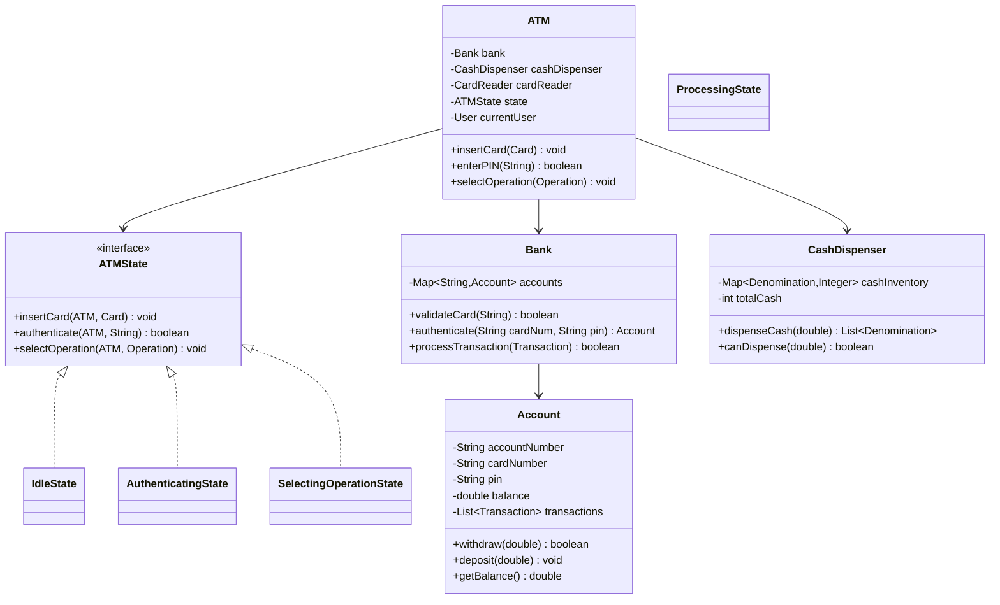

# ATM Machine - Low Level Design

## Problem Statement

Design an ATM system supporting cash withdrawal, balance inquiry, deposit, PIN management, and transaction history while maintaining account security and cash inventory.

---

## Requirements

### Functional Requirements
1. Authenticate user (card + PIN)
2. Check balance
3. Withdraw cash
4. Deposit cash/check
5. Change PIN
6. Print receipt
7. Transaction history

### Non-Functional Requirements
1. Security (PIN encryption, failed attempt lockout)
2. Cash management (denominations, refill alerts)
3. Concurrent user support
4. Transaction logging

---

## Class Diagram



---

## Key Implementation

```java
public enum Operation {
    CHECK_BALANCE,
    WITHDRAW,
    DEPOSIT,
    CHANGE_PIN,
    TRANSACTION_HISTORY,
    EXIT
}

public class Card {
    private final String cardNumber;
    private final String accountNumber;
    private boolean isBlocked;

    public Card(String cardNumber, String accountNumber) {
        this.cardNumber = cardNumber;
        this.accountNumber = accountNumber;
        this.isBlocked = false;
    }

    public String getCardNumber() { return cardNumber; }
    public String getAccountNumber() { return accountNumber; }
    public boolean isBlocked() { return isBlocked; }
    public void block() { this.isBlocked = true; }
}

public class Account {
    private final String accountNumber;
    private final String cardNumber;
    private String pin;  // Should be hashed in production
    private double balance;
    private final List<Transaction> transactions;
    private int failedAttempts;

    public Account(String accountNumber, String cardNumber, String pin, double initialBalance) {
        this.accountNumber = accountNumber;
        this.cardNumber = cardNumber;
        this.pin = pin;
        this.balance = initialBalance;
        this.transactions = new ArrayList<>();
        this.failedAttempts = 0;
    }

    public synchronized boolean withdraw(double amount) {
        if (amount > balance) {
            return false;
        }
        balance -= amount;
        addTransaction(new Transaction(TransactionType.WITHDRAWAL, amount));
        return true;
    }

    public synchronized void deposit(double amount) {
        balance += amount;
        addTransaction(new Transaction(TransactionType.DEPOSIT, amount));
    }

    public boolean validatePIN(String inputPIN) {
        if (pin.equals(inputPIN)) {
            failedAttempts = 0;
            return true;
        }
        failedAttempts++;
        return false;
    }

    public boolean isLocked() {
        return failedAttempts >= 3;
    }

    private void addTransaction(Transaction transaction) {
        transactions.add(transaction);
    }

    public double getBalance() { return balance; }
    public List<Transaction> getTransactions() { return new ArrayList<>(transactions); }
    public void changePIN(String newPIN) { this.pin = newPIN; }
}

public enum TransactionType {
    WITHDRAWAL,
    DEPOSIT,
    BALANCE_INQUIRY
}

public class Transaction {
    private final String id;
    private final TransactionType type;
    private final double amount;
    private final LocalDateTime timestamp;

    public Transaction(TransactionType type, double amount) {
        this.id = UUID.randomUUID().toString();
        this.type = type;
        this.amount = amount;
        this.timestamp = LocalDateTime.now();
    }

    @Override
    public String toString() {
        return String.format("%s - %s: $%.2f", timestamp, type, amount);
    }
}

public class CashDispenser {
    private final Map<Integer, Integer> cashInventory;  // Denomination -> Count
    private int totalCash;

    public CashDispenser() {
        this.cashInventory = new HashMap<>();
        // Initialize with some cash
        cashInventory.put(20, 50);
        cashInventory.put(50, 30);
        cashInventory.put(100, 20);
        calculateTotal();
    }

    public synchronized boolean canDispense(double amount) {
        return amount <= totalCash && amount % 20 == 0;
    }

    public synchronized Map<Integer, Integer> dispenseCash(double amount) {
        if (!canDispense(amount)) {
            throw new IllegalArgumentException("Cannot dispense amount");
        }

        Map<Integer, Integer> dispensed = new HashMap<>();
        int remaining = (int) amount;

        // Greedy algorithm - largest denomination first
        Integer[] denoms = {100, 50, 20};

        for (int denom : denoms) {
            int count = Math.min(remaining / denom, cashInventory.get(denom));
            if (count > 0) {
                dispensed.put(denom, count);
                cashInventory.put(denom, cashInventory.get(denom) - count);
                remaining -= count * denom;
            }
        }

        if (remaining > 0) {
            // Rollback
            for (Map.Entry<Integer, Integer> entry : dispensed.entrySet()) {
                cashInventory.put(entry.getKey(), cashInventory.get(entry.getKey()) + entry.getValue());
            }
            throw new IllegalStateException("Cannot dispense exact amount");
        }

        calculateTotal();
        return dispensed;
    }

    private void calculateTotal() {
        totalCash = cashInventory.entrySet().stream()
            .mapToInt(e -> e.getKey() * e.getValue())
            .sum();
    }

    public int getTotalCash() { return totalCash; }
}

public class Bank {
    private final Map<String, Account> accounts;

    public Bank() {
        this.accounts = new ConcurrentHashMap<>();
    }

    public void addAccount(Account account) {
        accounts.put(account.getAccountNumber(), account);
    }

    public Account authenticate(String cardNumber, String pin) {
        Account account = accounts.values().stream()
            .filter(acc -> acc.getCardNumber().equals(cardNumber))
            .findFirst()
            .orElse(null);

        if (account == null) return null;

        if (account.isLocked()) {
            System.out.println("Account is locked due to multiple failed attempts");
            return null;
        }

        if (account.validatePIN(pin)) {
            return account;
        }

        return null;
    }
}

// State Pattern
public interface ATMState {
    void insertCard(ATM atm, Card card);
    void enterPIN(ATM atm, String pin);
    void selectOperation(ATM atm, Operation operation);
    void ejectCard(ATM atm);
}

public class IdleState implements ATMState {
    @Override
    public void insertCard(ATM atm, Card card) {
        if (card.isBlocked()) {
            System.out.println("Card is blocked!");
            return;
        }
        atm.setCurrentCard(card);
        atm.setState(new AuthenticatingState());
        System.out.println("Please enter your PIN:");
    }

    @Override
    public void enterPIN(ATM atm, String pin) {
        System.out.println("Please insert card first");
    }

    @Override
    public void selectOperation(ATM atm, Operation operation) {
        System.out.println("Please insert card first");
    }

    @Override
    public void ejectCard(ATM atm) {
        System.out.println("No card inserted");
    }
}

public class AuthenticatingState implements ATMState {
    @Override
    public void insertCard(ATM atm, Card card) {
        System.out.println("Card already inserted");
    }

    @Override
    public void enterPIN(ATM atm, String pin) {
        Account account = atm.getBank().authenticate(
            atm.getCurrentCard().getCardNumber(), pin
        );

        if (account != null) {
            atm.setCurrentAccount(account);
            atm.setState(new SelectingOperationState());
            System.out.println("Authentication successful!");
        } else {
            System.out.println("Invalid PIN!");
            atm.ejectCard();
        }
    }

    @Override
    public void selectOperation(ATM atm, Operation operation) {
        System.out.println("Please authenticate first");
    }

    @Override
    public void ejectCard(ATM atm) {
        atm.reset();
    }
}

public class SelectingOperationState implements ATMState {
    @Override
    public void insertCard(ATM atm, Card card) {
        System.out.println("Session already active");
    }

    @Override
    public void enterPIN(ATM atm, String pin) {
        System.out.println("Already authenticated");
    }

    @Override
    public void selectOperation(ATM atm, Operation operation) {
        switch (operation) {
            case CHECK_BALANCE:
                System.out.println("Balance: $" + atm.getCurrentAccount().getBalance());
                break;

            case WITHDRAW:
                System.out.println("Enter amount:");
                // In real system, get input
                break;

            case EXIT:
                atm.ejectCard();
                break;

            default:
                System.out.println("Operation not implemented");
        }
    }

    @Override
    public void ejectCard(ATM atm) {
        System.out.println("Thank you!");
        atm.reset();
    }
}

public class ATM {
    private final Bank bank;
    private final CashDispenser cashDispenser;
    private ATMState state;
    private Card currentCard;
    private Account currentAccount;

    public ATM(Bank bank) {
        this.bank = bank;
        this.cashDispenser = new CashDispenser();
        this.state = new IdleState();
    }

    public void insertCard(Card card) {
        state.insertCard(this, card);
    }

    public void enterPIN(String pin) {
        state.enterPIN(this, pin);
    }

    public void selectOperation(Operation operation) {
        state.selectOperation(this, operation);
    }

    public void withdrawCash(double amount) {
        if (currentAccount == null) {
            System.out.println("Not authenticated");
            return;
        }

        if (!cashDispenser.canDispense(amount)) {
            System.out.println("Cannot dispense amount");
            return;
        }

        if (currentAccount.withdraw(amount)) {
            Map<Integer, Integer> cash = cashDispenser.dispenseCash(amount);
            System.out.println("Dispensing: " + cash);
        } else {
            System.out.println("Insufficient balance");
        }
    }

    public void ejectCard() {
        state.ejectCard(this);
    }

    public void reset() {
        this.state = new IdleState();
        this.currentCard = null;
        this.currentAccount = null;
    }

    // Getters and setters
    public Bank getBank() { return bank; }
    public Card getCurrentCard() { return currentCard; }
    public Account getCurrentAccount() { return currentAccount; }
    public void setCurrentCard(Card card) { this.currentCard = card; }
    public void setCurrentAccount(Account account) { this.currentAccount = account; }
    public void setState(ATMState state) { this.state = state; }
}
```

---

## Summary

ATM System demonstrates:
- **State Pattern**: Session flow management
- **Security**: PIN validation, attempt lockout
- **Cash Management**: Denomination-based dispensing
- **Transaction Logging**: Audit trail
- **Concurrency**: Thread-safe account operations
