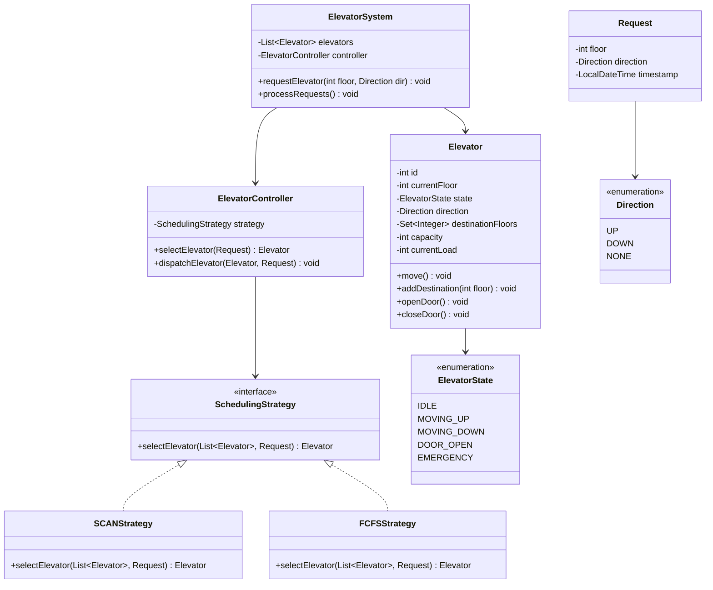

# Elevator System - Low Level Design

## Problem Statement

Design an elevator system for a multi-story building that efficiently handles passenger requests, optimizes travel time, and manages multiple elevators with different scheduling algorithms.

---

## Requirements

### Functional Requirements
1. Multiple elevators in a building
2. External requests (floor buttons: UP/DOWN)
3. Internal requests (destination floor inside elevator)
4. Door open/close operations
5. Emergency handling
6. Optimal elevator selection for requests
7. Display current floor and direction

### Non-Functional Requirements
1. **Efficiency**: Minimize wait time and travel time
2. **Fairness**: No request starvation
3. **Safety**: Door timing, weight limits
4. **Scalability**: Support 50+ floors, 10+ elevators

---

## Class Diagram



---

## Key Implementation

```java
public enum ElevatorState {
    IDLE,
    MOVING_UP,
    MOVING_DOWN,
    DOOR_OPEN,
    EMERGENCY
}

public enum Direction {
    UP, DOWN, NONE
}

public class Request {
    private final int floor;
    private final Direction direction;
    private final LocalDateTime timestamp;

    public Request(int floor, Direction direction) {
        this.floor = floor;
        this.direction = direction;
        this.timestamp = LocalDateTime.now();
    }

    public int getFloor() { return floor; }
    public Direction getDirection() { return direction; }
    public LocalDateTime getTimestamp() { return timestamp; }
}

public class Elevator {
    private final int id;
    private int currentFloor;
    private ElevatorState state;
    private Direction direction;
    private final TreeSet<Integer> upDestinations;
    private final TreeSet<Integer> downDestinations;
    private final int capacity;
    private int currentLoad;

    public Elevator(int id, int capacity) {
        this.id = id;
        this.currentFloor = 0;
        this.state = ElevatorState.IDLE;
        this.direction = Direction.NONE;
        this.upDestinations = new TreeSet<>();
        this.downDestinations = new TreeSet<>(Collections.reverseOrder());
        this.capacity = capacity;
        this.currentLoad = 0;
    }

    public void addDestination(int floor) {
        if (floor > currentFloor) {
            upDestinations.add(floor);
            if (state == ElevatorState.IDLE) {
                direction = Direction.UP;
                state = ElevatorState.MOVING_UP;
            }
        } else if (floor < currentFloor) {
            downDestinations.add(floor);
            if (state == ElevatorState.IDLE) {
                direction = Direction.DOWN;
                state = ElevatorState.MOVING_DOWN;
            }
        }
    }

    public void move() {
        if (state == ElevatorState.IDLE) {
            return;
        }

        if (direction == Direction.UP) {
            if (!upDestinations.isEmpty()) {
                int nextFloor = upDestinations.first();

                // Move towards next floor
                if (currentFloor < nextFloor) {
                    currentFloor++;
                    System.out.println("Elevator " + id + " moving to floor " + currentFloor);
                }

                // Reached destination
                if (currentFloor == nextFloor) {
                    upDestinations.remove(currentFloor);
                    openDoor();
                    closeDoor();

                    // Check if should change direction
                    if (upDestinations.isEmpty()) {
                        if (!downDestinations.isEmpty()) {
                            direction = Direction.DOWN;
                            state = ElevatorState.MOVING_DOWN;
                        } else {
                            state = ElevatorState.IDLE;
                            direction = Direction.NONE;
                        }
                    }
                }
            }
        } else if (direction == Direction.DOWN) {
            if (!downDestinations.isEmpty()) {
                int nextFloor = downDestinations.first();

                if (currentFloor > nextFloor) {
                    currentFloor--;
                    System.out.println("Elevator " + id + " moving to floor " + currentFloor);
                }

                if (currentFloor == nextFloor) {
                    downDestinations.remove(currentFloor);
                    openDoor();
                    closeDoor();

                    if (downDestinations.isEmpty()) {
                        if (!upDestinations.isEmpty()) {
                            direction = Direction.UP;
                            state = ElevatorState.MOVING_UP;
                        } else {
                            state = ElevatorState.IDLE;
                            direction = Direction.NONE;
                        }
                    }
                }
            }
        }
    }

    private void openDoor() {
        System.out.println("Elevator " + id + " door opening at floor " + currentFloor);
        state = ElevatorState.DOOR_OPEN;
        try {
            Thread.sleep(2000);  // Door open for 2 seconds
        } catch (InterruptedException e) {
            Thread.currentThread().interrupt();
        }
    }

    private void closeDoor() {
        System.out.println("Elevator " + id + " door closing");
        state = (direction == Direction.UP) ? ElevatorState.MOVING_UP : ElevatorState.MOVING_DOWN;
    }

    public int getCurrentFloor() { return currentFloor; }
    public ElevatorState getState() { return state; }
    public Direction getDirection() { return direction; }
    public int getId() { return id; }

    public boolean isAvailableFor(Request request) {
        if (state == ElevatorState.EMERGENCY) return false;
        if (currentLoad >= capacity) return false;
        return true;
    }

    public int getDistance(Request request) {
        return Math.abs(currentFloor - request.getFloor());
    }
}

// Scheduling Strategy Interface
public interface SchedulingStrategy {
    Elevator selectElevator(List<Elevator> elevators, Request request);
}

// SCAN (Look) Algorithm - Most common in real elevators
public class SCANStrategy implements SchedulingStrategy {
    @Override
    public Elevator selectElevator(List<Elevator> elevators, Request request) {
        Elevator best = null;
        int minCost = Integer.MAX_VALUE;

        for (Elevator elevator : elevators) {
            if (!elevator.isAvailableFor(request)) {
                continue;
            }

            int cost = calculateCost(elevator, request);
            if (cost < minCost) {
                minCost = cost;
                best = elevator;
            }
        }

        return best != null ? best : elevators.get(0);  // Fallback
    }

    private int calculateCost(Elevator elevator, Request request) {
        int currentFloor = elevator.getCurrentFloor();
        int targetFloor = request.getFloor();
        Direction elevatorDir = elevator.getDirection();
        Direction requestDir = request.getDirection();

        // Elevator is idle - direct distance
        if (elevatorDir == Direction.NONE) {
            return Math.abs(targetFloor - currentFloor);
        }

        // Elevator going same direction and will pass request floor
        if (elevatorDir == requestDir) {
            if (elevatorDir == Direction.UP && targetFloor >= currentFloor) {
                return targetFloor - currentFloor;
            }
            if (elevatorDir == Direction.DOWN && targetFloor <= currentFloor) {
                return currentFloor - targetFloor;
            }
        }

        // Elevator needs to turn around - higher cost
        return Math.abs(targetFloor - currentFloor) + 100;
    }
}

// First-Come-First-Served
public class FCFSStrategy implements SchedulingStrategy {
    @Override
    public Elevator selectElevator(List<Elevator> elevators, Request request) {
        // Select nearest available elevator
        return elevators.stream()
            .filter(e -> e.isAvailableFor(request))
            .min(Comparator.comparingInt(e -> e.getDistance(request)))
            .orElse(elevators.get(0));
    }
}

public class ElevatorController {
    private final SchedulingStrategy strategy;
    private final Queue<Request> pendingRequests;

    public ElevatorController(SchedulingStrategy strategy) {
        this.strategy = strategy;
        this.pendingRequests = new LinkedList<>();
    }

    public void addRequest(Request request) {
        pendingRequests.offer(request);
    }

    public void processRequests(List<Elevator> elevators) {
        while (!pendingRequests.isEmpty()) {
            Request request = pendingRequests.poll();
            Elevator selected = strategy.selectElevator(elevators, request);

            if (selected != null) {
                dispatchElevator(selected, request);
            } else {
                pendingRequests.offer(request);  // Re-queue
            }
        }
    }

    private void dispatchElevator(Elevator elevator, Request request) {
        System.out.println("Dispatching Elevator " + elevator.getId() +
                         " to floor " + request.getFloor());
        elevator.addDestination(request.getFloor());
    }
}

public class ElevatorSystem {
    private final List<Elevator> elevators;
    private final ElevatorController controller;
    private final int totalFloors;

    public ElevatorSystem(int numElevators, int totalFloors, SchedulingStrategy strategy) {
        this.elevators = new ArrayList<>();
        this.totalFloors = totalFloors;
        this.controller = new ElevatorController(strategy);

        for (int i = 0; i < numElevators; i++) {
            elevators.add(new Elevator(i + 1, 10));  // Capacity of 10
        }
    }

    public void requestElevator(int floor, Direction direction) {
        Request request = new Request(floor, direction);
        controller.addRequest(request);
        controller.processRequests(elevators);
    }

    public void selectDestination(int elevatorId, int floor) {
        elevators.get(elevatorId - 1).addDestination(floor);
    }

    public void run() {
        // Simulate elevator movement
        while (true) {
            for (Elevator elevator : elevators) {
                elevator.move();
            }

            try {
                Thread.sleep(1000);  // 1 second per floor
            } catch (InterruptedException e) {
                Thread.currentThread().interrupt();
                break;
            }
        }
    }

    public void displayStatus() {
        System.out.println("\n=== Elevator Status ===");
        for (Elevator elevator : elevators) {
            System.out.println("Elevator " + elevator.getId() +
                             " - Floor " + elevator.getCurrentFloor() +
                             " - " + elevator.getState() +
                             " - " + elevator.getDirection());
        }
    }
}
```

---

## Design Decisions

### 1. **SCAN/LOOK Algorithm**
**Decision**: Default to SCAN algorithm (move in one direction, serve all requests, then reverse)
**Reasoning**:
- Most efficient for multiple requests
- Prevents starvation
- Used in real-world elevators
- Better than FCFS for high load

### 2. **TreeSet for Destinations**
**Decision**: Separate TreeSets for up/down destinations
**Reasoning**:
- Automatic sorting (ascending for up, descending for down)
- O(log n) insertion
- Easy to get next destination with `first()`

### 3. **Strategy Pattern for Scheduling**
**Decision**: Pluggable scheduling strategies
**Reasoning**:
- Easy to switch algorithms (SCAN, FCFS, etc.)
- Can add new strategies without modifying core
- Testable in isolation

### 4. **State Machine**
**Decision**: Explicit state enum and transitions
**Reasoning**:
- Clear state representation
- Easy to debug
- Prevents invalid state transitions

---

## Summary

Elevator System demonstrates:
- **State Machine Pattern**: Elevator states and transitions
- **Strategy Pattern**: Pluggable scheduling algorithms
- **Concurrency**: Thread-safe request handling
- **Optimization**: SCAN algorithm for efficiency
- **Real-World Modeling**: Complex system with multiple constraints
