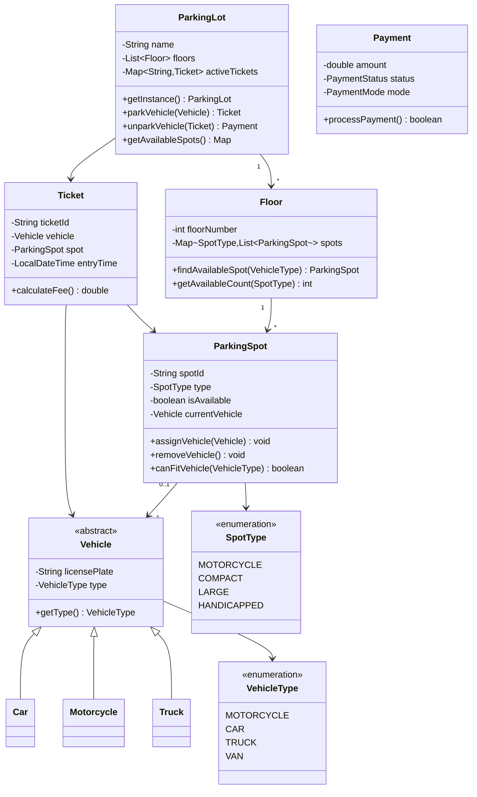

# Parking Lot System - Low Level Design

## Problem Statement

Design a parking lot system that can accommodate different vehicle types, track available spots, calculate parking fees, and generate tickets. The system should support multiple floors, spot allocation strategies, and payment processing.

### Real-World Context
One of the most popular LLD interview questions testing OOP design, strategy pattern, and resource allocation algorithms.

---

## Requirements

### Functional Requirements
1. **Multiple Vehicle Types**: Car, Motorcycle, Truck, Van
2. **Multiple Spot Types**: Compact, Large, Handicapped, Motorcycle
3. **Multi-Floor Support**: Parking lot can have multiple floors
4. **Entry/Exit Management**: Generate ticket on entry, calculate fee on exit
5. **Spot Allocation**: Find nearest available spot for vehicle type
6. **Payment Processing**: Hourly-based pricing with different rates per vehicle type
7. **Availability Display**: Show available spots per floor and type

### Non-Functional Requirements
1. **Thread Safety**: Handle concurrent entry/exit
2. **Extensibility**: Easy to add new vehicle/spot types
3. **Scalability**: Support large parking lots (1000+ spots)
4. **Performance**: O(1) spot finding using efficient data structures

### Out of Scope
- Reservation system
- Monthly passes
- Electric vehicle charging
- Valet parking

---

## Core Entities & Relationships

### Main Entities
1. **ParkingLot** - Singleton managing the entire lot
2. **Floor** - Represents one floor with multiple spots
3. **ParkingSpot** - Individual parking space
4. **Vehicle** - Abstract class for different vehicle types
5. **Ticket** - Generated on entry
6. **Payment** - Handles fee calculation

---

## Class Diagram



---

## Design Patterns Used

### 1. **Singleton Pattern**
**Why**: Only one parking lot instance should exist
**How**: Private constructor, static getInstance() method
**Benefit**: Global access point, controlled instantiation

### 2. **Factory Pattern**
**Why**: Create different vehicle types
**How**: VehicleFactory with createVehicle() method
**Benefit**: Encapsulates object creation logic

### 3. **Strategy Pattern**
**Why**: Different spot allocation strategies (nearest, random, etc.)
**How**: SpotAllocationStrategy interface
**Benefit**: Easy to switch algorithms

### 4. **State Pattern** (Potential)
**Why**: Ticket/Payment state transitions
**How**: Different states for payment (PENDING, PAID, FAILED)
**Benefit**: Clean state management

---

## Detailed Class Design (Java)

### Enums

```java
public enum VehicleType {
    MOTORCYCLE,
    CAR,
    TRUCK,
    VAN
}

public enum SpotType {
    MOTORCYCLE(1),
    COMPACT(2),
    LARGE(3),
    HANDICAPPED(2);

    private final int capacity;  // Can fit vehicles up to this size

    SpotType(int capacity) {
        this.capacity = capacity;
    }

    public boolean canFit(VehicleType vehicleType) {
        switch (vehicleType) {
            case MOTORCYCLE:
                return this.capacity >= 1;
            case CAR:
                return this.capacity >= 2;
            case TRUCK:
            case VAN:
                return this.capacity >= 3;
            default:
                return false;
        }
    }
}

public enum PaymentStatus {
    PENDING,
    PAID,
    FAILED,
    REFUNDED
}

public enum PaymentMode {
    CASH,
    CREDIT_CARD,
    DEBIT_CARD,
    UPI
}
```

### Vehicle Classes

```java
/**
 * Abstract base class for all vehicles
 */
public abstract class Vehicle {
    protected final String licensePlate;
    protected final VehicleType type;

    public Vehicle(String licensePlate, VehicleType type) {
        this.licensePlate = licensePlate;
        this.type = type;
    }

    public String getLicensePlate() {
        return licensePlate;
    }

    public VehicleType getType() {
        return type;
    }

    @Override
    public String toString() {
        return type + " (" + licensePlate + ")";
    }
}

public class Motorcycle extends Vehicle {
    public Motorcycle(String licensePlate) {
        super(licensePlate, VehicleType.MOTORCYCLE);
    }
}

public class Car extends Vehicle {
    public Car(String licensePlate) {
        super(licensePlate, VehicleType.CAR);
    }
}

public class Truck extends Vehicle {
    public Truck(String licensePlate) {
        super(licensePlate, VehicleType.TRUCK);
    }
}

public class Van extends Vehicle {
    public Van(String licensePlate) {
        super(licensePlate, VehicleType.VAN);
    }
}
```

### ParkingSpot Class

```java
/**
 * Represents a single parking spot
 */
public class ParkingSpot {
    private final String spotId;
    private final SpotType type;
    private boolean isAvailable;
    private Vehicle currentVehicle;

    public ParkingSpot(String spotId, SpotType type) {
        this.spotId = spotId;
        this.type = type;
        this.isAvailable = true;
        this.currentVehicle = null;
    }

    public synchronized boolean assignVehicle(Vehicle vehicle) {
        if (!isAvailable) {
            return false;
        }

        if (!canFitVehicle(vehicle.getType())) {
            return false;
        }

        this.currentVehicle = vehicle;
        this.isAvailable = false;
        return true;
    }

    public synchronized void removeVehicle() {
        this.currentVehicle = null;
        this.isAvailable = true;
    }

    public boolean canFitVehicle(VehicleType vehicleType) {
        return type.canFit(vehicleType);
    }

    public boolean isAvailable() {
        return isAvailable;
    }

    public String getSpotId() {
        return spotId;
    }

    public SpotType getType() {
        return type;
    }

    public Vehicle getCurrentVehicle() {
        return currentVehicle;
    }

    @Override
    public String toString() {
        return "Spot " + spotId + " (" + type + ") - " +
               (isAvailable ? "Available" : "Occupied");
    }
}
```

### Floor Class

```java
import java.util.*;
import java.util.concurrent.ConcurrentHashMap;

/**
 * Represents one floor of the parking lot
 */
public class Floor {
    private final int floorNumber;
    private final Map<SpotType, List<ParkingSpot>> spotsByType;

    public Floor(int floorNumber) {
        this.floorNumber = floorNumber;
        this.spotsByType = new ConcurrentHashMap<>();

        for (SpotType type : SpotType.values()) {
            spotsByType.put(type, new ArrayList<>());
        }
    }

    public void addSpot(ParkingSpot spot) {
        spotsByType.get(spot.getType()).add(spot);
    }

    /**
     * Find first available spot that can fit the vehicle
     */
    public ParkingSpot findAvailableSpot(VehicleType vehicleType) {
        // Try to find exact match first
        SpotType preferredType = getPreferredSpotType(vehicleType);

        ParkingSpot spot = findSpotOfType(preferredType, vehicleType);
        if (spot != null) {
            return spot;
        }

        // If no exact match, try larger spots
        for (SpotType type : SpotType.values()) {
            if (type.canFit(vehicleType)) {
                spot = findSpotOfType(type, vehicleType);
                if (spot != null) {
                    return spot;
                }
            }
        }

        return null;  // No available spot
    }

    private ParkingSpot findSpotOfType(SpotType spotType, VehicleType vehicleType) {
        List<ParkingSpot> spots = spotsByType.get(spotType);

        for (ParkingSpot spot : spots) {
            if (spot.isAvailable() && spot.canFitVehicle(vehicleType)) {
                return spot;
            }
        }

        return null;
    }

    private SpotType getPreferredSpotType(VehicleType vehicleType) {
        switch (vehicleType) {
            case MOTORCYCLE:
                return SpotType.MOTORCYCLE;
            case CAR:
                return SpotType.COMPACT;
            case TRUCK:
            case VAN:
                return SpotType.LARGE;
            default:
                return SpotType.COMPACT;
        }
    }

    public int getAvailableCount(SpotType type) {
        return (int) spotsByType.get(type).stream()
                .filter(ParkingSpot::isAvailable)
                .count();
    }

    public int getFloorNumber() {
        return floorNumber;
    }

    public Map<SpotType, Integer> getAvailability() {
        Map<SpotType, Integer> availability = new HashMap<>();

        for (SpotType type : SpotType.values()) {
            availability.put(type, getAvailableCount(type));
        }

        return availability;
    }
}
```

### Ticket Class

```java
import java.time.LocalDateTime;
import java.util.UUID;

/**
 * Parking ticket generated on entry
 */
public class Ticket {
    private final String ticketId;
    private final Vehicle vehicle;
    private final ParkingSpot spot;
    private final LocalDateTime entryTime;

    public Ticket(Vehicle vehicle, ParkingSpot spot) {
        this.ticketId = UUID.randomUUID().toString();
        this.vehicle = vehicle;
        this.spot = spot;
        this.entryTime = LocalDateTime.now();
    }

    public String getTicketId() {
        return ticketId;
    }

    public Vehicle getVehicle() {
        return vehicle;
    }

    public ParkingSpot getSpot() {
        return spot;
    }

    public LocalDateTime getEntryTime() {
        return entryTime;
    }

    /**
     * Calculate parking duration in hours (rounded up)
     */
    public long getParkingDurationHours() {
        LocalDateTime now = LocalDateTime.now();
        long minutes = java.time.Duration.between(entryTime, now).toMinutes();
        return (minutes + 59) / 60;  // Round up to nearest hour
    }

    @Override
    public String toString() {
        return "Ticket #" + ticketId + "\n" +
               "Vehicle: " + vehicle + "\n" +
               "Spot: " + spot.getSpotId() + "\n" +
               "Entry: " + entryTime;
    }
}
```

### Payment Class

```java
/**
 * Handles payment calculation and processing
 */
public class Payment {
    private final Ticket ticket;
    private final double amount;
    private PaymentStatus status;
    private PaymentMode mode;

    // Hourly rates per vehicle type
    private static final Map<VehicleType, Double> HOURLY_RATES = Map.of(
        VehicleType.MOTORCYCLE, 10.0,
        VehicleType.CAR, 20.0,
        VehicleType.TRUCK, 50.0,
        VehicleType.VAN, 40.0
    );

    public Payment(Ticket ticket) {
        this.ticket = ticket;
        this.amount = calculateFee();
        this.status = PaymentStatus.PENDING;
    }

    private double calculateFee() {
        long hours = ticket.getParkingDurationHours();
        VehicleType type = ticket.getVehicle().getType();
        double hourlyRate = HOURLY_RATES.getOrDefault(type, 20.0);

        return hours * hourlyRate;
    }

    public boolean processPayment(PaymentMode mode) {
        this.mode = mode;

        // Simulate payment processing
        try {
            // In real system, integrate with payment gateway
            System.out.println("Processing " + mode + " payment of $" + amount);
            this.status = PaymentStatus.PAID;
            return true;
        } catch (Exception e) {
            this.status = PaymentStatus.FAILED;
            return false;
        }
    }

    public double getAmount() {
        return amount;
    }

    public PaymentStatus getStatus() {
        return status;
    }

    public Ticket getTicket() {
        return ticket;
    }

    @Override
    public String toString() {
        return "Payment: $" + amount + " (" + status + ")";
    }
}
```

### ParkingLot Class (Singleton)

```java
import java.util.*;
import java.util.concurrent.ConcurrentHashMap;

/**
 * Main parking lot controller (Singleton)
 */
public class ParkingLot {
    private static ParkingLot instance;
    private final String name;
    private final List<Floor> floors;
    private final Map<String, Ticket> activeTickets;

    private ParkingLot(String name, int numFloors) {
        this.name = name;
        this.floors = new ArrayList<>();
        this.activeTickets = new ConcurrentHashMap<>();

        for (int i = 0; i < numFloors; i++) {
            floors.add(new Floor(i + 1));
        }
    }

    public static synchronized ParkingLot getInstance(String name, int numFloors) {
        if (instance == null) {
            instance = new ParkingLot(name, numFloors);
        }
        return instance;
    }

    public static ParkingLot getInstance() {
        if (instance == null) {
            throw new IllegalStateException("Parking lot not initialized");
        }
        return instance;
    }

    /**
     * Park a vehicle and return ticket
     */
    public synchronized Ticket parkVehicle(Vehicle vehicle) {
        // Find available spot across all floors
        for (Floor floor : floors) {
            ParkingSpot spot = floor.findAvailableSpot(vehicle.getType());

            if (spot != null && spot.assignVehicle(vehicle)) {
                Ticket ticket = new Ticket(vehicle, spot);
                activeTickets.put(ticket.getTicketId(), ticket);

                System.out.println("Vehicle parked successfully!");
                System.out.println(ticket);
                return ticket;
            }
        }

        System.out.println("Sorry, no available spot for " + vehicle.getType());
        return null;
    }

    /**
     * Unpark vehicle and process payment
     */
    public synchronized Payment unparkVehicle(String ticketId, PaymentMode paymentMode) {
        Ticket ticket = activeTickets.get(ticketId);

        if (ticket == null) {
            throw new IllegalArgumentException("Invalid ticket ID");
        }

        // Calculate payment
        Payment payment = new Payment(ticket);

        // Process payment
        if (payment.processPayment(paymentMode)) {
            // Release spot
            ticket.getSpot().removeVehicle();

            // Remove from active tickets
            activeTickets.remove(ticketId);

            System.out.println("\nVehicle exited successfully!");
            System.out.println("Duration: " + ticket.getParkingDurationHours() + " hours");
            System.out.println(payment);

            return payment;
        } else {
            System.out.println("Payment failed!");
            return null;
        }
    }

    /**
     * Get availability across all floors
     */
    public void displayAvailability() {
        System.out.println("\n=== Parking Availability ===");

        for (Floor floor : floors) {
            System.out.println("\nFloor " + floor.getFloorNumber() + ":");
            Map<SpotType, Integer> availability = floor.getAvailability();

            for (Map.Entry<SpotType, Integer> entry : availability.entrySet()) {
                System.out.println("  " + entry.getKey() + ": " + entry.getValue() + " spots");
            }
        }
    }

    public Floor getFloor(int floorNumber) {
        if (floorNumber < 1 || floorNumber > floors.size()) {
            throw new IllegalArgumentException("Invalid floor number");
        }
        return floors.get(floorNumber - 1);
    }

    public String getName() {
        return name;
    }
}
```

---

## Design Decisions & Reasoning

### 1. **Singleton for ParkingLot**
**Decision**: Only one ParkingLot instance
**Reasoning**:
- Represents single physical parking lot
- Global access point for all operations
- Prevents multiple instances causing inconsistency

### 2. **Synchronized Spot Assignment**
**Decision**: Use `synchronized` keyword on critical methods
**Reasoning**:
- Prevents race conditions (two vehicles assigned same spot)
- Thread-safe in concurrent environment
- Ensures data consistency

**Alternative**: Lock-free data structures
**Trade-off**: Synchronized is simpler, sufficient for moderate concurrency

### 3. **SpotType.canFit() Logic**
**Decision**: Capacity-based matching (1=motorcycle, 2=car, 3=truck)
**Reasoning**:
- Allows flexible spot assignment
- Motorcycle can park in any spot
- Car can park in compact or large
- Clear upgrade path

### 4. **Hourly Rate Map**
**Decision**: Static map with rates per vehicle type
**Reasoning**:
- Easy to modify rates
- Centralized pricing logic
- Can be moved to database/config later

### 5. **Round-Up Hour Calculation**
**Decision**: Round parking duration up to nearest hour
**Reasoning**:
- Standard parking lot practice
- Fair to parking lot owner
- Simple implementation: `(minutes + 59) / 60`

---

## SOLID Principles Application

### Single Responsibility
- **ParkingLot**: Manages overall lot operations
- **Floor**: Manages spots on one floor
- **ParkingSpot**: Manages single spot state
- **Payment**: Handles fee calculation and processing

### Open/Closed
- Easy to add new VehicleTypes without modifying existing code
- Can extend with new SpotTypes
- Payment strategies can be added via strategy pattern

### Liskov Substitution
- All Vehicle subclasses can replace Vehicle
- Polymorphic usage in spot assignment

### Interface Segregation
- Clean, minimal interfaces
- No forced dependencies on unused methods

### Dependency Inversion
- ParkingLot depends on abstractions (Vehicle, not Car/Truck)
- Can inject different allocation strategies

---

## Complexity Analysis

| Operation | Time Complexity | Space Complexity |
|-----------|----------------|------------------|
| Park Vehicle | O(F × S) worst | O(1) |
| Unpark Vehicle | O(1) | O(1) |
| Find Spot | O(S) per floor | O(1) |
| Calculate Fee | O(1) | O(1) |
| Display Availability | O(F × T) | O(F × T) |

Where:
- F = number of floors
- S = spots per floor
- T = spot types

---

## Sample Usage

```java
public class ParkingLotDemo {
    public static void main(String[] args) {
        // Initialize parking lot
        ParkingLot lot = ParkingLot.getInstance("City Center Parking", 3);

        // Add spots to floors
        Floor floor1 = lot.getFloor(1);
        for (int i = 1; i <= 10; i++) {
            floor1.addSpot(new ParkingSpot("F1-M" + i, SpotType.MOTORCYCLE));
        }
        for (int i = 1; i <= 20; i++) {
            floor1.addSpot(new ParkingSpot("F1-C" + i, SpotType.COMPACT));
        }
        for (int i = 1; i <= 10; i++) {
            floor1.addSpot(new ParkingSpot("F1-L" + i, SpotType.LARGE));
        }

        // Park vehicles
        Vehicle car1 = new Car("ABC-123");
        Ticket ticket1 = lot.parkVehicle(car1);

        Vehicle motorcycle = new Motorcycle("XYZ-789");
        Ticket ticket2 = lot.parkVehicle(motorcycle);

        // Display availability
        lot.displayAvailability();

        // Unpark and pay
        if (ticket1 != null) {
            lot.unparkVehicle(ticket1.getTicketId(), PaymentMode.CREDIT_CARD);
        }

        lot.displayAvailability();
    }
}
```

---

## Summary

This Parking Lot design demonstrates:
- **Singleton Pattern**: Controlled instance management
- **Thread Safety**: Synchronized critical sections
- **Resource Allocation**: Efficient spot finding
- **Extensibility**: Easy to add new types
- **Real-World Modeling**: Floors, spots, tickets, payments
