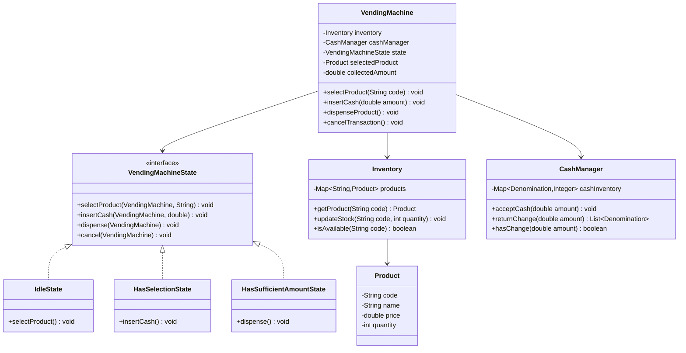

# Vending Machine - Low Level Design

## Problem Statement

Design a vending machine that accepts cash, dispenses products, returns change, and manages inventory. The machine should handle various product types, payment methods, and out-of-stock scenarios.

---

## Requirements

### Functional Requirements
1. Display available products with prices
2. Accept cash (coins and notes)
3. Select product
4. Dispense product
5. Return change
6. Handle out-of-stock items
7. Refund on cancellation

### Non-Functional Requirements
1. **State Management**: Clear state transitions
2. **Thread Safety**: Handle concurrent operations
3. **Inventory Management**: Track stock levels
4. **Cash Management**: Sufficient change availability

---

## Class Diagram



---

## Key Implementation

```java
public class Product {
    private final String code;
    private final String name;
    private final double price;
    private int quantity;

    public Product(String code, String name, double price, int quantity) {
        this.code = code;
        this.name = name;
        this.price = price;
        this.quantity = quantity;
    }

    public boolean isAvailable() {
        return quantity > 0;
    }

    public void decrementQuantity() {
        if (quantity > 0) quantity--;
    }

    public String getCode() { return code; }
    public String getName() { return name; }
    public double getPrice() { return price; }
    public int getQuantity() { return quantity; }
}

public class Inventory {
    private final Map<String, Product> products;

    public Inventory() {
        this.products = new ConcurrentHashMap<>();
    }

    public void addProduct(Product product) {
        products.put(product.getCode(), product);
    }

    public Product getProduct(String code) {
        return products.get(code);
    }

    public boolean isAvailable(String code) {
        Product product = products.get(code);
        return product != null && product.isAvailable();
    }

    public void updateStock(String code) {
        Product product = products.get(code);
        if (product != null) {
            product.decrementQuantity();
        }
    }

    public void displayProducts() {
        System.out.println("\n=== Available Products ===");
        products.values().forEach(p ->
            System.out.println(p.getCode() + " - " + p.getName() +
                             " - $" + p.getPrice() + " (" + p.getQuantity() + " left)")
        );
    }
}

public enum Denomination {
    ONE(1.0),
    FIVE(5.0),
    TEN(10.0),
    TWENTY(20.0);

    private final double value;

    Denomination(double value) {
        this.value = value;
    }

    public double getValue() { return value; }
}

public class CashManager {
    private final Map<Denomination, Integer> cashInventory;
    private double totalCash;

    public CashManager() {
        this.cashInventory = new HashMap<>();
        for (Denomination denom : Denomination.values()) {
            cashInventory.put(denom, 10);  // Initial change
        }
        this.totalCash = 0;
    }

    public void acceptCash(double amount) {
        totalCash += amount;
        System.out.println("Accepted: $" + amount);
    }

    public List<Denomination> returnChange(double amount) {
        List<Denomination> change = new ArrayList<>();
        double remaining = amount;

        // Greedy algorithm - largest denomination first
        for (Denomination denom : Denomination.values()) {
            while (remaining >= denom.getValue() &&
                   cashInventory.get(denom) > 0) {
                change.add(denom);
                cashInventory.put(denom, cashInventory.get(denom) - 1);
                remaining -= denom.getValue();
                remaining = Math.round(remaining * 100.0) / 100.0;  // Avoid floating point errors
            }
        }

        if (remaining > 0.01) {  // Couldn't return exact change
            // Return all change back
            for (Denomination denom : change) {
                cashInventory.put(denom, cashInventory.get(denom) + 1);
            }
            throw new IllegalStateException("Insufficient change available");
        }

        return change;
    }

    public boolean hasChange(double amount) {
        // Simplified check
        return totalCash >= amount;
    }

    public double getTotalCash() {
        return totalCash;
    }
}

// State Pattern Interface
public interface VendingMachineState {
    void selectProduct(VendingMachine machine, String code);
    void insertCash(VendingMachine machine, double amount);
    void dispense(VendingMachine machine);
    void cancel(VendingMachine machine);
}

public class IdleState implements VendingMachineState {
    @Override
    public void selectProduct(VendingMachine machine, String code) {
        Product product = machine.getInventory().getProduct(code);

        if (product == null) {
            System.out.println("Invalid product code!");
            return;
        }

        if (!product.isAvailable()) {
            System.out.println("Product out of stock!");
            return;
        }

        machine.setSelectedProduct(product);
        machine.setState(new HasSelectionState());
        System.out.println("Selected: " + product.getName() + " - $" + product.getPrice());
        System.out.println("Please insert cash...");
    }

    @Override
    public void insertCash(VendingMachine machine, double amount) {
        System.out.println("Please select a product first!");
    }

    @Override
    public void dispense(VendingMachine machine) {
        System.out.println("Please select a product first!");
    }

    @Override
    public void cancel(VendingMachine machine) {
        System.out.println("No transaction to cancel");
    }
}

public class HasSelectionState implements VendingMachineState {
    @Override
    public void selectProduct(VendingMachine machine, String code) {
        System.out.println("Product already selected. Complete or cancel current transaction.");
    }

    @Override
    public void insertCash(VendingMachine machine, double amount) {
        machine.addCollectedAmount(amount);
        machine.getCashManager().acceptCash(amount);

        System.out.println("Total collected: $" + machine.getCollectedAmount());

        if (machine.getCollectedAmount() >= machine.getSelectedProduct().getPrice()) {
            machine.setState(new HasSufficientAmountState());
            System.out.println("Sufficient amount collected. Dispensing...");
            machine.dispenseProduct();
        } else {
            double remaining = machine.getSelectedProduct().getPrice() - machine.getCollectedAmount();
            System.out.println("Please insert $" + String.format("%.2f", remaining) + " more");
        }
    }

    @Override
    public void dispense(VendingMachine machine) {
        System.out.println("Insufficient amount!");
    }

    @Override
    public void cancel(VendingMachine machine) {
        double refund = machine.getCollectedAmount();
        if (refund > 0) {
            System.out.println("Refunding $" + refund);
            try {
                machine.getCashManager().returnChange(refund);
            } catch (IllegalStateException e) {
                System.out.println("Error: " + e.getMessage());
            }
        }
        machine.reset();
    }
}

public class HasSufficientAmountState implements VendingMachineState {
    @Override
    public void selectProduct(VendingMachine machine, String code) {
        System.out.println("Transaction in progress!");
    }

    @Override
    public void insertCash(VendingMachine machine, double amount) {
        System.out.println("Sufficient amount already collected!");
    }

    @Override
    public void dispense(VendingMachine machine) {
        Product product = machine.getSelectedProduct();

        // Dispense product
        System.out.println("Dispensing: " + product.getName());
        machine.getInventory().updateStock(product.getCode());

        // Return change
        double change = machine.getCollectedAmount() - product.getPrice();
        if (change > 0) {
            System.out.println("Returning change: $" + String.format("%.2f", change));
            try {
                machine.getCashManager().returnChange(change);
            } catch (IllegalStateException e) {
                System.out.println("Error: " + e.getMessage());
            }
        }

        System.out.println("Thank you!");
        machine.reset();
    }

    @Override
    public void cancel(VendingMachine machine) {
        System.out.println("Cannot cancel - product being dispensed");
    }
}

public class VendingMachine {
    private final Inventory inventory;
    private final CashManager cashManager;
    private VendingMachineState state;
    private Product selectedProduct;
    private double collectedAmount;

    public VendingMachine() {
        this.inventory = new Inventory();
        this.cashManager = new CashManager();
        this.state = new IdleState();
        this.collectedAmount = 0;
    }

    public void selectProduct(String code) {
        state.selectProduct(this, code);
    }

    public void insertCash(double amount) {
        state.insertCash(this, amount);
    }

    public void dispenseProduct() {
        state.dispense(this);
    }

    public void cancelTransaction() {
        state.cancel(this);
    }

    public void reset() {
        this.state = new IdleState();
        this.selectedProduct = null;
        this.collectedAmount = 0;
    }

    public void addCollectedAmount(double amount) {
        this.collectedAmount += amount;
    }

    // Getters and setters
    public Inventory getInventory() { return inventory; }
    public CashManager getCashManager() { return cashManager; }
    public Product getSelectedProduct() { return selectedProduct; }
    public double getCollectedAmount() { return collectedAmount; }

    public void setSelectedProduct(Product product) {
        this.selectedProduct = product;
    }

    public void setState(VendingMachineState state) {
        this.state = state;
    }

    public void displayProducts() {
        inventory.displayProducts();
    }
}
```

---

## Sample Usage

```java
public class VendingMachineDemo {
    public static void main(String[] args) {
        VendingMachine machine = new VendingMachine();

        // Stock products
        machine.getInventory().addProduct(new Product("A1", "Coke", 1.50, 10));
        machine.getInventory().addProduct(new Product("A2", "Pepsi", 1.50, 10));
        machine.getInventory().addProduct(new Product("B1", "Chips", 2.00, 5));
        machine.getInventory().addProduct(new Product("B2", "Candy", 1.00, 8));

        // Display products
        machine.displayProducts();

        // Purchase flow
        machine.selectProduct("A1");
        machine.insertCash(1.00);
        machine.insertCash(0.50);
        // Product dispensed automatically

        machine.displayProducts();

        // Purchase with change
        machine.selectProduct("B1");
        machine.insertCash(5.00);

        // Cancel transaction
        machine.selectProduct("B2");
        machine.insertCash(0.50);
        machine.cancelTransaction();  // Get refund
    }
}
```

---

## Design Decisions

### 1. **State Pattern**
**Decision**: Use State pattern for machine states
**Reasoning**:
- Clean state transitions
- Each state handles its own logic
- Prevents invalid operations (e.g., dispensing before payment)
- Easy to add new states

### 2. **Automatic Dispensing**
**Decision**: Dispense automatically when sufficient amount reached
**Reasoning**:
- Better user experience
- Mimics real vending machines
- Reduces manual steps

### 3. **Greedy Change Algorithm**
**Decision**: Return largest denominations first
**Reasoning**:
- Minimizes number of bills/coins
- Standard practice
- O(n) complexity where n = number of denominations

---

## Summary

Vending Machine demonstrates:
- **State Pattern**: Clean state management
- **Inventory Management**: Stock tracking
- **Transaction Handling**: Payment and change
- **Error Handling**: Out-of-stock, insufficient change
