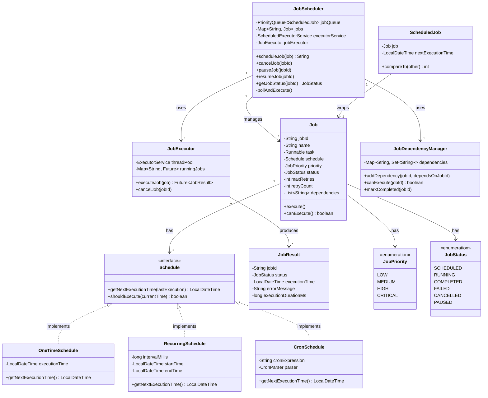

# Job Scheduler - Low Level Design

## Problem Statement

Design a job scheduling system similar to Cron that allows users to schedule tasks to run at specific times or intervals. The system should support one-time jobs, recurring jobs, delayed execution, priority-based scheduling, and job dependency management.

**Real-world context**: Similar to Quartz Scheduler, Kubernetes CronJobs, or Unix cron.

---

## Requirements

### Functional Requirements
1. Schedule one-time jobs at specific time
2. Schedule recurring jobs (every N seconds/minutes/hours/days)
3. Schedule jobs with cron expressions (e.g., "0 0 * * *")
4. Cancel scheduled jobs
5. Priority-based job execution
6. Job dependencies (Job B runs after Job A completes)
7. Retry failed jobs with exponential backoff
8. Get job status and execution history
9. Pause/resume jobs

### Non-Functional Requirements
1. **Accuracy**: Jobs execute within 1 second of scheduled time
2. **Reliability**: Failed jobs are retried, state persisted
3. **Scalability**: Handle 10,000+ concurrent jobs
4. **Performance**: Minimal CPU usage when idle
5. **Thread-Safety**: Concurrent job scheduling and execution

### Out of Scope
1. Distributed scheduling across multiple servers
2. UI for job management
3. Job result persistence in database
4. Complex workflow orchestration (DAGs)

---

## Core Entities & Relationships

1. **Job**: Represents a task to execute
2. **Schedule**: Defines when job should run (one-time, recurring, cron)
3. **JobScheduler**: Main coordinator managing all jobs
4. **JobExecutor**: Thread pool executing jobs
5. **JobResult**: Execution result with status
6. **JobDependency**: Relationship between jobs

**Relationships**:
- Job HAS-ONE Schedule
- JobScheduler MANAGES-MANY Job
- JobExecutor EXECUTES Job
- Job HAS-MANY JobResult (execution history)
- Job HAS-MANY JobDependency

---

## Class Diagram



---

## Design Patterns Used

### 1. **Strategy Pattern**
- **Where**: Schedule interface with OneTimeSchedule, RecurringSchedule, CronSchedule
- **Why**: Different scheduling strategies without changing Job class
- **Benefit**: Easy to add custom schedule types

### 2. **Command Pattern**
- **Where**: Job wraps Runnable task
- **Why**: Encapsulates executable task as object
- **Benefit**: Can store, pass, and execute tasks polymorphically

### 3. **Singleton Pattern**
- **Where**: JobScheduler
- **Why**: Single global scheduler managing all jobs
- **Benefit**: Centralized control, prevents duplicate schedulers

### 4. **Observer Pattern**
- **Where**: JobListener for job events
- **Why**: Notify multiple components of job state changes
- **Benefit**: Loose coupling between scheduler and monitoring

### 5. **Template Method Pattern**
- **Where**: Job.execute() with hooks (beforeExecute, afterExecute)
- **Why**: Common execution flow with customizable steps
- **Benefit**: Consistent error handling, logging

---

## Detailed Class Design

```java
// ============== Core Entities ==============

public class Job {
    private final String jobId;
    private final String name;
    private final Runnable task;
    private final Schedule schedule;
    private final JobPriority priority;
    private JobStatus status;
    private int maxRetries;
    private int retryCount;
    private final List<String> dependencies;
    private final List<JobResult> executionHistory;

    public Job(String name, Runnable task, Schedule schedule, JobPriority priority) {
        this.jobId = UUID.randomUUID().toString();
        this.name = name;
        this.task = task;
        this.schedule = schedule;
        this.priority = priority;
        this.status = JobStatus.SCHEDULED;
        this.maxRetries = 3;
        this.retryCount = 0;
        this.dependencies = new ArrayList<>();
        this.executionHistory = new ArrayList<>();
    }

    public JobResult execute() {
        status = JobStatus.RUNNING;
        long startTime = System.currentTimeMillis();
        JobResult result;

        try {
            beforeExecute();
            task.run();
            afterExecute();

            result = new JobResult(jobId, JobStatus.COMPLETED,
                    LocalDateTime.now(), null, System.currentTimeMillis() - startTime);
            status = JobStatus.COMPLETED;
            retryCount = 0; // Reset on success
        } catch (Exception e) {
            result = new JobResult(jobId, JobStatus.FAILED,
                    LocalDateTime.now(), e.getMessage(), System.currentTimeMillis() - startTime);
            status = JobStatus.FAILED;
            retryCount++;
        }

        executionHistory.add(result);
        return result;
    }

    protected void beforeExecute() {
        // Hook for subclasses
        System.out.println("Executing job: " + name);
    }

    protected void afterExecute() {
        // Hook for subclasses
        System.out.println("Completed job: " + name);
    }

    public boolean shouldRetry() {
        return status == JobStatus.FAILED && retryCount < maxRetries;
    }

    public long getRetryDelayMillis() {
        // Exponential backoff: 2^retryCount * 1000ms
        return (long) Math.pow(2, retryCount) * 1000;
    }

    // Getters and setters
    public String getJobId() { return jobId; }
    public String getName() { return name; }
    public Schedule getSchedule() { return schedule; }
    public JobPriority getPriority() { return priority; }
    public JobStatus getStatus() { return status; }
    public void setStatus(JobStatus status) { this.status = status; }
    public List<String> getDependencies() { return new ArrayList<>(dependencies); }
    public void addDependency(String jobId) { dependencies.add(jobId); }
    public List<JobResult> getExecutionHistory() { return new ArrayList<>(executionHistory); }
}

public enum JobPriority {
    LOW(1),
    MEDIUM(2),
    HIGH(3),
    CRITICAL(4);

    private final int value;

    JobPriority(int value) {
        this.value = value;
    }

    public int getValue() {
        return value;
    }
}

public enum JobStatus {
    SCHEDULED,
    RUNNING,
    COMPLETED,
    FAILED,
    CANCELLED,
    PAUSED
}

// ============== Scheduling Strategies ==============

public interface Schedule {
    LocalDateTime getNextExecutionTime(LocalDateTime lastExecution);
    boolean shouldExecute(LocalDateTime currentTime);
}

public class OneTimeSchedule implements Schedule {
    private final LocalDateTime executionTime;
    private boolean executed;

    public OneTimeSchedule(LocalDateTime executionTime) {
        this.executionTime = executionTime;
        this.executed = false;
    }

    @Override
    public LocalDateTime getNextExecutionTime(LocalDateTime lastExecution) {
        if (executed) {
            return null; // No more executions
        }
        return executionTime;
    }

    @Override
    public boolean shouldExecute(LocalDateTime currentTime) {
        return !executed && currentTime.isAfter(executionTime);
    }

    public void markExecuted() {
        this.executed = true;
    }
}

public class RecurringSchedule implements Schedule {
    private final long intervalMillis;
    private final LocalDateTime startTime;
    private final LocalDateTime endTime; // Optional

    public RecurringSchedule(long intervalMillis, LocalDateTime startTime, LocalDateTime endTime) {
        this.intervalMillis = intervalMillis;
        this.startTime = startTime;
        this.endTime = endTime;
    }

    public RecurringSchedule(long intervalMillis) {
        this(intervalMillis, LocalDateTime.now(), null);
    }

    @Override
    public LocalDateTime getNextExecutionTime(LocalDateTime lastExecution) {
        if (lastExecution == null) {
            return startTime;
        }

        LocalDateTime next = lastExecution.plus(intervalMillis, ChronoUnit.MILLIS);

        if (endTime != null && next.isAfter(endTime)) {
            return null; // Schedule ended
        }

        return next;
    }

    @Override
    public boolean shouldExecute(LocalDateTime currentTime) {
        if (currentTime.isBefore(startTime)) {
            return false;
        }

        if (endTime != null && currentTime.isAfter(endTime)) {
            return false;
        }

        return true;
    }
}

public class CronSchedule implements Schedule {
    private final String cronExpression;
    private LocalDateTime lastExecutionTime;

    public CronSchedule(String cronExpression) {
        this.cronExpression = cronExpression;
        validateCronExpression(cronExpression);
    }

    @Override
    public LocalDateTime getNextExecutionTime(LocalDateTime lastExecution) {
        // Simplified cron parsing (production would use library like quartz-cron)
        return calculateNextExecutionTime(lastExecution != null ? lastExecution : LocalDateTime.now());
    }

    @Override
    public boolean shouldExecute(LocalDateTime currentTime) {
        LocalDateTime next = getNextExecutionTime(lastExecutionTime);
        return next != null && currentTime.isAfter(next);
    }

    private void validateCronExpression(String expression) {
        // Cron format: "minute hour day month dayOfWeek"
        String[] parts = expression.split(" ");
        if (parts.length != 5) {
            throw new IllegalArgumentException("Invalid cron expression. Expected 5 fields.");
        }
    }

    private LocalDateTime calculateNextExecutionTime(LocalDateTime from) {
        // Simplified implementation
        // Production: Use library like CronSequenceGenerator from Spring or Quartz
        String[] parts = cronExpression.split(" ");

        int minute = parseField(parts[0], 0, 59);
        int hour = parseField(parts[1], 0, 23);
        int day = parseField(parts[2], 1, 31);
        int month = parseField(parts[3], 1, 12);

        LocalDateTime next = from.plusMinutes(1).withSecond(0).withNano(0);

        // Find next matching time
        while (true) {
            if (matches(next, minute, hour, day, month)) {
                return next;
            }
            next = next.plusMinutes(1);

            // Safety check
            if (next.isAfter(from.plusYears(1))) {
                return null;
            }
        }
    }

    private boolean matches(LocalDateTime time, int minute, int hour, int day, int month) {
        return (minute == -1 || time.getMinute() == minute) &&
               (hour == -1 || time.getHour() == hour) &&
               (day == -1 || time.getDayOfMonth() == day) &&
               (month == -1 || time.getMonthValue() == month);
    }

    private int parseField(String field, int min, int max) {
        if ("*".equals(field)) {
            return -1; // Wildcard
        }
        int value = Integer.parseInt(field);
        if (value < min || value > max) {
            throw new IllegalArgumentException("Value out of range: " + value);
        }
        return value;
    }
}

// ============== Scheduled Job Wrapper ==============

public class ScheduledJob implements Comparable<ScheduledJob> {
    private final Job job;
    private LocalDateTime nextExecutionTime;

    public ScheduledJob(Job job, LocalDateTime nextExecutionTime) {
        this.job = job;
        this.nextExecutionTime = nextExecutionTime;
    }

    @Override
    public int compareTo(ScheduledJob other) {
        // First compare by execution time
        int timeComparison = this.nextExecutionTime.compareTo(other.nextExecutionTime);
        if (timeComparison != 0) {
            return timeComparison;
        }

        // Then by priority (higher priority first)
        return Integer.compare(other.job.getPriority().getValue(),
                this.job.getPriority().getValue());
    }

    public void updateNextExecutionTime() {
        this.nextExecutionTime = job.getSchedule().getNextExecutionTime(nextExecutionTime);
    }

    // Getters
    public Job getJob() { return job; }
    public LocalDateTime getNextExecutionTime() { return nextExecutionTime; }
}

// ============== Job Executor ==============

public class JobExecutor {
    private final ExecutorService threadPool;
    private final Map<String, Future<JobResult>> runningJobs;
    private final int maxConcurrentJobs;

    public JobExecutor(int maxConcurrentJobs) {
        this.maxConcurrentJobs = maxConcurrentJobs;
        this.threadPool = Executors.newFixedThreadPool(maxConcurrentJobs);
        this.runningJobs = new ConcurrentHashMap<>();
    }

    public Future<JobResult> executeJob(Job job) {
        if (runningJobs.size() >= maxConcurrentJobs) {
            throw new IllegalStateException("Max concurrent jobs reached");
        }

        Future<JobResult> future = threadPool.submit(() -> {
            try {
                return job.execute();
            } finally {
                runningJobs.remove(job.getJobId());
            }
        });

        runningJobs.put(job.getJobId(), future);
        return future;
    }

    public void cancelJob(String jobId) {
        Future<JobResult> future = runningJobs.get(jobId);
        if (future != null) {
            future.cancel(true);
            runningJobs.remove(jobId);
        }
    }

    public boolean isRunning(String jobId) {
        return runningJobs.containsKey(jobId);
    }

    public void shutdown() {
        threadPool.shutdown();
        try {
            if (!threadPool.awaitTermination(60, TimeUnit.SECONDS)) {
                threadPool.shutdownNow();
            }
        } catch (InterruptedException e) {
            threadPool.shutdownNow();
        }
    }
}

// ============== Job Result ==============

public class JobResult {
    private final String jobId;
    private final JobStatus status;
    private final LocalDateTime executionTime;
    private final String errorMessage;
    private final long executionDurationMs;

    public JobResult(String jobId, JobStatus status, LocalDateTime executionTime,
                     String errorMessage, long executionDurationMs) {
        this.jobId = jobId;
        this.status = status;
        this.executionTime = executionTime;
        this.errorMessage = errorMessage;
        this.executionDurationMs = executionDurationMs;
    }

    // Getters
    public String getJobId() { return jobId; }
    public JobStatus getStatus() { return status; }
    public LocalDateTime getExecutionTime() { return executionTime; }
    public String getErrorMessage() { return errorMessage; }
    public long getExecutionDurationMs() { return executionDurationMs; }

    @Override
    public String toString() {
        return String.format("JobResult{jobId='%s', status=%s, executionTime=%s, duration=%dms}",
                jobId, status, executionTime, executionDurationMs);
    }
}

// ============== Job Dependency Manager ==============

public class JobDependencyManager {
    private final Map<String, Set<String>> dependencies; // jobId -> set of jobs it depends on
    private final Map<String, JobStatus> jobStatuses;

    public JobDependencyManager() {
        this.dependencies = new ConcurrentHashMap<>();
        this.jobStatuses = new ConcurrentHashMap<>();
    }

    public void addDependency(String jobId, String dependsOnJobId) {
        dependencies.computeIfAbsent(jobId, k -> ConcurrentHashMap.newKeySet()).add(dependsOnJobId);
    }

    public boolean canExecute(String jobId) {
        Set<String> deps = dependencies.get(jobId);
        if (deps == null || deps.isEmpty()) {
            return true;
        }

        // All dependencies must be completed
        return deps.stream()
                .allMatch(depId -> JobStatus.COMPLETED.equals(jobStatuses.get(depId)));
    }

    public void updateJobStatus(String jobId, JobStatus status) {
        jobStatuses.put(jobId, status);
    }

    public Set<String> getDependencies(String jobId) {
        return new HashSet<>(dependencies.getOrDefault(jobId, Collections.emptySet()));
    }
}

// ============== Main Scheduler ==============

public class JobScheduler {
    private static JobScheduler instance;
    private final PriorityQueue<ScheduledJob> jobQueue;
    private final Map<String, Job> jobs;
    private final JobExecutor jobExecutor;
    private final JobDependencyManager dependencyManager;
    private final ScheduledExecutorService schedulerThread;
    private final ReentrantLock lock;

    private JobScheduler() {
        this.jobQueue = new PriorityQueue<>();
        this.jobs = new ConcurrentHashMap<>();
        this.jobExecutor = new JobExecutor(10); // Max 10 concurrent jobs
        this.dependencyManager = new JobDependencyManager();
        this.lock = new ReentrantLock();
        this.schedulerThread = Executors.newSingleThreadScheduledExecutor();

        startScheduler();
    }

    public static synchronized JobScheduler getInstance() {
        if (instance == null) {
            instance = new JobScheduler();
        }
        return instance;
    }

    public String scheduleJob(Job job) {
        lock.lock();
        try {
            jobs.put(job.getJobId(), job);

            LocalDateTime nextExecution = job.getSchedule().getNextExecutionTime(null);
            if (nextExecution != null) {
                jobQueue.offer(new ScheduledJob(job, nextExecution));
            }

            return job.getJobId();
        } finally {
            lock.unlock();
        }
    }

    public void cancelJob(String jobId) {
        lock.lock();
        try {
            Job job = jobs.get(jobId);
            if (job != null) {
                job.setStatus(JobStatus.CANCELLED);
                jobExecutor.cancelJob(jobId);
                jobs.remove(jobId);
                jobQueue.removeIf(sj -> sj.getJob().getJobId().equals(jobId));
            }
        } finally {
            lock.unlock();
        }
    }

    public void pauseJob(String jobId) {
        Job job = jobs.get(jobId);
        if (job != null) {
            job.setStatus(JobStatus.PAUSED);
        }
    }

    public void resumeJob(String jobId) {
        lock.lock();
        try {
            Job job = jobs.get(jobId);
            if (job != null && job.getStatus() == JobStatus.PAUSED) {
                job.setStatus(JobStatus.SCHEDULED);
                LocalDateTime nextExecution = job.getSchedule().getNextExecutionTime(LocalDateTime.now());
                if (nextExecution != null) {
                    jobQueue.offer(new ScheduledJob(job, nextExecution));
                }
            }
        } finally {
            lock.unlock();
        }
    }

    public JobStatus getJobStatus(String jobId) {
        Job job = jobs.get(jobId);
        return job != null ? job.getStatus() : null;
    }

    public Job getJob(String jobId) {
        return jobs.get(jobId);
    }

    private void startScheduler() {
        schedulerThread.scheduleAtFixedRate(this::pollAndExecute, 0, 100, TimeUnit.MILLISECONDS);
    }

    private void pollAndExecute() {
        lock.lock();
        try {
            LocalDateTime now = LocalDateTime.now();

            while (!jobQueue.isEmpty()) {
                ScheduledJob scheduledJob = jobQueue.peek();

                if (scheduledJob.getNextExecutionTime().isAfter(now)) {
                    break; // Not yet time
                }

                jobQueue.poll(); // Remove from queue

                Job job = scheduledJob.getJob();

                // Check if job can execute (not paused, dependencies met)
                if (!canExecuteJob(job)) {
                    rescheduleJob(job);
                    continue;
                }

                // Execute job
                executeJob(job, scheduledJob);
            }
        } finally {
            lock.unlock();
        }
    }

    private boolean canExecuteJob(Job job) {
        if (job.getStatus() == JobStatus.PAUSED || job.getStatus() == JobStatus.CANCELLED) {
            return false;
        }

        return dependencyManager.canExecute(job.getJobId());
    }

    private void executeJob(Job job, ScheduledJob scheduledJob) {
        try {
            dependencyManager.updateJobStatus(job.getJobId(), JobStatus.RUNNING);

            Future<JobResult> future = jobExecutor.executeJob(job);

            // Handle result asynchronously
            CompletableFuture.runAsync(() -> {
                try {
                    JobResult result = future.get();
                    handleJobResult(job, result, scheduledJob);
                } catch (Exception e) {
                    handleJobFailure(job, e, scheduledJob);
                }
            });
        } catch (Exception e) {
            handleJobFailure(job, e, scheduledJob);
        }
    }

    private void handleJobResult(Job job, JobResult result, ScheduledJob scheduledJob) {
        lock.lock();
        try {
            dependencyManager.updateJobStatus(job.getJobId(), result.getStatus());

            if (result.getStatus() == JobStatus.COMPLETED) {
                // Reschedule if recurring
                rescheduleJob(job);
            } else if (result.getStatus() == JobStatus.FAILED && job.shouldRetry()) {
                // Retry with backoff
                scheduleRetry(job);
            }
        } finally {
            lock.unlock();
        }
    }

    private void handleJobFailure(Job job, Exception e, ScheduledJob scheduledJob) {
        lock.lock();
        try {
            dependencyManager.updateJobStatus(job.getJobId(), JobStatus.FAILED);

            if (job.shouldRetry()) {
                scheduleRetry(job);
            }
        } finally {
            lock.unlock();
        }
    }

    private void rescheduleJob(Job job) {
        LocalDateTime nextExecution = job.getSchedule().getNextExecutionTime(LocalDateTime.now());
        if (nextExecution != null) {
            jobQueue.offer(new ScheduledJob(job, nextExecution));
        } else {
            // Job schedule completed, remove from active jobs
            jobs.remove(job.getJobId());
        }
    }

    private void scheduleRetry(Job job) {
        long delayMillis = job.getRetryDelayMillis();
        LocalDateTime retryTime = LocalDateTime.now().plus(delayMillis, ChronoUnit.MILLIS);
        jobQueue.offer(new ScheduledJob(job, retryTime));
    }

    public void shutdown() {
        schedulerThread.shutdown();
        jobExecutor.shutdown();
    }
}
```

---

## Key Workflows

### 1. Schedule and Execute Job


### 2. Job with Dependencies


---

## Design Decisions & Reasoning

### 1. **PriorityQueue for Job Queue**
**Decision**: Use PriorityQueue ordered by execution time and priority.

**Reasoning**:
- Always process next job to execute
- O(log n) insertion and removal
- Natural ordering handles scheduling

**Alternative**: Delay Queue
- Similar performance
- PriorityQueue more flexible for custom comparators

### 2. **Polling vs Event-Driven**
**Decision**: Poll queue every 100ms.

**Reasoning**:
- Simple implementation
- Acceptable 100ms accuracy
- Lower complexity than event-driven

**Alternative**: Event-driven with timers
- More accurate (< 1ms)
- Higher complexity, more threads
- Overkill for most use cases

### 3. **Strategy Pattern for Schedules**
**Decision**: Separate Schedule interface.

**Reasoning**:
- Job doesn't know scheduling logic
- Easy to add custom schedules (lunar calendar, business days)
- Open/Closed Principle

### 4. **Exponential Backoff for Retries**
**Decision**: Retry delay = 2^retryCount * 1000ms.

**Reasoning**:
- Prevents thundering herd
- Gives transient failures time to recover
- Industry standard

### 5. **Separate JobExecutor Thread Pool**
**Decision**: Dedicated thread pool for job execution.

**Reasoning**:
- Isolates scheduling logic from execution
- Prevents long-running jobs from blocking scheduler
- Configurable concurrency limit

### 6. **Immutable ScheduledJob**
**Decision**: ScheduledJob is immutable wrapper.

**Reasoning**:
- Thread-safe comparison in PriorityQueue
- Clear separation between scheduling metadata and job logic
- Prevents accidental mutations

---

## SOLID Principles Application

### 1. **Single Responsibility Principle (SRP)**
- `Job`: Executes task
- `Schedule`: Determines when to run
- `JobScheduler`: Manages scheduling
- `JobExecutor`: Executes jobs in thread pool
- `JobDependencyManager`: Manages dependencies

Each class has one clear responsibility.

### 2. **Open/Closed Principle (OCP)**
- Adding new schedule types (e.g., `BusinessDaySchedule`) doesn't modify existing code:
```java
public class BusinessDaySchedule implements Schedule {
    @Override
    public LocalDateTime getNextExecutionTime(LocalDateTime lastExecution) {
        LocalDateTime next = lastExecution.plusDays(1);
        while (isWeekend(next) || isHoliday(next)) {
            next = next.plusDays(1);
        }
        return next;
    }
}
```

### 3. **Liskov Substitution Principle (LSP)**
- Any `Schedule` implementation can replace another without breaking JobScheduler
- All implementations honor `getNextExecutionTime()` contract

### 4. **Interface Segregation Principle (ISP)**
- `Schedule` interface has only necessary methods
- Clients don't depend on unused methods

### 5. **Dependency Inversion Principle (DIP)**
- `Job` depends on `Schedule` interface, not concrete implementations
- `JobScheduler` depends on abstractions (Job, Schedule), not concrete classes

---

## Extensibility & Future Enhancements

### 1. **Persistent Storage**
```java
public interface JobRepository {
    void saveJob(Job job);
    Job loadJob(String jobId);
    List<Job> loadAllActiveJobs();
}

// Load jobs on startup
jobRepository.loadAllActiveJobs().forEach(job -> scheduler.scheduleJob(job));
```

### 2. **Distributed Scheduling**
```java
public class DistributedJobScheduler extends JobScheduler {
    private ZooKeeper zooKeeper;

    @Override
    public String scheduleJob(Job job) {
        acquireDistributedLock(job.getJobId());
        try {
            return super.scheduleJob(job);
        } finally {
            releaseLock(job.getJobId());
        }
    }
}
```

### 3. **Job Monitoring Dashboard**
```java
public class JobMonitor {
    public Map<String, Object> getJobStatistics(String jobId) {
        Job job = scheduler.getJob(jobId);
        List<JobResult> history = job.getExecutionHistory();

        return Map.of(
            "totalExecutions", history.size(),
            "successRate", calculateSuccessRate(history),
            "avgDuration", calculateAvgDuration(history)
        );
    }
}
```

### 4. **Dynamic Job Updates**
```java
public void updateJobSchedule(String jobId, Schedule newSchedule) {
    Job job = jobs.get(jobId);
    job.setSchedule(newSchedule);
    rescheduleJob(job);
}
```

---

## Complexity Analysis

### Time Complexity

| Operation | Complexity | Explanation |
|-----------|-----------|-------------|
| `scheduleJob()` | O(log n) | PriorityQueue insertion |
| `cancelJob()` | O(n) | Remove from PriorityQueue |
| `pollAndExecute()` | O(log n) | Poll from queue |
| `executeJob()` | O(1) | Submit to thread pool |

### Space Complexity
- O(n) where n = number of scheduled jobs
- Each job + ScheduledJob wrapper

### Bottlenecks
1. **Large job queue**: 100k+ jobs slows down polling
2. **Thread pool exhaustion**: Max concurrent jobs limit
3. **Lock contention**: High frequency scheduling

### Optimizations
1. **Hierarchical timing wheels** for better O(1) scheduling
2. **Partitioned queues** by time range (next hour, next day, etc.)
3. **Lock-free data structures** for high concurrency

---

## Testing Strategy

### Key Test Cases

```java
@Test
public void testOneTimeJobExecution() throws InterruptedException {
    AtomicBoolean executed = new AtomicBoolean(false);
    Runnable task = () -> executed.set(true);

    Job job = new Job("test-job", task,
            new OneTimeSchedule(LocalDateTime.now().plusSeconds(1)),
            JobPriority.MEDIUM);

    scheduler.scheduleJob(job);
    Thread.sleep(2000);

    assertTrue(executed.get());
    assertEquals(JobStatus.COMPLETED, job.getStatus());
}

@Test
public void testRecurringJobExecution() throws InterruptedException {
    AtomicInteger count = new AtomicInteger(0);
    Runnable task = () -> count.incrementAndGet();

    Job job = new Job("recurring-job", task,
            new RecurringSchedule(500), // Every 500ms
            JobPriority.MEDIUM);

    scheduler.scheduleJob(job);
    Thread.sleep(1600); // Should execute ~3 times

    assertTrue(count.get() >= 3);
}

@Test
public void testJobDependencies() throws InterruptedException {
    List<String> executionOrder = Collections.synchronizedList(new ArrayList<>());

    Job jobA = new Job("jobA", () -> executionOrder.add("A"),
            new OneTimeSchedule(LocalDateTime.now().plusSeconds(1)),
            JobPriority.MEDIUM);

    Job jobB = new Job("jobB", () -> executionOrder.add("B"),
            new OneTimeSchedule(LocalDateTime.now().plusSeconds(1)),
            JobPriority.MEDIUM);
    jobB.addDependency(jobA.getJobId());

    scheduler.scheduleJob(jobA);
    scheduler.scheduleJob(jobB);

    Thread.sleep(3000);

    assertEquals(Arrays.asList("A", "B"), executionOrder);
}

@Test
public void testRetryOnFailure() {
    AtomicInteger attempts = new AtomicInteger(0);
    Runnable failingTask = () -> {
        attempts.incrementAndGet();
        throw new RuntimeException("Simulated failure");
    };

    Job job = new Job("failing-job", failingTask,
            new OneTimeSchedule(LocalDateTime.now().plusSeconds(1)),
            JobPriority.MEDIUM);

    scheduler.scheduleJob(job);
    Thread.sleep(10000); // Wait for retries

    assertEquals(4, attempts.get()); // Initial + 3 retries
}
```

---

## Summary

This Job Scheduler demonstrates:

1. **Flexible Scheduling**: One-time, recurring, and cron-based schedules
2. **Priority-Based Execution**: Critical jobs run first
3. **Dependency Management**: Jobs wait for dependencies
4. **Fault Tolerance**: Automatic retries with exponential backoff
5. **Concurrency Control**: Thread-safe execution with configurable parallelism
6. **SOLID Design**: Clean separation of concerns

**Key Takeaways**:
- PriorityQueue enables efficient time-based scheduling
- Strategy pattern provides scheduling flexibility
- Separate executor thread pool isolates long-running jobs
- Exponential backoff prevents retry storms

**Production Considerations**:
- Persist jobs to survive restarts
- Use distributed locks for multi-instance deployments (ZooKeeper, Redis)
- Implement job result persistence
- Add monitoring and alerting for failed jobs
- Consider Quartz or Kubernetes CronJobs for production systems
