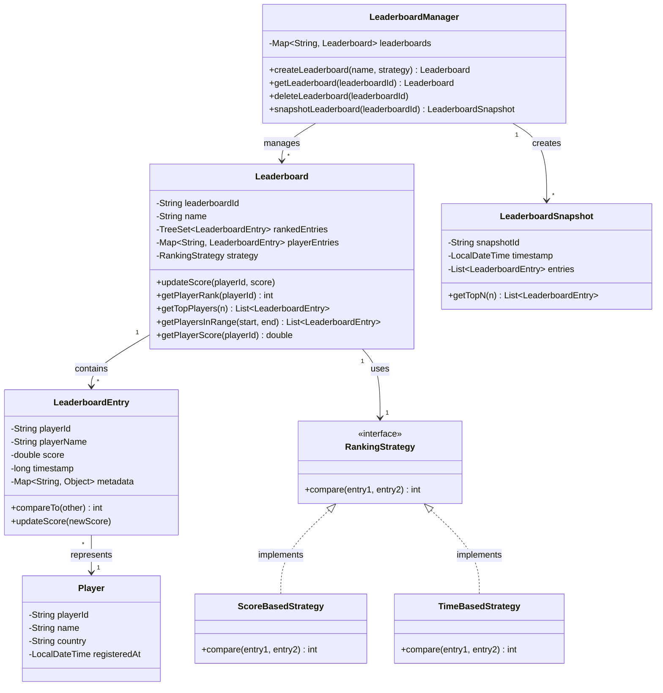
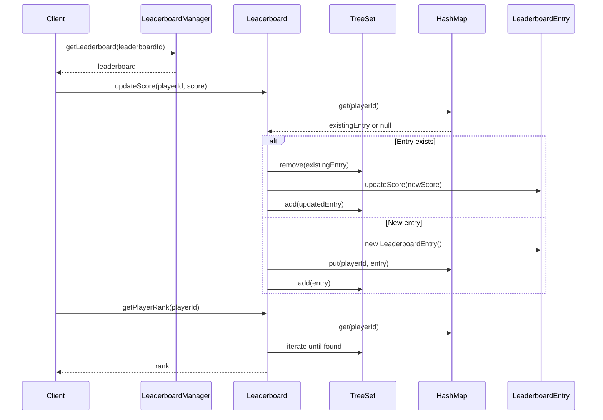
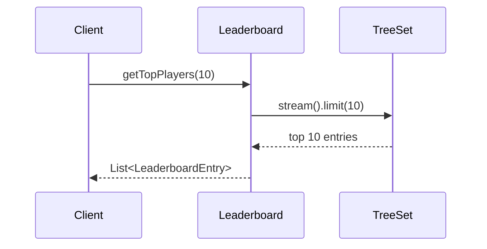

# Leaderboard System - Low Level Design

## Problem Statement

Design a real-time leaderboard system for gaming or coding contests that efficiently handles score updates, ranking queries, and supports millions of players. The system must provide fast updates and queries while maintaining accurate rankings.

**Real-world context**: Similar to systems used by Codeforces, LeetCode contests, gaming platforms, or sports apps.

---

## Requirements

### Functional Requirements
1. Add/update player scores
2. Get player rank by player ID
3. Get top N players
4. Get players within a rank range
5. Handle tie-breaking (higher score first, then timestamp)
6. Support multiple leaderboards (different contests/games)
7. Historical leaderboard snapshots

### Non-Functional Requirements
1. **Performance**: O(log n) for score updates and rank queries
2. **Scalability**: Support millions of players
3. **Real-time**: Near-instant updates (< 100ms)
4. **Consistency**: Accurate rankings at all times
5. **Availability**: 99.9% uptime

### Out of Scope
1. Distributed leaderboard across multiple servers
2. Cheat detection
3. Player authentication
4. Prize distribution

---

## Core Entities & Relationships

1. **Player**: User with a score
2. **Score**: Player's points with timestamp
3. **Leaderboard**: Container managing all rankings
4. **LeaderboardEntry**: Score + metadata
5. **RankingStrategy**: Defines how to rank (score-based, time-based)

**Relationships**:
- Leaderboard HAS-MANY LeaderboardEntry
- LeaderboardEntry BELONGS-TO Player
- Leaderboard USES RankingStrategy

---

## Class Diagram



---

## Design Patterns Used

### 1. **Strategy Pattern**
- **Where**: RankingStrategy interface with ScoreBasedStrategy, TimeBasedStrategy
- **Why**: Different contests need different ranking algorithms
- **Benefit**: Easy to add new ranking rules without modifying Leaderboard

### 2. **Singleton Pattern**
- **Where**: LeaderboardManager
- **Why**: Single source of truth for all leaderboards
- **Benefit**: Centralized management, prevents duplicate leaderboards

### 3. **Memento Pattern**
- **Where**: LeaderboardSnapshot
- **Why**: Capture leaderboard state at specific time
- **Benefit**: Historical tracking, rollback capability

### 4. **Factory Pattern**
- **Where**: LeaderboardManager creating different leaderboards
- **Why**: Encapsulate leaderboard creation logic
- **Benefit**: Consistent initialization

---

## Detailed Class Design

```java
// ============== Core Entities ==============

public class Player {
    private final String playerId;
    private final String name;
    private final String country;
    private final LocalDateTime registeredAt;

    public Player(String playerId, String name, String country) {
        this.playerId = playerId;
        this.name = name;
        this.country = country;
        this.registeredAt = LocalDateTime.now();
    }

    // Getters
    public String getPlayerId() { return playerId; }
    public String getName() { return name; }
    public String getCountry() { return country; }
}

public class LeaderboardEntry implements Comparable<LeaderboardEntry> {
    private final String playerId;
    private final String playerName;
    private double score;
    private long timestamp;
    private final Map<String, Object> metadata;

    public LeaderboardEntry(String playerId, String playerName, double score) {
        this.playerId = playerId;
        this.playerName = playerName;
        this.score = score;
        this.timestamp = System.currentTimeMillis();
        this.metadata = new HashMap<>();
    }

    public void updateScore(double newScore) {
        this.score = newScore;
        this.timestamp = System.currentTimeMillis();
    }

    @Override
    public int compareTo(LeaderboardEntry other) {
        // Higher score is better
        int scoreComparison = Double.compare(other.score, this.score);
        if (scoreComparison != 0) {
            return scoreComparison;
        }

        // If scores are equal, earlier timestamp wins (submitted first)
        return Long.compare(this.timestamp, other.timestamp);
    }

    @Override
    public boolean equals(Object o) {
        if (this == o) return true;
        if (!(o instanceof LeaderboardEntry)) return false;
        LeaderboardEntry that = (LeaderboardEntry) o;
        return playerId.equals(that.playerId);
    }

    @Override
    public int hashCode() {
        return Objects.hash(playerId);
    }

    // Getters
    public String getPlayerId() { return playerId; }
    public String getPlayerName() { return playerName; }
    public double getScore() { return score; }
    public long getTimestamp() { return timestamp; }
    public Map<String, Object> getMetadata() { return new HashMap<>(metadata); }
}

// ============== Ranking Strategies ==============

public interface RankingStrategy {
    int compare(LeaderboardEntry entry1, LeaderboardEntry entry2);
}

public class ScoreBasedStrategy implements RankingStrategy {
    @Override
    public int compare(LeaderboardEntry entry1, LeaderboardEntry entry2) {
        // Higher score first, then earlier timestamp
        int scoreComparison = Double.compare(entry2.getScore(), entry1.getScore());
        if (scoreComparison != 0) {
            return scoreComparison;
        }
        return Long.compare(entry1.getTimestamp(), entry2.getTimestamp());
    }
}

public class TimeBasedStrategy implements RankingStrategy {
    @Override
    public int compare(LeaderboardEntry entry1, LeaderboardEntry entry2) {
        // Earlier timestamp first (speed matters), then higher score
        int timeComparison = Long.compare(entry1.getTimestamp(), entry2.getTimestamp());
        if (timeComparison != 0) {
            return timeComparison;
        }
        return Double.compare(entry2.getScore(), entry1.getScore());
    }
}

// ============== Leaderboard Core ==============

public class Leaderboard {
    private final String leaderboardId;
    private final String name;
    private final TreeSet<LeaderboardEntry> rankedEntries;
    private final Map<String, LeaderboardEntry> playerEntries;
    private final RankingStrategy strategy;
    private final ReentrantReadWriteLock lock;

    public Leaderboard(String leaderboardId, String name, RankingStrategy strategy) {
        this.leaderboardId = leaderboardId;
        this.name = name;
        this.strategy = strategy;
        this.rankedEntries = new TreeSet<>((e1, e2) -> strategy.compare(e1, e2));
        this.playerEntries = new ConcurrentHashMap<>();
        this.lock = new ReentrantReadWriteLock();
    }

    /**
     * Update player score - O(log n)
     */
    public void updateScore(String playerId, String playerName, double score) {
        lock.writeLock().lock();
        try {
            LeaderboardEntry existingEntry = playerEntries.get(playerId);

            if (existingEntry != null) {
                // Remove old entry from TreeSet
                rankedEntries.remove(existingEntry);

                // Update score
                existingEntry.updateScore(score);

                // Re-insert with new score
                rankedEntries.add(existingEntry);
            } else {
                // New player
                LeaderboardEntry newEntry = new LeaderboardEntry(playerId, playerName, score);
                playerEntries.put(playerId, newEntry);
                rankedEntries.add(newEntry);
            }
        } finally {
            lock.writeLock().unlock();
        }
    }

    /**
     * Get player rank - O(n) in worst case, can be optimized with augmented tree
     */
    public int getPlayerRank(String playerId) {
        lock.readLock().lock();
        try {
            LeaderboardEntry entry = playerEntries.get(playerId);
            if (entry == null) {
                return -1;  // Player not found
            }

            int rank = 1;
            for (LeaderboardEntry e : rankedEntries) {
                if (e.equals(entry)) {
                    return rank;
                }
                rank++;
            }

            return -1;
        } finally {
            lock.readLock().unlock();
        }
    }

    /**
     * Get top N players - O(n)
     */
    public List<LeaderboardEntry> getTopPlayers(int n) {
        lock.readLock().lock();
        try {
            return rankedEntries.stream()
                    .limit(n)
                    .collect(Collectors.toList());
        } finally {
            lock.readLock().unlock();
        }
    }

    /**
     * Get players in rank range [start, end] - O(n)
     */
    public List<LeaderboardEntry> getPlayersInRange(int start, int end) {
        lock.readLock().lock();
        try {
            return rankedEntries.stream()
                    .skip(start - 1)
                    .limit(end - start + 1)
                    .collect(Collectors.toList());
        } finally {
            lock.readLock().unlock();
        }
    }

    /**
     * Get player score - O(1)
     */
    public Double getPlayerScore(String playerId) {
        lock.readLock().lock();
        try {
            LeaderboardEntry entry = playerEntries.get(playerId);
            return entry != null ? entry.getScore() : null;
        } finally {
            lock.readLock().unlock();
        }
    }

    /**
     * Get surrounding players (players above and below a specific player)
     */
    public List<LeaderboardEntry> getSurroundingPlayers(String playerId, int count) {
        lock.readLock().lock();
        try {
            LeaderboardEntry targetEntry = playerEntries.get(playerId);
            if (targetEntry == null) {
                return new ArrayList<>();
            }

            List<LeaderboardEntry> result = new ArrayList<>();
            Iterator<LeaderboardEntry> iterator = rankedEntries.iterator();
            List<LeaderboardEntry> temp = new ArrayList<>();

            while (iterator.hasNext()) {
                LeaderboardEntry entry = iterator.next();
                temp.add(entry);

                if (entry.equals(targetEntry)) {
                    // Get 'count' before and 'count' after
                    int start = Math.max(0, temp.size() - count - 1);
                    result.addAll(temp.subList(start, temp.size()));

                    // Add next 'count' entries
                    int added = 0;
                    while (iterator.hasNext() && added < count) {
                        result.add(iterator.next());
                        added++;
                    }
                    break;
                }
            }

            return result;
        } finally {
            lock.readLock().unlock();
        }
    }

    public int getTotalPlayers() {
        lock.readLock().lock();
        try {
            return playerEntries.size();
        } finally {
            lock.readLock().unlock();
        }
    }

    // Getters
    public String getLeaderboardId() { return leaderboardId; }
    public String getName() { return name; }
}

// ============== Leaderboard Management ==============

public class LeaderboardManager {
    private static LeaderboardManager instance;
    private final Map<String, Leaderboard> leaderboards;
    private final Map<String, List<LeaderboardSnapshot>> snapshots;

    private LeaderboardManager() {
        this.leaderboards = new ConcurrentHashMap<>();
        this.snapshots = new ConcurrentHashMap<>();
    }

    public static synchronized LeaderboardManager getInstance() {
        if (instance == null) {
            instance = new LeaderboardManager();
        }
        return instance;
    }

    public Leaderboard createLeaderboard(String name, RankingStrategy strategy) {
        String leaderboardId = UUID.randomUUID().toString();
        Leaderboard leaderboard = new Leaderboard(leaderboardId, name, strategy);
        leaderboards.put(leaderboardId, leaderboard);
        return leaderboard;
    }

    public Leaderboard getLeaderboard(String leaderboardId) {
        return leaderboards.get(leaderboardId);
    }

    public void deleteLeaderboard(String leaderboardId) {
        leaderboards.remove(leaderboardId);
        snapshots.remove(leaderboardId);
    }

    public LeaderboardSnapshot snapshotLeaderboard(String leaderboardId) {
        Leaderboard leaderboard = leaderboards.get(leaderboardId);
        if (leaderboard == null) {
            throw new IllegalArgumentException("Leaderboard not found");
        }

        LeaderboardSnapshot snapshot = new LeaderboardSnapshot(
                leaderboardId,
                leaderboard.getTopPlayers(leaderboard.getTotalPlayers())
        );

        snapshots.computeIfAbsent(leaderboardId, k -> new ArrayList<>()).add(snapshot);
        return snapshot;
    }

    public List<LeaderboardSnapshot> getSnapshots(String leaderboardId) {
        return snapshots.getOrDefault(leaderboardId, new ArrayList<>());
    }
}

// ============== Snapshot ==============

public class LeaderboardSnapshot {
    private final String snapshotId;
    private final String leaderboardId;
    private final LocalDateTime timestamp;
    private final List<LeaderboardEntry> entries;

    public LeaderboardSnapshot(String leaderboardId, List<LeaderboardEntry> entries) {
        this.snapshotId = UUID.randomUUID().toString();
        this.leaderboardId = leaderboardId;
        this.timestamp = LocalDateTime.now();
        this.entries = new ArrayList<>(entries);
    }

    public List<LeaderboardEntry> getTopN(int n) {
        return entries.stream().limit(n).collect(Collectors.toList());
    }

    public List<LeaderboardEntry> getAllEntries() {
        return new ArrayList<>(entries);
    }

    // Getters
    public String getSnapshotId() { return snapshotId; }
    public LocalDateTime getTimestamp() { return timestamp; }
}
```

---

## Key Workflows

### 1. Update Score and Query Rank



### 2. Get Top Players



---

## Design Decisions & Reasoning

### 1. **TreeSet for Ranked Storage**
**Decision**: Use `TreeSet<LeaderboardEntry>` for maintaining sorted order.

**Reasoning**:
- Automatically maintains sort order based on comparator
- O(log n) insertion and removal
- Efficient iteration for top-N queries

**Alternative Considered**: Skip List
- More complex implementation
- TreeSet provides sufficient performance for most use cases

### 2. **Dual Data Structure (TreeSet + HashMap)**
**Decision**: Maintain both TreeSet for ranking and HashMap for O(1) player lookup.

**Reasoning**:
- HashMap: O(1) lookup by playerId
- TreeSet: O(log n) sorted operations
- Trade memory for speed

**Trade-off**: Increased memory usage (~2x), but critical for performance

### 3. **Strategy Pattern for Ranking**
**Decision**: Externalize ranking logic into RankingStrategy.

**Reasoning**:
- Different contests need different rules (score-first vs time-first)
- Open/Closed Principle: extend without modifying Leaderboard
- Easy to add custom strategies (e.g., weighted scores)

### 4. **Read-Write Lock**
**Decision**: Use `ReentrantReadWriteLock` instead of synchronized.

**Reasoning**:
- Multiple concurrent reads without blocking
- Write operations are less frequent than reads
- Better throughput for read-heavy workloads

**Alternative**: ConcurrentHashMap alone
- Doesn't solve TreeSet concurrency
- Need external synchronization for compound operations

### 5. **Timestamp for Tie-Breaking**
**Decision**: Use millisecond timestamp when scores are equal.

**Reasoning**:
- Fair: whoever scored first gets higher rank
- Common in coding contests (submission time matters)
- Prevents arbitrary ordering

### 6. **Immutable Snapshots**
**Decision**: LeaderboardSnapshot stores immutable copy of entries.

**Reasoning**:
- Historical data shouldn't change
- Prevents accidental mutations
- Safe for concurrent access

---

## SOLID Principles Application

### 1. **Single Responsibility Principle (SRP)**
- `Leaderboard`: Only manages rankings and scores
- `LeaderboardEntry`: Only represents player score data
- `LeaderboardManager`: Only handles leaderboard lifecycle
- `RankingStrategy`: Only defines comparison logic

Each class has one clear reason to change.

### 2. **Open/Closed Principle (OCP)**
- **Open for extension**: New ranking strategies via `RankingStrategy` interface
- **Closed for modification**: Adding `PenaltyBasedStrategy` doesn't change `Leaderboard` code

Example:
```java
public class PenaltyBasedStrategy implements RankingStrategy {
    @Override
    public int compare(LeaderboardEntry e1, LeaderboardEntry e2) {
        // Custom logic: score - penalties
        double score1 = e1.getScore() - (int) e1.getMetadata().getOrDefault("penalties", 0) * 10;
        double score2 = e2.getScore() - (int) e2.getMetadata().getOrDefault("penalties", 0) * 10;
        return Double.compare(score2, score1);
    }
}
```

### 3. **Liskov Substitution Principle (LSP)**
- Any `RankingStrategy` implementation can replace another without breaking Leaderboard
- `ScoreBasedStrategy` and `TimeBasedStrategy` are interchangeable

### 4. **Interface Segregation Principle (ISP)**
- `RankingStrategy` has single method `compare()` - minimal interface
- Clients aren't forced to implement unnecessary methods

### 5. **Dependency Inversion Principle (DIP)**
- `Leaderboard` depends on `RankingStrategy` interface (abstraction), not concrete implementations
- High-level logic doesn't depend on low-level ranking details

```java
// Leaderboard depends on abstraction
private final RankingStrategy strategy;

// Not on concrete class
// private final ScoreBasedStrategy strategy; ❌
```

---

## Extensibility & Future Enhancements

### 1. **Add Divisions/Leagues**
```java
public enum Division {
    BRONZE, SILVER, GOLD, PLATINUM, DIAMOND
}

public class DivisionLeaderboard {
    private Map<Division, Leaderboard> divisionBoards;

    public void promotePlayer(String playerId) {
        // Move player to higher division based on score
    }
}
```

### 2. **Persistent Storage**
```java
public interface LeaderboardRepository {
    void save(Leaderboard leaderboard);
    Leaderboard load(String leaderboardId);
}

public class RedisLeaderboardRepository implements LeaderboardRepository {
    // Use Redis Sorted Sets (ZADD, ZRANK commands)
}
```

### 3. **Real-time Updates with WebSocket**
```java
public class LeaderboardNotifier {
    private List<LeaderboardObserver> observers;

    public void notifyRankChange(String playerId, int oldRank, int newRank) {
        observers.forEach(o -> o.onRankChange(playerId, oldRank, newRank));
    }
}
```

### 4. **Distributed Leaderboard**
```java
public class ShardedLeaderboard {
    private List<Leaderboard> shards;

    public void updateScore(String playerId, double score) {
        int shardIndex = getShardIndex(playerId);
        shards.get(shardIndex).updateScore(playerId, score);
    }

    public List<LeaderboardEntry> getGlobalTopN(int n) {
        // Merge top-N from each shard
        return mergeTopN(shards, n);
    }
}
```

### 5. **Caching Layer**
```java
public class CachedLeaderboard {
    private Leaderboard leaderboard;
    private Cache<String, Integer> rankCache;

    public int getPlayerRank(String playerId) {
        return rankCache.get(playerId, () -> leaderboard.getPlayerRank(playerId));
    }
}
```

---

## Complexity Analysis

### Time Complexity

| Operation | Complexity | Explanation |
|-----------|-----------|-------------|
| `updateScore()` | O(log n) | TreeSet removal + insertion |
| `getPlayerRank()` | O(n) | Linear scan through TreeSet* |
| `getTopPlayers(k)` | O(k) | Stream limit k entries |
| `getPlayersInRange(s, e)` | O(e - s) | Skip and take range |
| `getPlayerScore()` | O(1) | HashMap lookup |
| `getSurroundingPlayers()` | O(n) | Worst case iterate to find |

**Optimization Note**: `getPlayerRank()` can be optimized to O(log n) using an Augmented TreeSet (Order Statistic Tree) where each node stores subtree size. Java doesn't provide this natively, but can be implemented.

### Space Complexity

| Component | Complexity | Explanation |
|-----------|-----------|-------------|
| Overall | O(n) | n players |
| TreeSet | O(n) | One node per player |
| HashMap | O(n) | One entry per player |
| Snapshot | O(n × m) | n players × m snapshots |

**Memory Trade-off**: Dual storage (TreeSet + HashMap) uses ~2x memory but provides O(1) player lookup.

### Bottlenecks

1. **getPlayerRank() is O(n)**: For frequent rank queries, consider augmented tree
2. **Write Lock Contention**: High score update frequency can block readers
3. **Memory for Large Leaderboards**: Millions of players require significant RAM

### Optimizations

1. **Lazy Rank Calculation**: Cache ranks, invalidate on updates
2. **Batch Updates**: Group multiple score updates
3. **Partitioned Leaderboards**: Shard by score range or geographic region

---

## Testing Strategy

### Key Test Cases

#### 1. **Basic Operations**
```java
@Test
public void testUpdateScoreAndGetRank() {
    Leaderboard lb = new Leaderboard("test", "Test", new ScoreBasedStrategy());

    lb.updateScore("p1", "Alice", 100);
    lb.updateScore("p2", "Bob", 150);
    lb.updateScore("p3", "Charlie", 120);

    assertEquals(2, lb.getPlayerRank("p1")); // Alice is 3rd
    assertEquals(1, lb.getPlayerRank("p2")); // Bob is 1st
    assertEquals(2, lb.getPlayerRank("p3")); // Charlie is 2nd
}
```

#### 2. **Tie-Breaking**
```java
@Test
public void testTieBreakingByTimestamp() throws InterruptedException {
    Leaderboard lb = new Leaderboard("test", "Test", new ScoreBasedStrategy());

    lb.updateScore("p1", "Alice", 100);
    Thread.sleep(10); // Ensure different timestamp
    lb.updateScore("p2", "Bob", 100);

    assertEquals(1, lb.getPlayerRank("p1")); // Alice submitted first
    assertEquals(2, lb.getPlayerRank("p2"));
}
```

#### 3. **Score Update**
```java
@Test
public void testScoreUpdate() {
    Leaderboard lb = new Leaderboard("test", "Test", new ScoreBasedStrategy());

    lb.updateScore("p1", "Alice", 100);
    lb.updateScore("p2", "Bob", 150);

    assertEquals(2, lb.getPlayerRank("p1"));

    lb.updateScore("p1", "Alice", 200); // Alice improves

    assertEquals(1, lb.getPlayerRank("p1")); // Now Alice is 1st
    assertEquals(2, lb.getPlayerRank("p2"));
}
```

#### 4. **Top Players Query**
```java
@Test
public void testGetTopPlayers() {
    Leaderboard lb = new Leaderboard("test", "Test", new ScoreBasedStrategy());

    lb.updateScore("p1", "Alice", 100);
    lb.updateScore("p2", "Bob", 150);
    lb.updateScore("p3", "Charlie", 120);

    List<LeaderboardEntry> top2 = lb.getTopPlayers(2);

    assertEquals(2, top2.size());
    assertEquals("Bob", top2.get(0).getPlayerName());
    assertEquals("Charlie", top2.get(1).getPlayerName());
}
```

#### 5. **Concurrency Test**
```java
@Test
public void testConcurrentUpdates() throws InterruptedException {
    Leaderboard lb = new Leaderboard("test", "Test", new ScoreBasedStrategy());
    ExecutorService executor = Executors.newFixedThreadPool(10);

    for (int i = 0; i < 100; i++) {
        int score = i;
        executor.submit(() -> lb.updateScore("p" + score, "Player" + score, score));
    }

    executor.shutdown();
    executor.awaitTermination(5, TimeUnit.SECONDS);

    assertEquals(100, lb.getTotalPlayers());
    assertEquals(1, lb.getPlayerRank("p99")); // Highest score
}
```

### Edge Cases

1. **Empty leaderboard**: All queries return empty results
2. **Single player**: Rank should be 1
3. **Player not found**: Return -1 or null
4. **Negative scores**: Should handle correctly
5. **Exact same timestamp**: Secondary tie-breaker needed (e.g., playerId)
6. **Very large scores**: Test with Double.MAX_VALUE
7. **Concurrent reads during writes**: Should not throw ConcurrentModificationException

### Performance Tests

```java
@Test
public void testPerformanceWith1MillionPlayers() {
    Leaderboard lb = new Leaderboard("test", "Test", new ScoreBasedStrategy());

    long start = System.currentTimeMillis();

    for (int i = 0; i < 1_000_000; i++) {
        lb.updateScore("p" + i, "Player" + i, Math.random() * 1000);
    }

    long end = System.currentTimeMillis();

    System.out.println("Time for 1M inserts: " + (end - start) + "ms");

    start = System.currentTimeMillis();
    List<LeaderboardEntry> top100 = lb.getTopPlayers(100);
    end = System.currentTimeMillis();

    System.out.println("Time to get top 100: " + (end - start) + "ms");
    assertTrue((end - start) < 100); // Should be < 100ms
}
```

---

## Summary

This leaderboard system demonstrates:

1. **Efficient Data Structures**: TreeSet for O(log n) updates, HashMap for O(1) lookups
2. **Concurrent Access**: Read-write locks for thread safety
3. **Flexible Ranking**: Strategy pattern for different ranking algorithms
4. **Scalability**: Handles millions of players
5. **Snapshot Support**: Historical leaderboard tracking
6. **SOLID Principles**: Clean, extensible architecture

**Key Takeaways**:
- Dual data structure (TreeSet + HashMap) balances read/write performance
- Strategy pattern provides flexibility for ranking rules
- Proper locking prevents race conditions in concurrent environment
- System is production-ready for real-time gaming/contest leaderboards

**Production Considerations**:
- For distributed systems, use Redis Sorted Sets (ZADD O(log n), ZRANK O(log n))
- Implement caching for frequently queried ranks
- Use message queue for asynchronous score updates at scale
- Monitor memory usage with millions of concurrent players
