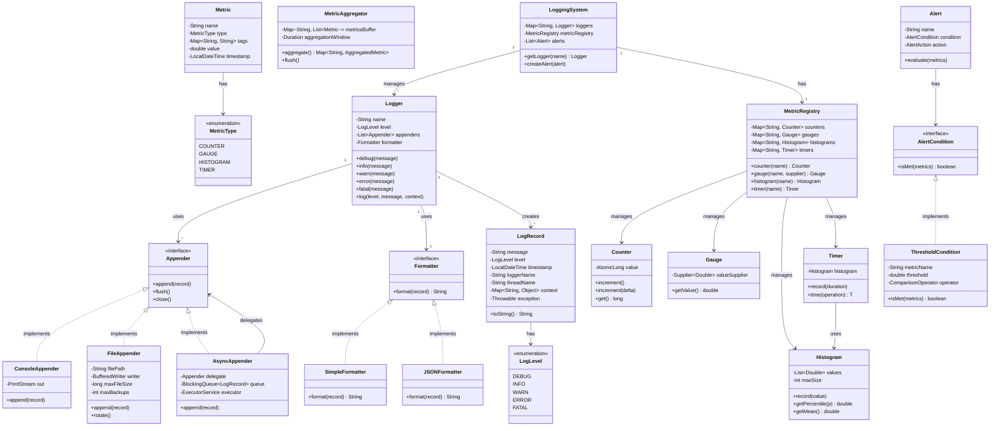
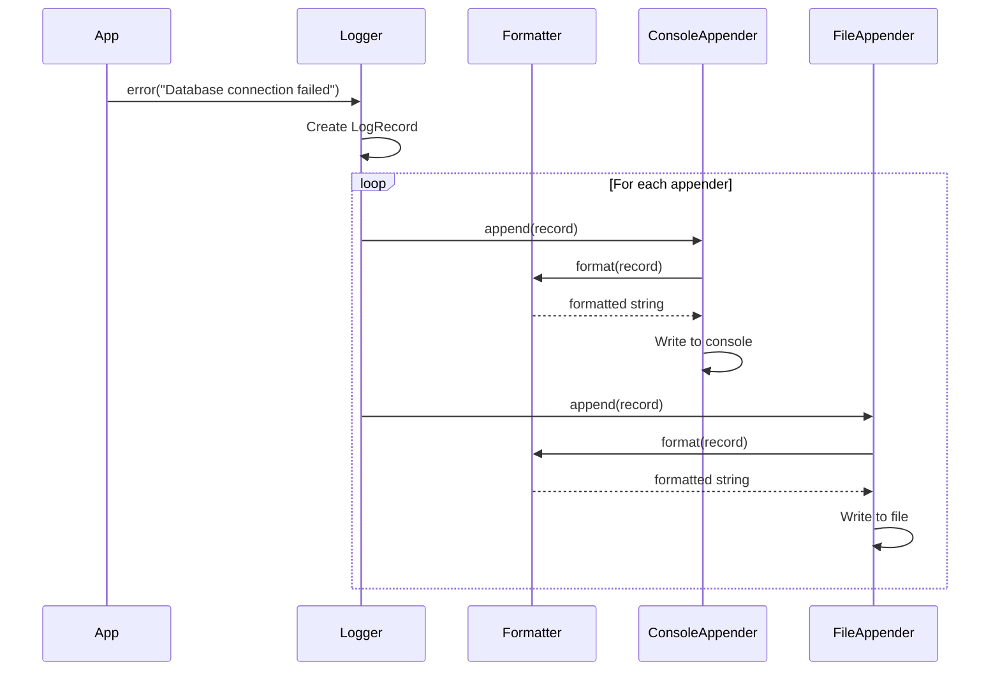
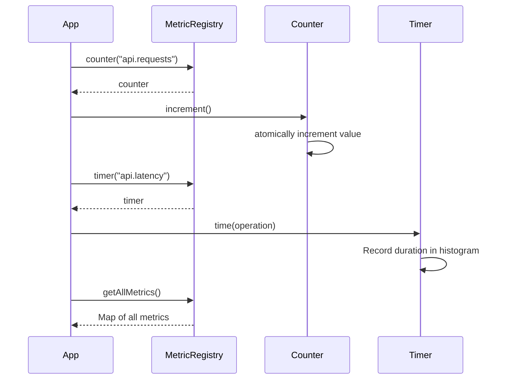

# Logging & Metrics System - Low Level Design

## Problem Statement

Design a comprehensive logging and metrics aggregation system that collects, processes, and analyzes application logs and metrics. Support different log levels, multiple output destinations, metrics aggregation, alerting, and efficient querying.

**Real-world context**: Similar to ELK Stack (Elasticsearch, Logstash, Kibana), Prometheus, Datadog, or Splunk.

---

## Requirements

### Functional Requirements
1. Log messages with different levels (DEBUG, INFO, WARN, ERROR, FATAL)
2. Support multiple log destinations (console, file, database, remote service)
3. Structured logging (key-value pairs, JSON format)
4. Metrics collection (counters, gauges, histograms, timers)
5. Metrics aggregation by time windows
6. Query logs by time range, level, source
7. Alert on specific conditions (error rate, threshold breaches)
8. Log rotation and archival
9. Asynchronous logging for performance

### Non-Functional Requirements
1. **Performance**: Minimal overhead (< 1ms per log)
2. **Scalability**: Handle 100k+ logs/second
3. **Reliability**: No log loss
4. **Storage**: Efficient compression and archival
5. **Thread-Safety**: Concurrent logging from multiple threads

### Out of Scope
1. Distributed tracing (spans, traces)
2. Full-text search (Elasticsearch features)
3. Real-time dashboard UI
4. Log shipping across servers
5. Compliance features (GDPR, HIPAA)

---

## Core Entities & Relationships

1. **Logger**: Main interface for logging
2. **LogRecord**: Individual log entry
3. **LogLevel**: Severity of log
4. **Appender**: Output destination
5. **Formatter**: Log formatting strategy
6. **Metric**: Measurement (counter, gauge, histogram)
7. **MetricAggregator**: Aggregates metrics over time
8. **Alert**: Condition-based notification

**Relationships**:
- Logger HAS-MANY Appender
- Logger USES Formatter
- Appender WRITES LogRecord
- MetricAggregator AGGREGATES Metric
- Alert MONITORS Metric

---

## Class Diagram



---

## Design Patterns Used

### 1. **Singleton Pattern**
- **Where**: LoggingSystem, MetricRegistry
- **Why**: Single global instance for logging infrastructure
- **Benefit**: Centralized management

### 2. **Strategy Pattern**
- **Where**: Formatter interface (SimpleFormatter, JSONFormatter)
- **Why**: Different formatting strategies without changing Logger
- **Benefit**: Flexible output formats

### 3. **Chain of Responsibility**
- **Where**: Multiple appenders process same log
- **Why**: Log to multiple destinations
- **Benefit**: Flexible routing

### 4. **Decorator Pattern**
- **Where**: AsyncAppender wraps another Appender
- **Why**: Add asynchronous behavior without modifying original
- **Benefit**: Performance optimization

### 5. **Observer Pattern**
- **Where**: Alerts observe metrics
- **Why**: Notify when conditions are met
- **Benefit**: Decoupled monitoring

### 6. **Factory Pattern**
- **Where**: MetricRegistry creates metrics
- **Why**: Centralized metric creation
- **Benefit**: Consistent metric management

---

## Detailed Class Design

```java
// ============== Core Logging ==============

public class Logger {
    private final String name;
    private LogLevel level;
    private final List<Appender> appenders;
    private Formatter formatter;

    public Logger(String name, LogLevel level) {
        this.name = name;
        this.level = level;
        this.appenders = new CopyOnWriteArrayList<>();
        this.formatter = new SimpleFormatter();
    }

    public void debug(String message) {
        log(LogLevel.DEBUG, message, null, null);
    }

    public void info(String message) {
        log(LogLevel.INFO, message, null, null);
    }

    public void warn(String message) {
        log(LogLevel.WARN, message, null, null);
    }

    public void error(String message) {
        log(LogLevel.ERROR, message, null, null);
    }

    public void error(String message, Throwable exception) {
        log(LogLevel.ERROR, message, null, exception);
    }

    public void fatal(String message) {
        log(LogLevel.FATAL, message, null, null);
    }

    public void log(LogLevel level, String message, Map<String, Object> context, Throwable exception) {
        if (level.getValue() < this.level.getValue()) {
            return; // Below threshold
        }

        LogRecord record = new LogRecord(message, level, name, context, exception);

        for (Appender appender : appenders) {
            try {
                appender.append(record);
            } catch (Exception e) {
                // Don't let logging failure crash application
                System.err.println("Failed to append log: " + e.getMessage());
            }
        }
    }

    public void addAppender(Appender appender) {
        appenders.add(appender);
    }

    public void setFormatter(Formatter formatter) {
        this.formatter = formatter;
    }

    public void setLevel(LogLevel level) {
        this.level = level;
    }

    // Getters
    public String getName() { return name; }
    public Formatter getFormatter() { return formatter; }
}

public class LogRecord {
    private final String message;
    private final LogLevel level;
    private final LocalDateTime timestamp;
    private final String loggerName;
    private final String threadName;
    private final Map<String, Object> context;
    private final Throwable exception;

    public LogRecord(String message, LogLevel level, String loggerName,
                     Map<String, Object> context, Throwable exception) {
        this.message = message;
        this.level = level;
        this.timestamp = LocalDateTime.now();
        this.loggerName = loggerName;
        this.threadName = Thread.currentThread().getName();
        this.context = context != null ? new HashMap<>(context) : new HashMap<>();
        this.exception = exception;
    }

    // Getters
    public String getMessage() { return message; }
    public LogLevel getLevel() { return level; }
    public LocalDateTime getTimestamp() { return timestamp; }
    public String getLoggerName() { return loggerName; }
    public String getThreadName() { return threadName; }
    public Map<String, Object> getContext() { return new HashMap<>(context); }
    public Throwable getException() { return exception; }

    @Override
    public String toString() {
        return String.format("[%s] [%s] [%s] %s",
                timestamp, level, loggerName, message);
    }
}

public enum LogLevel {
    DEBUG(0),
    INFO(1),
    WARN(2),
    ERROR(3),
    FATAL(4);

    private final int value;

    LogLevel(int value) {
        this.value = value;
    }

    public int getValue() {
        return value;
    }
}

// ============== Appenders ==============

public interface Appender {
    void append(LogRecord record);
    void flush();
    void close();
}

public class ConsoleAppender implements Appender {
    private final PrintStream out;
    private Formatter formatter;

    public ConsoleAppender() {
        this(System.out);
    }

    public ConsoleAppender(PrintStream out) {
        this.out = out;
        this.formatter = new SimpleFormatter();
    }

    @Override
    public synchronized void append(LogRecord record) {
        String formatted = formatter.format(record);
        out.println(formatted);
    }

    @Override
    public void flush() {
        out.flush();
    }

    @Override
    public void close() {
        // Don't close System.out
    }

    public void setFormatter(Formatter formatter) {
        this.formatter = formatter;
    }
}

public class FileAppender implements Appender {
    private final String filePath;
    private BufferedWriter writer;
    private Formatter formatter;
    private long currentFileSize;
    private final long maxFileSize;
    private final int maxBackups;

    public FileAppender(String filePath, long maxFileSize, int maxBackups) throws IOException {
        this.filePath = filePath;
        this.maxFileSize = maxFileSize;
        this.maxBackups = maxBackups;
        this.formatter = new SimpleFormatter();
        this.currentFileSize = 0;
        openFile();
    }

    private void openFile() throws IOException {
        File file = new File(filePath);
        boolean append = file.exists();
        this.writer = new BufferedWriter(new FileWriter(file, append));
        if (append) {
            this.currentFileSize = file.length();
        }
    }

    @Override
    public synchronized void append(LogRecord record) {
        try {
            String formatted = formatter.format(record);
            writer.write(formatted);
            writer.newLine();

            currentFileSize += formatted.length() + System.lineSeparator().length();

            if (currentFileSize >= maxFileSize) {
                rotate();
            }
        } catch (IOException e) {
            System.err.println("Failed to write log: " + e.getMessage());
        }
    }

    private void rotate() throws IOException {
        writer.close();

        // Rotate backup files
        for (int i = maxBackups - 1; i > 0; i--) {
            File file = new File(filePath + "." + i);
            if (file.exists()) {
                file.renameTo(new File(filePath + "." + (i + 1)));
            }
        }

        // Rename current file to .1
        new File(filePath).renameTo(new File(filePath + ".1"));

        // Open new file
        currentFileSize = 0;
        openFile();
    }

    @Override
    public synchronized void flush() {
        try {
            writer.flush();
        } catch (IOException e) {
            System.err.println("Failed to flush: " + e.getMessage());
        }
    }

    @Override
    public synchronized void close() {
        try {
            writer.close();
        } catch (IOException e) {
            System.err.println("Failed to close: " + e.getMessage());
        }
    }

    public void setFormatter(Formatter formatter) {
        this.formatter = formatter;
    }
}

public class AsyncAppender implements Appender {
    private final Appender delegate;
    private final BlockingQueue<LogRecord> queue;
    private final ExecutorService executor;
    private volatile boolean closed = false;

    public AsyncAppender(Appender delegate, int queueSize) {
        this.delegate = delegate;
        this.queue = new LinkedBlockingQueue<>(queueSize);
        this.executor = Executors.newSingleThreadExecutor();

        // Start consumer thread
        executor.submit(this::consumeLogs);
    }

    @Override
    public void append(LogRecord record) {
        if (closed) {
            return;
        }

        try {
            // Non-blocking: drop if queue full
            if (!queue.offer(record)) {
                System.err.println("Log queue full, dropping log");
            }
        } catch (Exception e) {
            System.err.println("Failed to queue log: " + e.getMessage());
        }
    }

    private void consumeLogs() {
        while (!closed || !queue.isEmpty()) {
            try {
                LogRecord record = queue.poll(100, TimeUnit.MILLISECONDS);
                if (record != null) {
                    delegate.append(record);
                }
            } catch (InterruptedException e) {
                Thread.currentThread().interrupt();
                break;
            }
        }
    }

    @Override
    public void flush() {
        delegate.flush();
    }

    @Override
    public void close() {
        closed = true;
        executor.shutdown();
        try {
            if (!executor.awaitTermination(5, TimeUnit.SECONDS)) {
                executor.shutdownNow();
            }
        } catch (InterruptedException e) {
            executor.shutdownNow();
        }
        delegate.close();
    }
}

// ============== Formatters ==============

public interface Formatter {
    String format(LogRecord record);
}

public class SimpleFormatter implements Formatter {
    @Override
    public String format(LogRecord record) {
        StringBuilder sb = new StringBuilder();
        sb.append(record.getTimestamp().format(DateTimeFormatter.ISO_LOCAL_DATE_TIME));
        sb.append(" [").append(record.getLevel()).append("]");
        sb.append(" [").append(record.getThreadName()).append("]");
        sb.append(" ").append(record.getLoggerName());
        sb.append(" - ").append(record.getMessage());

        if (!record.getContext().isEmpty()) {
            sb.append(" ").append(record.getContext());
        }

        if (record.getException() != null) {
            sb.append("\n").append(getStackTrace(record.getException()));
        }

        return sb.toString();
    }

    private String getStackTrace(Throwable throwable) {
        StringWriter sw = new StringWriter();
        PrintWriter pw = new PrintWriter(sw);
        throwable.printStackTrace(pw);
        return sw.toString();
    }
}

public class JSONFormatter implements Formatter {
    @Override
    public String format(LogRecord record) {
        Map<String, Object> json = new LinkedHashMap<>();
        json.put("timestamp", record.getTimestamp().toString());
        json.put("level", record.getLevel().name());
        json.put("logger", record.getLoggerName());
        json.put("thread", record.getThreadName());
        json.put("message", record.getMessage());

        if (!record.getContext().isEmpty()) {
            json.put("context", record.getContext());
        }

        if (record.getException() != null) {
            json.put("exception", record.getException().toString());
        }

        // Simple JSON serialization (use Jackson/Gson in production)
        return json.toString();
    }
}

// ============== Metrics ==============

public interface Metric {
    String getName();
    double getValue();
    Map<String, String> getTags();
}

public class Counter implements Metric {
    private final String name;
    private final AtomicLong value;
    private final Map<String, String> tags;

    public Counter(String name, Map<String, String> tags) {
        this.name = name;
        this.tags = tags != null ? new HashMap<>(tags) : new HashMap<>();
        this.value = new AtomicLong(0);
    }

    public void increment() {
        value.incrementAndGet();
    }

    public void increment(long delta) {
        value.addAndGet(delta);
    }

    public long get() {
        return value.get();
    }

    @Override
    public String getName() {
        return name;
    }

    @Override
    public double getValue() {
        return value.get();
    }

    @Override
    public Map<String, String> getTags() {
        return new HashMap<>(tags);
    }
}

public class Gauge implements Metric {
    private final String name;
    private final Supplier<Double> valueSupplier;
    private final Map<String, String> tags;

    public Gauge(String name, Supplier<Double> valueSupplier, Map<String, String> tags) {
        this.name = name;
        this.valueSupplier = valueSupplier;
        this.tags = tags != null ? new HashMap<>(tags) : new HashMap<>();
    }

    @Override
    public String getName() {
        return name;
    }

    @Override
    public double getValue() {
        return valueSupplier.get();
    }

    @Override
    public Map<String, String> getTags() {
        return new HashMap<>(tags);
    }
}

public class Histogram implements Metric {
    private final String name;
    private final List<Double> values;
    private final int maxSize;
    private final Map<String, String> tags;
    private final ReentrantReadWriteLock lock;

    public Histogram(String name, int maxSize, Map<String, String> tags) {
        this.name = name;
        this.maxSize = maxSize;
        this.tags = tags != null ? new HashMap<>(tags) : new HashMap<>();
        this.values = new ArrayList<>();
        this.lock = new ReentrantReadWriteLock();
    }

    public void record(double value) {
        lock.writeLock().lock();
        try {
            if (values.size() >= maxSize) {
                values.remove(0); // Remove oldest
            }
            values.add(value);
        } finally {
            lock.writeLock().unlock();
        }
    }

    public double getPercentile(double percentile) {
        lock.readLock().lock();
        try {
            if (values.isEmpty()) {
                return 0;
            }

            List<Double> sorted = new ArrayList<>(values);
            Collections.sort(sorted);

            int index = (int) Math.ceil(percentile / 100.0 * sorted.size()) - 1;
            return sorted.get(Math.max(0, index));
        } finally {
            lock.readLock().unlock();
        }
    }

    public double getMean() {
        lock.readLock().lock();
        try {
            if (values.isEmpty()) {
                return 0;
            }
            return values.stream().mapToDouble(Double::doubleValue).average().orElse(0);
        } finally {
            lock.readLock().unlock();
        }
    }

    @Override
    public String getName() {
        return name;
    }

    @Override
    public double getValue() {
        return getMean();
    }

    @Override
    public Map<String, String> getTags() {
        return new HashMap<>(tags);
    }
}

public class Timer {
    private final Histogram histogram;

    public Timer(String name, Map<String, String> tags) {
        this.histogram = new Histogram(name, 1000, tags);
    }

    public void record(long durationNanos) {
        histogram.record(durationNanos / 1_000_000.0); // Convert to ms
    }

    public <T> T time(Callable<T> operation) throws Exception {
        long start = System.nanoTime();
        try {
            return operation.call();
        } finally {
            record(System.nanoTime() - start);
        }
    }

    public void time(Runnable operation) {
        long start = System.nanoTime();
        try {
            operation.run();
        } finally {
            record(System.nanoTime() - start);
        }
    }

    public Histogram getHistogram() {
        return histogram;
    }
}

// ============== Metric Registry ==============

public class MetricRegistry {
    private static MetricRegistry instance;
    private final Map<String, Counter> counters;
    private final Map<String, Gauge> gauges;
    private final Map<String, Histogram> histograms;
    private final Map<String, Timer> timers;

    private MetricRegistry() {
        this.counters = new ConcurrentHashMap<>();
        this.gauges = new ConcurrentHashMap<>();
        this.histograms = new ConcurrentHashMap<>();
        this.timers = new ConcurrentHashMap<>();
    }

    public static synchronized MetricRegistry getInstance() {
        if (instance == null) {
            instance = new MetricRegistry();
        }
        return instance;
    }

    public Counter counter(String name) {
        return counter(name, null);
    }

    public Counter counter(String name, Map<String, String> tags) {
        return counters.computeIfAbsent(name, k -> new Counter(name, tags));
    }

    public Gauge gauge(String name, Supplier<Double> valueSupplier) {
        return gauge(name, valueSupplier, null);
    }

    public Gauge gauge(String name, Supplier<Double> valueSupplier, Map<String, String> tags) {
        return gauges.computeIfAbsent(name, k -> new Gauge(name, valueSupplier, tags));
    }

    public Histogram histogram(String name) {
        return histogram(name, 1000, null);
    }

    public Histogram histogram(String name, int maxSize, Map<String, String> tags) {
        return histograms.computeIfAbsent(name, k -> new Histogram(name, maxSize, tags));
    }

    public Timer timer(String name) {
        return timer(name, null);
    }

    public Timer timer(String name, Map<String, String> tags) {
        return timers.computeIfAbsent(name, k -> new Timer(name, tags));
    }

    public Map<String, Metric> getAllMetrics() {
        Map<String, Metric> all = new HashMap<>();
        all.putAll(counters);
        all.putAll(gauges);
        all.putAll(histograms);
        return all;
    }
}

// ============== Main System ==============

public class LoggingSystem {
    private static LoggingSystem instance;
    private final Map<String, Logger> loggers;
    private final MetricRegistry metricRegistry;

    private LoggingSystem() {
        this.loggers = new ConcurrentHashMap<>();
        this.metricRegistry = MetricRegistry.getInstance();
    }

    public static synchronized LoggingSystem getInstance() {
        if (instance == null) {
            instance = new LoggingSystem();
        }
        return instance;
    }

    public Logger getLogger(String name) {
        return loggers.computeIfAbsent(name, k -> createDefaultLogger(name));
    }

    public Logger getLogger(Class<?> clazz) {
        return getLogger(clazz.getName());
    }

    private Logger createDefaultLogger(String name) {
        Logger logger = new Logger(name, LogLevel.INFO);
        logger.addAppender(new ConsoleAppender());
        return logger;
    }

    public MetricRegistry getMetricRegistry() {
        return metricRegistry;
    }

    public void shutdown() {
        for (Logger logger : loggers.values()) {
            for (Appender appender : logger.appenders) {
                appender.flush();
                appender.close();
            }
        }
    }
}
```

---

## Key Workflows

### 1. Logging with Multiple Appenders



### 2. Metric Collection and Query



---

## Design Decisions & Reasoning

### 1. **Async Appender with Queue**
**Decision**: Separate AsyncAppender that wraps synchronous appenders.

**Reasoning**:
- Logging shouldn't block application threads
- Queue buffers bursts of log messages
- Dedicated consumer thread handles I/O

**Trade-off**: Possible log loss if queue fills up

### 2. **Log Levels as Enum**
**Decision**: Fixed set of log levels with integer values.

**Reasoning**:
- Industry standard (DEBUG, INFO, WARN, ERROR, FATAL)
- Integer comparison for efficient filtering
- Clear severity hierarchy

### 3. **Multiple Appenders per Logger**
**Decision**: Logger can have multiple appenders.

**Reasoning**:
- Log to console during development
- Log to file in production
- Log errors to separate error file
- Flexible routing

### 4. **File Rotation Based on Size**
**Decision**: Rotate when file reaches max size.

**Reasoning**:
- Prevents unbounded disk usage
- Keeps recent logs accessible
- Time-based rotation also common (daily)

### 5. **Lock-Free Counter with AtomicLong**
**Decision**: Use AtomicLong for counters.

**Reasoning**:
- Lock-free increments for high throughput
- CAS operations are fast
- No contention on frequent updates

### 6. **Histogram with Fixed Size Buffer**
**Decision**: Keep last N values, drop oldest.

**Reasoning**:
- Bounded memory usage
- Recent values more relevant for percentiles
- Alternative: Sliding window by time

---

## SOLID Principles Application

### 1. **Single Responsibility Principle (SRP)**
- `Logger`: Coordinates logging
- `Appender`: Writes to destination
- `Formatter`: Formats log records
- `Counter`: Tracks count metric
- `MetricRegistry`: Manages all metrics

### 2. **Open/Closed Principle (OCP)**
- Adding new appender doesn't modify Logger:
```java
public class DatabaseAppender implements Appender {
    @Override
    public void append(LogRecord record) {
        // Insert into database
    }
}
```

### 3. **Liskov Substitution Principle (LSP)**
- Any `Appender` implementation can replace another
- Any `Formatter` works with any Appender

### 4. **Interface Segregation Principle (ISP)**
- `Appender` interface has minimal methods
- Clients only depend on what they use

### 5. **Dependency Inversion Principle (DIP)**
- Logger depends on `Appender` interface, not concrete classes
- Easy to swap implementations

---

## Extensibility & Future Enhancements

### 1. **Remote Logging**
```java
public class HTTPAppender implements Appender {
    private final String endpoint;
    private final HttpClient client;

    @Override
    public void append(LogRecord record) {
        String json = new JSONFormatter().format(record);
        client.post(endpoint, json);
    }
}
```

### 2. **Log Sampling**
```java
public class SamplingAppender implements Appender {
    private final Appender delegate;
    private final double samplingRate;

    @Override
    public void append(LogRecord record) {
        if (Math.random() < samplingRate) {
            delegate.append(record);
        }
    }
}
```

### 3. **Distributed Tracing**
```java
public class Span {
    private final String traceId;
    private final String spanId;
    private final String parentSpanId;
    private final LocalDateTime startTime;
    private LocalDateTime endTime;

    public void finish() {
        this.endTime = LocalDateTime.now();
        // Send span to tracing system
    }
}
```

### 4. **Alerting**
```java
public class Alert {
    private final String name;
    private final Predicate<Map<String, Metric>> condition;
    private final Consumer<Alert> action;

    public void evaluate(Map<String, Metric> metrics) {
        if (condition.test(metrics)) {
            action.accept(this);
        }
    }
}

// Usage
Alert errorRateAlert = new Alert(
    "High Error Rate",
    metrics -> metrics.get("errors").getValue() > 100,
    alert -> sendEmail("Errors exceeded threshold")
);
```

---

## Complexity Analysis

### Time Complexity

| Operation | Complexity | Explanation |
|-----------|-----------|-------------|
| `log()` (sync) | O(n) | n appenders |
| `log()` (async) | O(1) | Queue insertion |
| `counter.increment()` | O(1) | Atomic operation |
| `histogram.record()` | O(1) amortized | Add to list |
| `histogram.getPercentile()` | O(n log n) | Sort values |

### Space Complexity
- O(l) for log queue (l = queue size)
- O(h) for histogram (h = max values)
- O(m) for all metrics (m = number of metrics)

### Bottlenecks
1. **File I/O**: Synchronous writes block
2. **Queue overflow**: Logs dropped
3. **Histogram sorting**: Expensive for percentiles

### Optimizations
1. **Batch writes**: Flush multiple logs at once
2. **Lock-free queue**: Reduce contention
3. **Pre-sorted histogram**: Use TreeSet for percentiles

---

## Testing Strategy

### Key Test Cases

```java
@Test
public void testLogLevelFiltering() {
    Logger logger = new Logger("test", LogLevel.WARN);
    MockAppender appender = new MockAppender();
    logger.addAppender(appender);

    logger.debug("Debug message"); // Should not appear
    logger.info("Info message");   // Should not appear
    logger.warn("Warning message"); // Should appear

    assertEquals(1, appender.getRecordCount());
}

@Test
public void testAsyncAppenderDoesNotBlock() {
    MockAppender delegate = new MockAppender();
    delegate.setDelay(100); // Simulate slow I/O

    AsyncAppender async = new AsyncAppender(delegate, 100);
    Logger logger = new Logger("test", LogLevel.INFO);
    logger.addAppender(async);

    long start = System.currentTimeMillis();
    for (int i = 0; i < 10; i++) {
        logger.info("Message " + i);
    }
    long duration = System.currentTimeMillis() - start;

    assertTrue(duration < 100); // Should not block
}

@Test
public void testFileRotation() throws IOException {
    String filePath = "test.log";
    FileAppender appender = new FileAppender(filePath, 1024, 3); // 1KB max

    Logger logger = new Logger("test", LogLevel.INFO);
    logger.addAppender(appender);

    // Write enough to trigger rotation
    for (int i = 0; i < 100; i++) {
        logger.info("This is a log message that will fill up the file");
    }

    appender.close();

    assertTrue(new File(filePath + ".1").exists()); // Backup created
}

@Test
public void testCounterThreadSafety() throws InterruptedException {
    Counter counter = new Counter("test", null);
    ExecutorService executor = Executors.newFixedThreadPool(10);

    for (int i = 0; i < 1000; i++) {
        executor.submit(counter::increment);
    }

    executor.shutdown();
    executor.awaitTermination(5, TimeUnit.SECONDS);

    assertEquals(1000, counter.get());
}

@Test
public void testHistogramPercentiles() {
    Histogram histogram = new Histogram("test", 1000, null);

    for (int i = 1; i <= 100; i++) {
        histogram.record(i);
    }

    assertEquals(50, histogram.getPercentile(50), 1.0); // Median
    assertEquals(95, histogram.getPercentile(95), 1.0); // 95th percentile
}
```

---

## Summary

This Logging & Metrics System demonstrates:

1. **Flexible Logging**: Multiple levels, appenders, formatters
2. **Asynchronous Processing**: Non-blocking logging
3. **Metrics Collection**: Counters, gauges, histograms, timers
4. **File Management**: Automatic rotation and archival
5. **Thread-Safety**: Concurrent logging and metrics
6. **Extensibility**: Easy to add new appenders and formatters

**Key Takeaways**:
- Decorator pattern for async behavior
- Strategy pattern for formatting
- Lock-free atomic operations for counters
- Bounded buffers for histograms

**Production Considerations**:
- Integrate with centralized logging (ELK, Splunk)
- Add structured logging with MDC (Mapped Diagnostic Context)
- Implement log sampling for high volume
- Use time-series database for metrics (Prometheus, InfluxDB)
- Add distributed tracing (Jaeger, Zipkin)
- Implement alerting based on metrics
- Compress archived logs
- Add log anonymization for sensitive data
