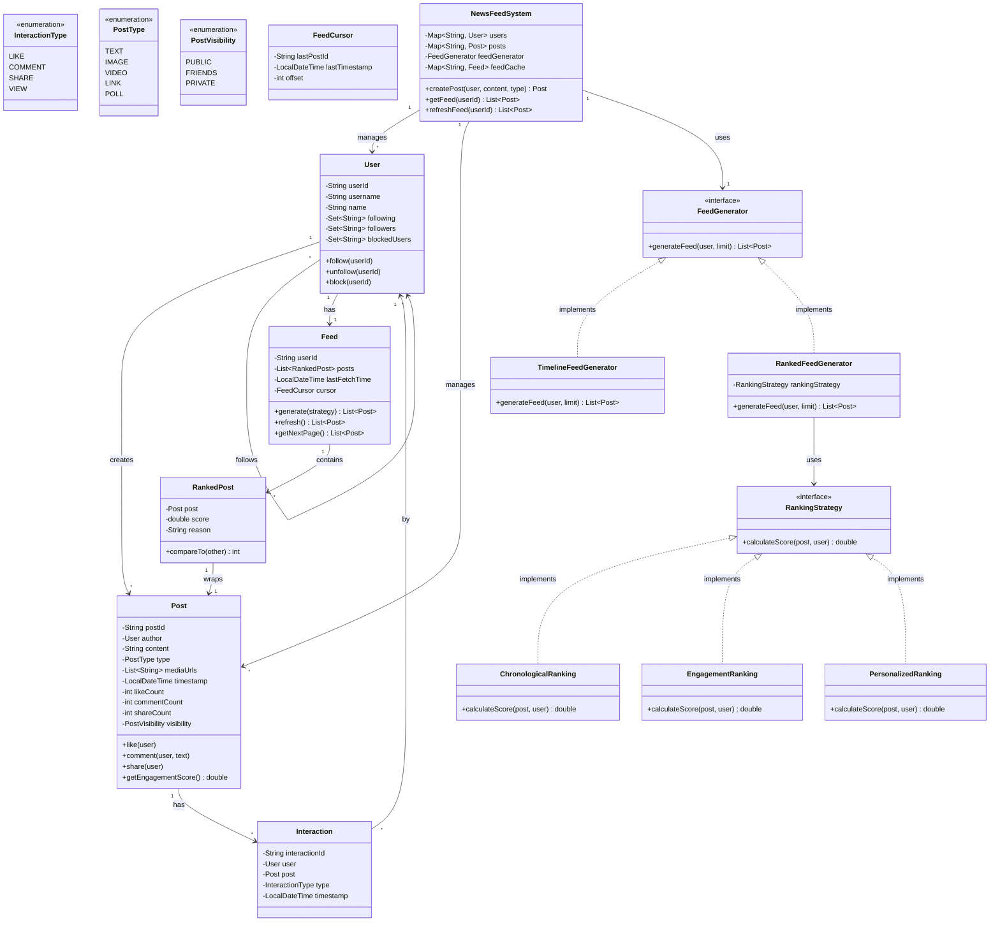
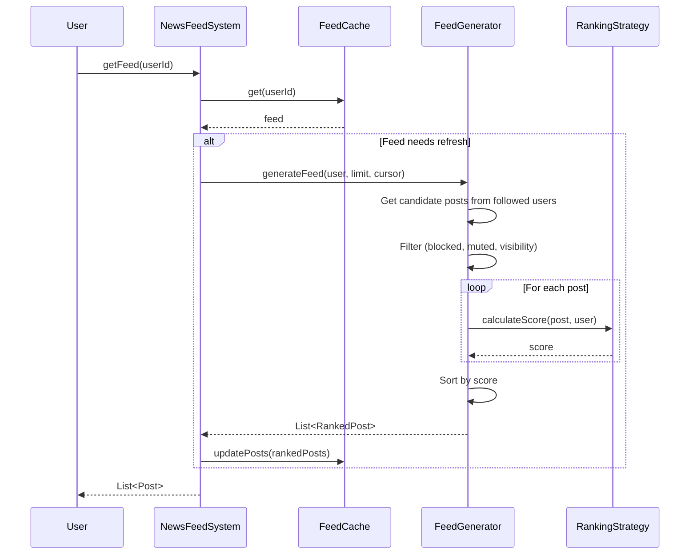
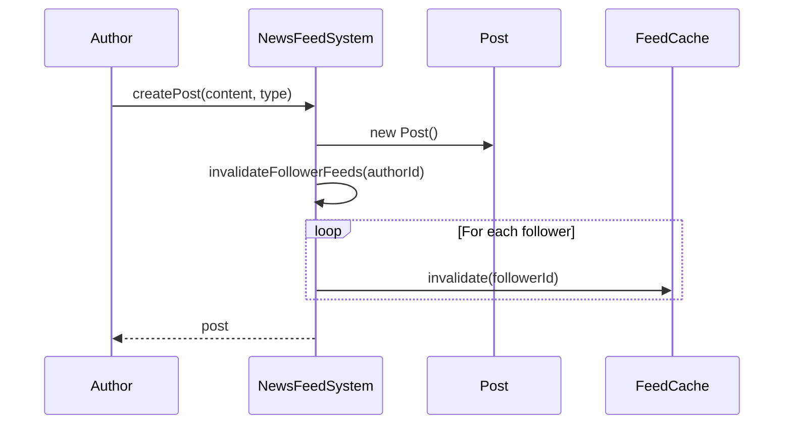

# News Feed System - Low Level Design

## Problem Statement

Design a news feed system like Facebook, Twitter, or LinkedIn that generates personalized content feeds for users. The system should efficiently fetch, rank, and display posts from followed users/pages, handle different content types, and support pagination.

**Real-world context**: Similar to Facebook News Feed, Twitter Timeline, Instagram Feed, or LinkedIn Feed.

---

## Requirements

### Functional Requirements
1. Generate personalized feed for each user
2. Support different post types (text, image, video, link)
3. Show posts from followed users and pages
4. Rank posts by relevance (not just chronological)
5. Support pagination (infinite scroll)
6. Handle likes, comments, shares
7. Filter feed by content type
8. Support feed refresh (pull-to-refresh)
9. Block/mute users

### Non-Functional Requirements
1. **Performance**: Load feed in < 500ms
2. **Scalability**: Support 1 billion users
3. **Freshness**: Show recent posts (< 5 minutes old)
4. **Availability**: 99.99% uptime
5. **Consistency**: Eventual consistency acceptable

### Out of Scope
1. Real-time updates (WebSocket push)
2. Complex ML-based ranking
3. Ad insertion
4. Stories/ephemeral content
5. Live streaming

---

## Core Entities & Relationships

1. **User**: Person using the platform
2. **Post**: Content created by user
3. **Feed**: Personalized list of posts for a user
4. **Follow**: User follows another user
5. **Interaction**: Like, comment, share on post
6. **RankingStrategy**: Algorithm to rank posts

**Relationships**:
- User CREATES-MANY Post
- User FOLLOWS-MANY User
- User HAS-ONE Feed
- Feed CONTAINS-MANY Post
- Post HAS-MANY Interaction

---

## Class Diagram



---

## Design Patterns Used

### 1. **Strategy Pattern**
- **Where**: FeedGenerator, RankingStrategy
- **Why**: Different algorithms for generating and ranking feeds
- **Benefit**: Easy to switch between chronological and ranked feeds

### 2. **Factory Pattern**
- **Where**: FeedGeneratorFactory
- **Why**: Create appropriate feed generator based on user preference
- **Benefit**: Encapsulate generator selection logic

### 3. **Observer Pattern**
- **Where**: Post updates notify interested users
- **Why**: Push new posts to followers' feeds
- **Benefit**: Real-time feed updates

### 4. **Facade Pattern**
- **Where**: NewsFeedSystem
- **Why**: Simplify complex feed generation logic
- **Benefit**: Clean API for clients

### 5. **Proxy Pattern**
- **Where**: FeedCache as proxy for FeedGenerator
- **Why**: Cache expensive feed generation
- **Benefit**: Improved performance

---

## Detailed Class Design

```java
// ============== Core Entities ==============

public class User {
    private final String userId;
    private String username;
    private String name;
    private final Set<String> following;
    private final Set<String> followers;
    private final Set<String> blockedUsers;
    private final Set<String> mutedUsers;

    public User(String username, String name) {
        this.userId = UUID.randomUUID().toString();
        this.username = username;
        this.name = name;
        this.following = ConcurrentHashMap.newKeySet();
        this.followers = ConcurrentHashMap.newKeySet();
        this.blockedUsers = ConcurrentHashMap.newKeySet();
        this.mutedUsers = ConcurrentHashMap.newKeySet();
    }

    public void follow(String userId) {
        following.add(userId);
    }

    public void unfollow(String userId) {
        following.remove(userId);
    }

    public void block(String userId) {
        blockedUsers.add(userId);
        unfollow(userId);
    }

    public void mute(String userId) {
        mutedUsers.add(userId);
    }

    public boolean isFollowing(String userId) {
        return following.contains(userId);
    }

    public boolean hasBlocked(String userId) {
        return blockedUsers.contains(userId);
    }

    public boolean hasMuted(String userId) {
        return mutedUsers.contains(userId);
    }

    // Getters
    public String getUserId() { return userId; }
    public String getUsername() { return username; }
    public String getName() { return name; }
    public Set<String> getFollowing() { return new HashSet<>(following); }
    public Set<String> getFollowers() { return new HashSet<>(followers); }
    public void addFollower(String userId) { followers.add(userId); }
    public void removeFollower(String userId) { followers.remove(userId); }
}

public class Post {
    private final String postId;
    private final User author;
    private String content;
    private final PostType type;
    private final List<String> mediaUrls;
    private final LocalDateTime timestamp;
    private final Set<String> likedBy;
    private final List<Comment> comments;
    private int shareCount;
    private int viewCount;
    private final PostVisibility visibility;

    public Post(User author, String content, PostType type, PostVisibility visibility) {
        this.postId = UUID.randomUUID().toString();
        this.author = author;
        this.content = content;
        this.type = type;
        this.visibility = visibility;
        this.timestamp = LocalDateTime.now();
        this.mediaUrls = new ArrayList<>();
        this.likedBy = ConcurrentHashMap.newKeySet();
        this.comments = new CopyOnWriteArrayList<>();
        this.shareCount = 0;
        this.viewCount = 0;
    }

    public synchronized void like(User user) {
        likedBy.add(user.getUserId());
    }

    public synchronized void unlike(User user) {
        likedBy.remove(user.getUserId());
    }

    public Comment comment(User user, String text) {
        Comment comment = new Comment(user, text);
        comments.add(comment);
        return comment;
    }

    public synchronized void share(User user) {
        shareCount++;
    }

    public synchronized void view(User user) {
        viewCount++;
    }

    public void addMediaUrl(String url) {
        mediaUrls.add(url);
    }

    /**
     * Calculate engagement score based on interactions
     * Used for ranking posts
     */
    public double getEngagementScore() {
        long ageInMinutes = ChronoUnit.MINUTES.between(timestamp, LocalDateTime.now());

        // Decay factor: newer posts get higher score
        double decayFactor = 1.0 / (1 + ageInMinutes / 60.0);

        // Weighted engagement: likes=1, comments=2, shares=3
        double engagementPoints = likedBy.size() + (comments.size() * 2) + (shareCount * 3);

        return engagementPoints * decayFactor;
    }

    /**
     * Get age in hours for time-based ranking
     */
    public long getAgeInHours() {
        return ChronoUnit.HOURS.between(timestamp, LocalDateTime.now());
    }

    public boolean canUserView(User user) {
        if (visibility == PostVisibility.PUBLIC) {
            return true;
        }
        if (visibility == PostVisibility.FRIENDS) {
            return user.isFollowing(author.getUserId()) || author.getUserId().equals(user.getUserId());
        }
        if (visibility == PostVisibility.PRIVATE) {
            return author.getUserId().equals(user.getUserId());
        }
        return false;
    }

    // Getters
    public String getPostId() { return postId; }
    public User getAuthor() { return author; }
    public String getContent() { return content; }
    public PostType getType() { return type; }
    public List<String> getMediaUrls() { return new ArrayList<>(mediaUrls); }
    public LocalDateTime getTimestamp() { return timestamp; }
    public int getLikeCount() { return likedBy.size(); }
    public int getCommentCount() { return comments.size(); }
    public int getShareCount() { return shareCount; }
    public int getViewCount() { return viewCount; }
    public PostVisibility getVisibility() { return visibility; }
}

public class Comment {
    private final String commentId;
    private final User author;
    private String text;
    private final LocalDateTime timestamp;

    public Comment(User author, String text) {
        this.commentId = UUID.randomUUID().toString();
        this.author = author;
        this.text = text;
        this.timestamp = LocalDateTime.now();
    }

    // Getters
    public String getCommentId() { return commentId; }
    public User getAuthor() { return author; }
    public String getText() { return text; }
    public LocalDateTime getTimestamp() { return timestamp; }
}

// ============== Enums ==============

public enum PostType {
    TEXT,
    IMAGE,
    VIDEO,
    LINK,
    POLL
}

public enum PostVisibility {
    PUBLIC,
    FRIENDS,
    PRIVATE
}

public enum InteractionType {
    LIKE,
    COMMENT,
    SHARE,
    VIEW
}

// ============== Feed Structure ==============

public class RankedPost implements Comparable<RankedPost> {
    private final Post post;
    private final double score;
    private final String reason; // Why this post was shown

    public RankedPost(Post post, double score, String reason) {
        this.post = post;
        this.score = score;
        this.reason = reason;
    }

    @Override
    public int compareTo(RankedPost other) {
        // Higher score first
        return Double.compare(other.score, this.score);
    }

    // Getters
    public Post getPost() { return post; }
    public double getScore() { return score; }
    public String getReason() { return reason; }
}

public class FeedCursor {
    private String lastPostId;
    private LocalDateTime lastTimestamp;
    private int offset;

    public FeedCursor() {
        this.offset = 0;
    }

    public FeedCursor(String lastPostId, LocalDateTime lastTimestamp, int offset) {
        this.lastPostId = lastPostId;
        this.lastTimestamp = lastTimestamp;
        this.offset = offset;
    }

    // Getters and setters
    public String getLastPostId() { return lastPostId; }
    public void setLastPostId(String lastPostId) { this.lastPostId = lastPostId; }
    public LocalDateTime getLastTimestamp() { return lastTimestamp; }
    public void setLastTimestamp(LocalDateTime lastTimestamp) { this.lastTimestamp = lastTimestamp; }
    public int getOffset() { return offset; }
    public void setOffset(int offset) { this.offset = offset; }
}

public class Feed {
    private final String userId;
    private final List<RankedPost> posts;
    private LocalDateTime lastFetchTime;
    private FeedCursor cursor;

    public Feed(String userId) {
        this.userId = userId;
        this.posts = new ArrayList<>();
        this.cursor = new FeedCursor();
    }

    public void updatePosts(List<RankedPost> newPosts) {
        this.posts.clear();
        this.posts.addAll(newPosts);
        this.lastFetchTime = LocalDateTime.now();
    }

    public void appendPosts(List<RankedPost> morePosts) {
        this.posts.addAll(morePosts);
    }

    public List<Post> getPosts(int limit) {
        return posts.stream()
                .limit(limit)
                .map(RankedPost::getPost)
                .collect(Collectors.toList());
    }

    public boolean needsRefresh() {
        if (lastFetchTime == null) {
            return true;
        }
        // Refresh if older than 5 minutes
        return ChronoUnit.MINUTES.between(lastFetchTime, LocalDateTime.now()) > 5;
    }

    // Getters
    public String getUserId() { return userId; }
    public FeedCursor getCursor() { return cursor; }
    public void setCursor(FeedCursor cursor) { this.cursor = cursor; }
}

// ============== Feed Generation ==============

public interface FeedGenerator {
    List<RankedPost> generateFeed(User user, int limit, FeedCursor cursor);
}

public class TimelineFeedGenerator implements FeedGenerator {
    private final Map<String, Post> posts;

    public TimelineFeedGenerator(Map<String, Post> posts) {
        this.posts = posts;
    }

    @Override
    public List<RankedPost> generateFeed(User user, int limit, FeedCursor cursor) {
        // Get posts from followed users
        List<Post> candidatePosts = new ArrayList<>();

        for (String followedUserId : user.getFollowing()) {
            candidatePosts.addAll(getPostsByUser(followedUserId));
        }

        // Filter posts
        candidatePosts = candidatePosts.stream()
                .filter(post -> !user.hasBlocked(post.getAuthor().getUserId()))
                .filter(post -> !user.hasMuted(post.getAuthor().getUserId()))
                .filter(post -> post.canUserView(user))
                .collect(Collectors.toList());

        // Sort by timestamp (chronological)
        candidatePosts.sort((p1, p2) -> p2.getTimestamp().compareTo(p1.getTimestamp()));

        // Apply cursor for pagination
        if (cursor.getLastTimestamp() != null) {
            candidatePosts = candidatePosts.stream()
                    .filter(p -> p.getTimestamp().isBefore(cursor.getLastTimestamp()))
                    .collect(Collectors.toList());
        }

        // Limit results
        candidatePosts = candidatePosts.stream()
                .limit(limit)
                .collect(Collectors.toList());

        // Convert to RankedPost (score = recency)
        return candidatePosts.stream()
                .map(post -> new RankedPost(post,
                        post.getTimestamp().toEpochSecond(ZoneOffset.UTC),
                        "Recent post"))
                .collect(Collectors.toList());
    }

    private List<Post> getPostsByUser(String userId) {
        return posts.values().stream()
                .filter(post -> post.getAuthor().getUserId().equals(userId))
                .collect(Collectors.toList());
    }
}

public class RankedFeedGenerator implements FeedGenerator {
    private final Map<String, Post> posts;
    private final RankingStrategy rankingStrategy;

    public RankedFeedGenerator(Map<String, Post> posts, RankingStrategy rankingStrategy) {
        this.posts = posts;
        this.rankingStrategy = rankingStrategy;
    }

    @Override
    public List<RankedPost> generateFeed(User user, int limit, FeedCursor cursor) {
        // Get candidate posts (from last 24 hours for performance)
        LocalDateTime cutoffTime = LocalDateTime.now().minusHours(24);

        List<Post> candidatePosts = new ArrayList<>();

        for (String followedUserId : user.getFollowing()) {
            candidatePosts.addAll(getRecentPostsByUser(followedUserId, cutoffTime));
        }

        // Filter
        candidatePosts = candidatePosts.stream()
                .filter(post -> !user.hasBlocked(post.getAuthor().getUserId()))
                .filter(post -> !user.hasMuted(post.getAuthor().getUserId()))
                .filter(post -> post.canUserView(user))
                .collect(Collectors.toList());

        // Rank posts
        List<RankedPost> rankedPosts = candidatePosts.stream()
                .map(post -> {
                    double score = rankingStrategy.calculateScore(post, user);
                    return new RankedPost(post, score, "Ranked by " + rankingStrategy.getClass().getSimpleName());
                })
                .sorted()
                .collect(Collectors.toList());

        // Apply pagination
        if (cursor.getOffset() > 0) {
            rankedPosts = rankedPosts.stream()
                    .skip(cursor.getOffset())
                    .collect(Collectors.toList());
        }

        return rankedPosts.stream()
                .limit(limit)
                .collect(Collectors.toList());
    }

    private List<Post> getRecentPostsByUser(String userId, LocalDateTime cutoffTime) {
        return posts.values().stream()
                .filter(post -> post.getAuthor().getUserId().equals(userId))
                .filter(post -> post.getTimestamp().isAfter(cutoffTime))
                .collect(Collectors.toList());
    }
}

// ============== Ranking Strategies ==============

public interface RankingStrategy {
    double calculateScore(Post post, User user);
}

public class ChronologicalRanking implements RankingStrategy {
    @Override
    public double calculateScore(Post post, User user) {
        // Score = timestamp (newer = higher score)
        return post.getTimestamp().toEpochSecond(ZoneOffset.UTC);
    }
}

public class EngagementRanking implements RankingStrategy {
    @Override
    public double calculateScore(Post post, User user) {
        // Use post's built-in engagement score
        return post.getEngagementScore();
    }
}

public class PersonalizedRanking implements RankingStrategy {
    @Override
    public double calculateScore(Post post, User user) {
        double score = 0;

        // Factor 1: Recency (decay over time)
        long ageInHours = post.getAgeInHours();
        double recencyScore = 100.0 / (1 + ageInHours);
        score += recencyScore * 0.3;

        // Factor 2: Engagement (likes, comments, shares)
        double engagementScore = post.getEngagementScore();
        score += engagementScore * 0.4;

        // Factor 3: Author affinity (user interacts more with certain authors)
        // Simplified: if user follows author, boost score
        if (user.isFollowing(post.getAuthor().getUserId())) {
            score += 20;
        }

        // Factor 4: Content type preference (simplified)
        if (post.getType() == PostType.IMAGE || post.getType() == PostType.VIDEO) {
            score += 10; // Visual content often preferred
        }

        return score;
    }
}

// ============== Main System ==============

public class NewsFeedSystem {
    private static NewsFeedSystem instance;
    private final Map<String, User> users;
    private final Map<String, Post> posts;
    private final Map<String, Feed> feedCache;
    private final FeedGenerator feedGenerator;

    private NewsFeedSystem() {
        this.users = new ConcurrentHashMap<>();
        this.posts = new ConcurrentHashMap<>();
        this.feedCache = new ConcurrentHashMap<>();

        // Default to ranked feed with personalized ranking
        this.feedGenerator = new RankedFeedGenerator(posts, new PersonalizedRanking());
    }

    public static synchronized NewsFeedSystem getInstance() {
        if (instance == null) {
            instance = new NewsFeedSystem();
        }
        return instance;
    }

    public User createUser(String username, String name) {
        User user = new User(username, name);
        users.put(user.getUserId(), user);
        feedCache.put(user.getUserId(), new Feed(user.getUserId()));
        return user;
    }

    public Post createPost(User author, String content, PostType type, PostVisibility visibility) {
        Post post = new Post(author, content, type, visibility);
        posts.put(post.getPostId(), post);

        // Invalidate feeds of followers
        invalidateFollowerFeeds(author.getUserId());

        return post;
    }

    public void follow(String userId, String targetUserId) {
        User user = users.get(userId);
        User target = users.get(targetUserId);

        if (user != null && target != null) {
            user.follow(targetUserId);
            target.addFollower(userId);

            // Invalidate user's feed
            invalidateFeed(userId);
        }
    }

    public List<Post> getFeed(String userId) {
        return getFeed(userId, 20);
    }

    public List<Post> getFeed(String userId, int limit) {
        User user = users.get(userId);
        if (user == null) {
            return Collections.emptyList();
        }

        Feed feed = feedCache.get(userId);

        if (feed == null || feed.needsRefresh()) {
            refreshFeed(userId);
            feed = feedCache.get(userId);
        }

        return feed.getPosts(limit);
    }

    public List<Post> refreshFeed(String userId) {
        User user = users.get(userId);
        if (user == null) {
            return Collections.emptyList();
        }

        Feed feed = feedCache.get(userId);
        FeedCursor cursor = new FeedCursor();

        List<RankedPost> rankedPosts = feedGenerator.generateFeed(user, 20, cursor);
        feed.updatePosts(rankedPosts);

        return feed.getPosts(20);
    }

    public List<Post> getNextPage(String userId) {
        User user = users.get(userId);
        Feed feed = feedCache.get(userId);

        if (user == null || feed == null) {
            return Collections.emptyList();
        }

        // Update cursor for next page
        FeedCursor cursor = feed.getCursor();
        cursor.setOffset(cursor.getOffset() + 20);

        List<RankedPost> morePosts = feedGenerator.generateFeed(user, 20, cursor);
        feed.appendPosts(morePosts);

        return morePosts.stream()
                .map(RankedPost::getPost)
                .collect(Collectors.toList());
    }

    private void invalidateFeed(String userId) {
        Feed feed = feedCache.get(userId);
        if (feed != null) {
            feed.updatePosts(Collections.emptyList());
        }
    }

    private void invalidateFollowerFeeds(String userId) {
        User user = users.get(userId);
        if (user != null) {
            for (String followerId : user.getFollowers()) {
                invalidateFeed(followerId);
            }
        }
    }

    // Getters
    public User getUser(String userId) {
        return users.get(userId);
    }

    public Post getPost(String postId) {
        return posts.get(postId);
    }
}
```

---

## Key Workflows

### 1. Generate Feed for User



### 2. Create Post and Invalidate Feeds



---

## Design Decisions & Reasoning

### 1. **Pull vs Push Model**
**Decision**: Hybrid approach - cache with lazy refresh.

**Reasoning**:
- **Pull**: Generate feed on-demand (scales for users with many followers)
- **Push**: Pre-compute feeds (faster but expensive for celebrity accounts)
- **Hybrid**: Cache + invalidate on new posts

**Trade-off**: Slight staleness (5 min) for better scalability

### 2. **Ranking Strategy**
**Decision**: Separate RankingStrategy interface.

**Reasoning**:
- Different users prefer different algorithms (chronological vs ranked)
- A/B testing different ranking algorithms
- Easy to add ML-based ranking

### 3. **Cursor-Based Pagination**
**Decision**: Use cursor with timestamp + offset.

**Reasoning**:
- Offset-based pagination has consistency issues (new posts shift pages)
- Cursor captures exact position in feed
- Supports infinite scroll

**Alternative**: Page numbers
- Simpler but inconsistent with real-time updates

### 4. **Candidate Post Filtering**
**Decision**: Only consider posts from last 24 hours for ranked feed.

**Reasoning**:
- Performance: Ranking millions of old posts is expensive
- Relevance: Very old posts unlikely to be relevant
- Recency bias is expected in social feeds

### 5. **Engagement Score Formula**
**Decision**: Weighted engagement (likes=1, comments=2, shares=3) with time decay.

**Reasoning**:
- Comments indicate deeper engagement than likes
- Shares amplify reach more than likes
- Time decay prevents old viral posts from dominating

### 6. **Feed Caching**
**Decision**: Cache entire feed per user, invalidate on new post.

**Reasoning**:
- Reading feeds is 100x more frequent than posting
- Acceptable to show slightly stale feed
- Alternative: Real-time updates require WebSocket infrastructure

---

## SOLID Principles Application

### 1. **Single Responsibility Principle (SRP)**
- `Post`: Represents a post and its interactions
- `Feed`: Manages user's feed state
- `FeedGenerator`: Generates feed list
- `RankingStrategy`: Calculates ranking score
- `NewsFeedSystem`: Coordinates all components

### 2. **Open/Closed Principle (OCP)**
- Adding new ranking strategy doesn't modify FeedGenerator:
```java
public class MLRanking implements RankingStrategy {
    @Override
    public double calculateScore(Post post, User user) {
        // Call ML model API
        return mlModel.predict(post, user);
    }
}
```

### 3. **Liskov Substitution Principle (LSP)**
- Any `RankingStrategy` can replace another without breaking system
- Any `FeedGenerator` implementation works interchangeably

### 4. **Interface Segregation Principle (ISP)**
- `FeedGenerator` has minimal interface (just `generateFeed`)
- `RankingStrategy` has single method (`calculateScore`)

### 5. **Dependency Inversion Principle (DIP)**
- `FeedGenerator` depends on `RankingStrategy` interface, not concrete class
- `NewsFeedSystem` depends on `FeedGenerator` abstraction

---

## Extensibility & Future Enhancements

### 1. **ML-Based Ranking**
```java
public class MLRanking implements RankingStrategy {
    private MLModel model;

    @Override
    public double calculateScore(Post post, User user) {
        Map<String, Object> features = extractFeatures(post, user);
        return model.predict(features);
    }

    private Map<String, Object> extractFeatures(Post post, User user) {
        return Map.of(
            "post_age_hours", post.getAgeInHours(),
            "engagement_count", post.getLikeCount() + post.getCommentCount(),
            "author_follower_count", post.getAuthor().getFollowers().size(),
            "user_affinity", calculateAffinity(user, post.getAuthor())
        );
    }
}
```

### 2. **Real-Time Updates**
```java
public class RealTimeFeedPublisher {
    private Map<String, WebSocketSession> userSessions;

    public void onNewPost(Post post) {
        User author = post.getAuthor();
        for (String followerId : author.getFollowers()) {
            WebSocketSession session = userSessions.get(followerId);
            if (session != null && session.isOpen()) {
                session.send(serializePost(post));
            }
        }
    }
}
```

### 3. **Content Filtering**
```java
public interface ContentFilter {
    boolean shouldShow(Post post, User user);
}

public class SensitiveContentFilter implements ContentFilter {
    @Override
    public boolean shouldShow(Post post, User user) {
        return !post.hasSensitiveContent() || user.allowsSensitiveContent();
    }
}
```

### 4. **Sponsored Posts / Ads**
```java
public class SponsoredFeedGenerator extends RankedFeedGenerator {
    private AdService adService;

    @Override
    public List<RankedPost> generateFeed(User user, int limit, FeedCursor cursor) {
        List<RankedPost> organicPosts = super.generateFeed(user, limit, cursor);

        // Inject ads every 5 posts
        List<RankedPost> withAds = new ArrayList<>();
        for (int i = 0; i < organicPosts.size(); i++) {
            withAds.add(organicPosts.get(i));
            if ((i + 1) % 5 == 0) {
                Post ad = adService.getAdForUser(user);
                withAds.add(new RankedPost(ad, 0, "Sponsored"));
            }
        }

        return withAds;
    }
}
```

---

## Complexity Analysis

### Time Complexity

| Operation | Complexity | Explanation |
|-----------|-----------|-------------|
| `createPost()` | O(f) | Invalidate f followers' feeds |
| `getFeed()` (cached) | O(1) | Return cached feed |
| `generateFeed()` | O(n log n) | Filter n posts + sort |
| `refreshFeed()` | O(n log n) | Regenerate feed |
| `getNextPage()` | O(n log n) | Generate next batch |

Where: f = followers, n = candidate posts (typically limited to last 24h)

### Space Complexity
- O(u × p) for feed cache (u users × p posts per feed)
- Typically cache ~100 posts per user

### Bottlenecks
1. **Celebrity problem**: Users with millions of followers
2. **Ranking computation**: Expensive for large candidate sets
3. **Cache invalidation**: Frequent posts = frequent invalidation

### Optimizations
1. **Fanout on write**: Pre-compute feeds for small accounts
2. **Fanout on read**: Generate on-demand for celebrity accounts
3. **Batch invalidation**: Group invalidations, process async
4. **Materialized views**: Pre-compute popular posts

---

## Testing Strategy

### Key Test Cases

```java
@Test
public void testGenerateChronologicalFeed() {
    User alice = new User("alice", "Alice");
    User bob = new User("bob", "Bob");
    alice.follow(bob.getUserId());

    Post post1 = new Post(bob, "First post", PostType.TEXT, PostVisibility.PUBLIC);
    Thread.sleep(1000);
    Post post2 = new Post(bob, "Second post", PostType.TEXT, PostVisibility.PUBLIC);

    FeedGenerator generator = new TimelineFeedGenerator(Map.of(
        post1.getPostId(), post1,
        post2.getPostId(), post2
    ));

    List<RankedPost> feed = generator.generateFeed(alice, 10, new FeedCursor());

    assertEquals(2, feed.size());
    assertEquals(post2.getPostId(), feed.get(0).getPost().getPostId()); // Newer first
}

@Test
public void testEngagementRanking() {
    User alice = new User("alice", "Alice");
    Post lowEngagement = new Post(alice, "Low", PostType.TEXT, PostVisibility.PUBLIC);
    Post highEngagement = new Post(alice, "High", PostType.TEXT, PostVisibility.PUBLIC);

    // Simulate engagement
    highEngagement.like(new User("user1", "User 1"));
    highEngagement.like(new User("user2", "User 2"));
    highEngagement.comment(new User("user3", "User 3"), "Great!");

    RankingStrategy strategy = new EngagementRanking();

    double scoreLow = strategy.calculateScore(lowEngagement, alice);
    double scoreHigh = strategy.calculateScore(highEngagement, alice);

    assertTrue(scoreHigh > scoreLow);
}

@Test
public void testBlockedUserPostsNotShown() {
    User alice = new User("alice", "Alice");
    User bob = new User("bob", "Bob");
    alice.follow(bob.getUserId());
    alice.block(bob.getUserId());

    Post bobPost = new Post(bob, "You won't see this", PostType.TEXT, PostVisibility.PUBLIC);

    NewsFeedSystem system = NewsFeedSystem.getInstance();
    system.createUser("alice", "Alice"); // Register users
    List<Post> feed = system.getFeed(alice.getUserId());

    assertFalse(feed.contains(bobPost));
}

@Test
public void testPagination() {
    User alice = new User("alice", "Alice");
    User bob = new User("bob", "Bob");
    alice.follow(bob.getUserId());

    // Create 50 posts
    for (int i = 0; i < 50; i++) {
        new Post(bob, "Post " + i, PostType.TEXT, PostVisibility.PUBLIC);
    }

    NewsFeedSystem system = NewsFeedSystem.getInstance();
    List<Post> page1 = system.getFeed(alice.getUserId(), 20);
    List<Post> page2 = system.getNextPage(alice.getUserId());

    assertEquals(20, page1.size());
    assertEquals(20, page2.size());
    assertNotEquals(page1.get(0).getPostId(), page2.get(0).getPostId());
}
```

---

## Summary

This News Feed System demonstrates:

1. **Flexible Feed Generation**: Timeline and ranked feeds
2. **Pluggable Ranking**: Strategy pattern for different algorithms
3. **Efficient Caching**: Lazy refresh with invalidation
4. **Pagination Support**: Cursor-based for consistency
5. **Content Filtering**: Blocked/muted users, visibility control
6. **Engagement Tracking**: Likes, comments, shares

**Key Takeaways**:
- Hybrid pull/push model balances performance and scale
- Strategy pattern enables A/B testing ranking algorithms
- Time decay prevents old content from dominating
- Cursor-based pagination handles real-time updates

**Production Considerations**:
- Use Redis for feed caching at scale
- Implement fanout-on-write for most users, fanout-on-read for celebrities
- Add ML-based ranking for personalization
- Implement real-time updates via WebSocket
- Add content moderation and spam detection
- Monitor feed generation latency and optimize slow queries
