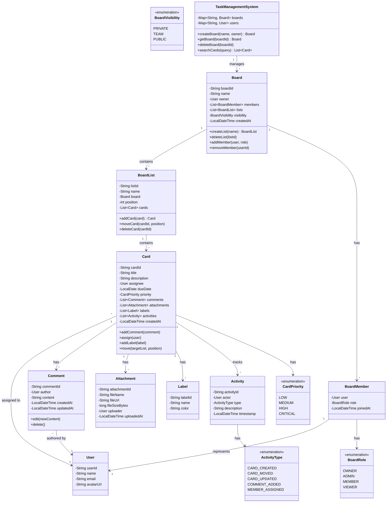
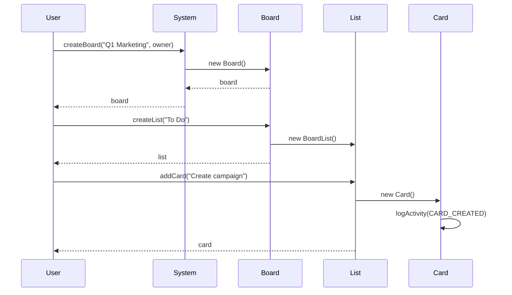
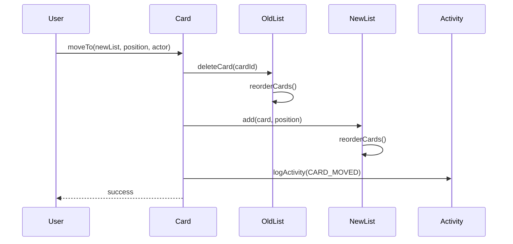

# Task Management System (Trello/Jira) - Low Level Design

## Problem Statement

Design a task management system like Trello or Jira that allows teams to organize work using boards, lists, and cards. Support features like task assignment, comments, attachments, labels, due dates, and workflow customization.

**Real-world context**: Similar to Trello, Jira, Asana, or Monday.com.

---

## Requirements

### Functional Requirements
1. Create boards, lists, and cards
2. Move cards between lists (drag-and-drop workflow)
3. Assign cards to users
4. Add comments to cards
5. Attach files to cards
6. Add labels/tags to cards
7. Set due dates and priorities
8. Track card history (audit log)
9. Search and filter cards
10. User permissions (board admin, member, viewer)

### Non-Functional Requirements
1. **Performance**: Load board in < 500ms
2. **Scalability**: Support 1000+ cards per board
3. **Consistency**: No lost updates during concurrent edits
4. **Availability**: 99.9% uptime
5. **Usability**: Intuitive API design

### Out of Scope
1. Real-time collaboration (WebSocket updates)
2. Email notifications
3. Calendar view
4. Gantt charts
5. Time tracking

---

## Core Entities & Relationships

1. **Board**: Container for project (e.g., "Q1 Marketing")
2. **List**: Column/stage (e.g., "To Do", "In Progress", "Done")
3. **Card**: Individual task/work item
4. **User**: Team member
5. **Comment**: Discussion on card
6. **Attachment**: File attached to card
7. **Label**: Tag for categorization
8. **Activity**: Audit log entry

**Relationships**:
- Board HAS-MANY List
- List HAS-MANY Card
- Card BELONGS-TO User (assignee)
- Card HAS-MANY Comment
- Card HAS-MANY Attachment
- Card HAS-MANY Label
- Card HAS-MANY Activity

---

## Class Diagram



---

## Design Patterns Used

### 1. **Composite Pattern**
- **Where**: Board → List → Card hierarchy
- **Why**: Uniform treatment of containers and items
- **Benefit**: Recursive operations on tree structure

### 2. **Observer Pattern**
- **Where**: Activity/audit log tracking
- **Why**: Notify observers when card changes
- **Benefit**: Decoupled event handling

### 3. **Builder Pattern**
- **Where**: Card.Builder for complex card creation
- **Why**: Many optional parameters (labels, attachments, due date)
- **Benefit**: Readable, flexible construction

### 4. **Strategy Pattern**
- **Where**: Permission checking (BoardPermissionStrategy)
- **Why**: Different boards may have different permission rules
- **Benefit**: Flexible access control

### 5. **Command Pattern**
- **Where**: Card actions (MoveCardCommand, AssignCardCommand)
- **Why**: Undo/redo functionality
- **Benefit**: Transaction-like operations

---

## Detailed Class Design

```java
// ============== Core Entities ==============

public class Board {
    private final String boardId;
    private String name;
    private final User owner;
    private final List<BoardMember> members;
    private final List<BoardList> lists;
    private BoardVisibility visibility;
    private final LocalDateTime createdAt;
    private final ReentrantReadWriteLock lock;

    public Board(String name, User owner) {
        this.boardId = UUID.randomUUID().toString();
        this.name = name;
        this.owner = owner;
        this.members = new CopyOnWriteArrayList<>();
        this.lists = new CopyOnWriteArrayList<>();
        this.visibility = BoardVisibility.PRIVATE;
        this.createdAt = LocalDateTime.now();
        this.lock = new ReentrantReadWriteLock();

        // Owner is automatically a member with OWNER role
        members.add(new BoardMember(owner, BoardRole.OWNER));
    }

    public BoardList createList(String name) {
        lock.writeLock().lock();
        try {
            int position = lists.size();
            BoardList list = new BoardList(name, this, position);
            lists.add(list);
            return list;
        } finally {
            lock.writeLock().unlock();
        }
    }

    public void deleteList(String listId) {
        lock.writeLock().lock();
        try {
            lists.removeIf(list -> list.getListId().equals(listId));
            reorderLists();
        } finally {
            lock.writeLock().unlock();
        }
    }

    public void moveList(String listId, int newPosition) {
        lock.writeLock().lock();
        try {
            BoardList listToMove = findListById(listId);
            if (listToMove == null) return;

            lists.remove(listToMove);
            lists.add(newPosition, listToMove);
            reorderLists();
        } finally {
            lock.writeLock().unlock();
        }
    }

    private void reorderLists() {
        for (int i = 0; i < lists.size(); i++) {
            lists.get(i).setPosition(i);
        }
    }

    public void addMember(User user, BoardRole role) {
        lock.writeLock().lock();
        try {
            members.add(new BoardMember(user, role));
        } finally {
            lock.writeLock().unlock();
        }
    }

    public void removeMember(String userId) {
        lock.writeLock().lock();
        try {
            members.removeIf(member -> member.getUser().getUserId().equals(userId));
        } finally {
            lock.writeLock().unlock();
        }
    }

    public boolean canUserEdit(User user) {
        return members.stream()
                .anyMatch(m -> m.getUser().equals(user) &&
                        (m.getRole() == BoardRole.OWNER ||
                         m.getRole() == BoardRole.ADMIN ||
                         m.getRole() == BoardRole.MEMBER));
    }

    public boolean canUserView(User user) {
        if (visibility == BoardVisibility.PUBLIC) {
            return true;
        }
        return members.stream().anyMatch(m -> m.getUser().equals(user));
    }

    public BoardList findListById(String listId) {
        return lists.stream()
                .filter(list -> list.getListId().equals(listId))
                .findFirst()
                .orElse(null);
    }

    // Getters
    public String getBoardId() { return boardId; }
    public String getName() { return name; }
    public List<BoardList> getLists() { return new ArrayList<>(lists); }
    public List<BoardMember> getMembers() { return new ArrayList<>(members); }
}

public class BoardList {
    private final String listId;
    private String name;
    private final Board board;
    private int position;
    private final List<Card> cards;

    public BoardList(String name, Board board, int position) {
        this.listId = UUID.randomUUID().toString();
        this.name = name;
        this.board = board;
        this.position = position;
        this.cards = new CopyOnWriteArrayList<>();
    }

    public Card addCard(String title) {
        int position = cards.size();
        Card card = new Card(title, this, position);
        cards.add(card);
        return card;
    }

    public void moveCard(String cardId, int newPosition) {
        Card cardToMove = findCardById(cardId);
        if (cardToMove == null) return;

        cards.remove(cardToMove);
        cards.add(newPosition, cardToMove);
        reorderCards();
    }

    public void deleteCard(String cardId) {
        cards.removeIf(card -> card.getCardId().equals(cardId));
        reorderCards();
    }

    private void reorderCards() {
        for (int i = 0; i < cards.size(); i++) {
            cards.get(i).setPosition(i);
        }
    }

    public Card findCardById(String cardId) {
        return cards.stream()
                .filter(card -> card.getCardId().equals(cardId))
                .findFirst()
                .orElse(null);
    }

    // Getters and setters
    public String getListId() { return listId; }
    public String getName() { return name; }
    public void setName(String name) { this.name = name; }
    public int getPosition() { return position; }
    public void setPosition(int position) { this.position = position; }
    public List<Card> getCards() { return new ArrayList<>(cards); }
    public Board getBoard() { return board; }
}

public class Card {
    private final String cardId;
    private String title;
    private String description;
    private User assignee;
    private LocalDate dueDate;
    private CardPriority priority;
    private BoardList list;
    private int position;
    private final List<Comment> comments;
    private final List<Attachment> attachments;
    private final Set<Label> labels;
    private final List<Activity> activities;
    private final LocalDateTime createdAt;
    private LocalDateTime updatedAt;

    public Card(String title, BoardList list, int position) {
        this.cardId = UUID.randomUUID().toString();
        this.title = title;
        this.list = list;
        this.position = position;
        this.priority = CardPriority.MEDIUM;
        this.comments = new CopyOnWriteArrayList<>();
        this.attachments = new CopyOnWriteArrayList<>();
        this.labels = ConcurrentHashMap.newKeySet();
        this.activities = new CopyOnWriteArrayList<>();
        this.createdAt = LocalDateTime.now();
        this.updatedAt = LocalDateTime.now();

        logActivity(null, ActivityType.CARD_CREATED, "Card created");
    }

    public void updateTitle(String newTitle, User actor) {
        this.title = newTitle;
        this.updatedAt = LocalDateTime.now();
        logActivity(actor, ActivityType.CARD_UPDATED, "Title updated to: " + newTitle);
    }

    public void updateDescription(String newDescription, User actor) {
        this.description = newDescription;
        this.updatedAt = LocalDateTime.now();
        logActivity(actor, ActivityType.CARD_UPDATED, "Description updated");
    }

    public void assign(User user, User actor) {
        this.assignee = user;
        this.updatedAt = LocalDateTime.now();
        logActivity(actor, ActivityType.MEMBER_ASSIGNED,
                "Assigned to " + user.getName());
    }

    public void setDueDate(LocalDate dueDate, User actor) {
        this.dueDate = dueDate;
        this.updatedAt = LocalDateTime.now();
        logActivity(actor, ActivityType.CARD_UPDATED, "Due date set to " + dueDate);
    }

    public void setPriority(CardPriority priority, User actor) {
        this.priority = priority;
        this.updatedAt = LocalDateTime.now();
        logActivity(actor, ActivityType.CARD_UPDATED, "Priority changed to " + priority);
    }

    public Comment addComment(User author, String content) {
        Comment comment = new Comment(author, content);
        comments.add(comment);
        logActivity(author, ActivityType.COMMENT_ADDED, "Comment added");
        return comment;
    }

    public void deleteComment(String commentId) {
        comments.removeIf(c -> c.getCommentId().equals(commentId));
    }

    public Attachment addAttachment(String fileName, String fileUrl, long fileSizeBytes, User uploader) {
        Attachment attachment = new Attachment(fileName, fileUrl, fileSizeBytes, uploader);
        attachments.add(attachment);
        logActivity(uploader, ActivityType.CARD_UPDATED,
                "Attachment added: " + fileName);
        return attachment;
    }

    public void addLabel(Label label, User actor) {
        labels.add(label);
        logActivity(actor, ActivityType.CARD_UPDATED, "Label added: " + label.getName());
    }

    public void removeLabel(Label label, User actor) {
        labels.remove(label);
        logActivity(actor, ActivityType.CARD_UPDATED, "Label removed: " + label.getName());
    }

    public void moveTo(BoardList targetList, int position, User actor) {
        String oldListName = this.list.getName();
        String newListName = targetList.getName();

        // Remove from current list
        this.list.deleteCard(this.cardId);

        // Add to target list
        this.list = targetList;
        this.position = position;
        targetList.getCards().add(position, this);
        targetList.reorderCards();

        logActivity(actor, ActivityType.CARD_MOVED,
                "Moved from '" + oldListName + "' to '" + newListName + "'");
    }

    private void logActivity(User actor, ActivityType type, String description) {
        Activity activity = new Activity(actor, type, description);
        activities.add(activity);
    }

    public boolean isOverdue() {
        return dueDate != null && LocalDate.now().isAfter(dueDate);
    }

    // Getters
    public String getCardId() { return cardId; }
    public String getTitle() { return title; }
    public String getDescription() { return description; }
    public User getAssignee() { return assignee; }
    public LocalDate getDueDate() { return dueDate; }
    public CardPriority getPriority() { return priority; }
    public List<Comment> getComments() { return new ArrayList<>(comments); }
    public List<Attachment> getAttachments() { return new ArrayList<>(attachments); }
    public Set<Label> getLabels() { return new HashSet<>(labels); }
    public List<Activity> getActivities() { return new ArrayList<>(activities); }
    public LocalDateTime getCreatedAt() { return createdAt; }
    public LocalDateTime getUpdatedAt() { return updatedAt; }
    public void setPosition(int position) { this.position = position; }
}

// ============== Supporting Classes ==============

public class User {
    private final String userId;
    private String name;
    private String email;
    private String avatarUrl;

    public User(String name, String email) {
        this.userId = UUID.randomUUID().toString();
        this.name = name;
        this.email = email;
    }

    @Override
    public boolean equals(Object o) {
        if (this == o) return true;
        if (!(o instanceof User)) return false;
        User user = (User) o;
        return userId.equals(user.userId);
    }

    @Override
    public int hashCode() {
        return Objects.hash(userId);
    }

    // Getters
    public String getUserId() { return userId; }
    public String getName() { return name; }
    public String getEmail() { return email; }
}

public class BoardMember {
    private final User user;
    private BoardRole role;
    private final LocalDateTime joinedAt;

    public BoardMember(User user, BoardRole role) {
        this.user = user;
        this.role = role;
        this.joinedAt = LocalDateTime.now();
    }

    // Getters
    public User getUser() { return user; }
    public BoardRole getRole() { return role; }
    public void setRole(BoardRole role) { this.role = role; }
}

public class Comment {
    private final String commentId;
    private final User author;
    private String content;
    private final LocalDateTime createdAt;
    private LocalDateTime updatedAt;

    public Comment(User author, String content) {
        this.commentId = UUID.randomUUID().toString();
        this.author = author;
        this.content = content;
        this.createdAt = LocalDateTime.now();
        this.updatedAt = LocalDateTime.now();
    }

    public void edit(String newContent) {
        this.content = newContent;
        this.updatedAt = LocalDateTime.now();
    }

    // Getters
    public String getCommentId() { return commentId; }
    public User getAuthor() { return author; }
    public String getContent() { return content; }
    public LocalDateTime getCreatedAt() { return createdAt; }
    public LocalDateTime getUpdatedAt() { return updatedAt; }
}

public class Attachment {
    private final String attachmentId;
    private final String fileName;
    private final String fileUrl;
    private final long fileSizeBytes;
    private final User uploader;
    private final LocalDateTime uploadedAt;

    public Attachment(String fileName, String fileUrl, long fileSizeBytes, User uploader) {
        this.attachmentId = UUID.randomUUID().toString();
        this.fileName = fileName;
        this.fileUrl = fileUrl;
        this.fileSizeBytes = fileSizeBytes;
        this.uploader = uploader;
        this.uploadedAt = LocalDateTime.now();
    }

    // Getters
    public String getAttachmentId() { return attachmentId; }
    public String getFileName() { return fileName; }
    public String getFileUrl() { return fileUrl; }
}

public class Label {
    private final String labelId;
    private String name;
    private String color;

    public Label(String name, String color) {
        this.labelId = UUID.randomUUID().toString();
        this.name = name;
        this.color = color;
    }

    @Override
    public boolean equals(Object o) {
        if (this == o) return true;
        if (!(o instanceof Label)) return false;
        Label label = (Label) o;
        return labelId.equals(label.labelId);
    }

    @Override
    public int hashCode() {
        return Objects.hash(labelId);
    }

    // Getters
    public String getLabelId() { return labelId; }
    public String getName() { return name; }
    public String getColor() { return color; }
}

public class Activity {
    private final String activityId;
    private final User actor;
    private final ActivityType type;
    private final String description;
    private final LocalDateTime timestamp;

    public Activity(User actor, ActivityType type, String description) {
        this.activityId = UUID.randomUUID().toString();
        this.actor = actor;
        this.type = type;
        this.description = description;
        this.timestamp = LocalDateTime.now();
    }

    // Getters
    public String getActivityId() { return activityId; }
    public User getActor() { return actor; }
    public ActivityType getType() { return type; }
    public String getDescription() { return description; }
    public LocalDateTime getTimestamp() { return timestamp; }
}

// ============== Enums ==============

public enum BoardRole {
    OWNER,    // Full access, can delete board
    ADMIN,    // Can manage members, edit board settings
    MEMBER,   // Can create/edit cards
    VIEWER    // Read-only access
}

public enum CardPriority {
    LOW,
    MEDIUM,
    HIGH,
    CRITICAL
}

public enum ActivityType {
    CARD_CREATED,
    CARD_MOVED,
    CARD_UPDATED,
    COMMENT_ADDED,
    MEMBER_ASSIGNED,
    LABEL_ADDED,
    ATTACHMENT_ADDED
}

public enum BoardVisibility {
    PRIVATE,  // Only members can see
    TEAM,     // Organization members can see
    PUBLIC    // Anyone can view
}

// ============== Main System ==============

public class TaskManagementSystem {
    private static TaskManagementSystem instance;
    private final Map<String, Board> boards;
    private final Map<String, User> users;

    private TaskManagementSystem() {
        this.boards = new ConcurrentHashMap<>();
        this.users = new ConcurrentHashMap<>();
    }

    public static synchronized TaskManagementSystem getInstance() {
        if (instance == null) {
            instance = new TaskManagementSystem();
        }
        return instance;
    }

    public Board createBoard(String name, User owner) {
        Board board = new Board(name, owner);
        boards.put(board.getBoardId(), board);
        return board;
    }

    public Board getBoard(String boardId) {
        return boards.get(boardId);
    }

    public void deleteBoard(String boardId) {
        boards.remove(boardId);
    }

    public User createUser(String name, String email) {
        User user = new User(name, email);
        users.put(user.getUserId(), user);
        return user;
    }

    public User getUser(String userId) {
        return users.get(userId);
    }

    /**
     * Search cards across all boards user has access to
     */
    public List<Card> searchCards(User user, String query) {
        List<Card> results = new ArrayList<>();

        for (Board board : boards.values()) {
            if (!board.canUserView(user)) {
                continue;
            }

            for (BoardList list : board.getLists()) {
                for (Card card : list.getCards()) {
                    if (matchesQuery(card, query)) {
                        results.add(card);
                    }
                }
            }
        }

        return results;
    }

    private boolean matchesQuery(Card card, String query) {
        String lowerQuery = query.toLowerCase();
        return card.getTitle().toLowerCase().contains(lowerQuery) ||
               (card.getDescription() != null &&
                card.getDescription().toLowerCase().contains(lowerQuery));
    }

    /**
     * Get cards assigned to user across all boards
     */
    public List<Card> getCardsAssignedToUser(User user) {
        List<Card> assignedCards = new ArrayList<>();

        for (Board board : boards.values()) {
            if (!board.canUserView(user)) {
                continue;
            }

            for (BoardList list : board.getLists()) {
                for (Card card : list.getCards()) {
                    if (user.equals(card.getAssignee())) {
                        assignedCards.add(card);
                    }
                }
            }
        }

        return assignedCards;
    }

    /**
     * Get overdue cards across all boards
     */
    public List<Card> getOverdueCards(User user) {
        List<Card> overdueCards = new ArrayList<>();

        for (Board board : boards.values()) {
            if (!board.canUserView(user)) {
                continue;
            }

            for (BoardList list : board.getLists()) {
                for (Card card : list.getCards()) {
                    if (card.isOverdue()) {
                        overdueCards.add(card);
                    }
                }
            }
        }

        return overdueCards;
    }
}
```

---

## Key Workflows

### 1. Create Board and Add Card



### 2. Move Card Between Lists



---

## Design Decisions & Reasoning

### 1. **Composite Pattern for Board Structure**
**Decision**: Board → List → Card hierarchy.

**Reasoning**:
- Natural tree structure
- Uniform interface for containers
- Recursive operations (search, filter)

### 2. **CopyOnWriteArrayList for Collections**
**Decision**: Use CopyOnWriteArrayList for lists of cards, comments.

**Reasoning**:
- Read-heavy workload (viewing boards)
- Writes are less frequent (adding cards)
- Thread-safe without explicit locking for reads

**Trade-off**: Write operations are expensive (copy entire array)

### 3. **Activity Log Pattern**
**Decision**: Every card change logs an Activity.

**Reasoning**:
- Audit trail for compliance
- Users can see who changed what
- Enables undo functionality

### 4. **Position-Based Ordering**
**Decision**: Cards have integer `position` field.

**Reasoning**:
- Explicit ordering for drag-and-drop
- Easy to reorder (update positions)
- Alternative: Linked list (more complex)

### 5. **Separate Attachment Entity**
**Decision**: Attachment as separate class, not just storing URLs.

**Reasoning**:
- Need metadata (uploader, upload time, file size)
- May add virus scanning status later
- Proper encapsulation

### 6. **Builder Pattern for Card Creation**
**Decision**: (Not shown but would use) Card.Builder for complex cards.

**Reasoning**:
- Many optional fields (labels, attachments, due date)
- Readable construction
- Immutable after creation

---

## SOLID Principles Application

### 1. **Single Responsibility Principle (SRP)**
- `Board`: Manages lists and members
- `BoardList`: Manages cards within a list
- `Card`: Represents individual task
- `Activity`: Tracks one audit log entry
- `TaskManagementSystem`: Coordinates all boards

Each class has one clear responsibility.

### 2. **Open/Closed Principle (OCP)**
- Adding new `ActivityType` doesn't require changing Card logic
- New board visibility rules can be added without modifying Board class

Example:
```java
public enum ActivityType {
    CARD_CREATED,
    CARD_MOVED,
    // Easy to add new types
    DUE_DATE_CHANGED,
    CHECKLIST_COMPLETED
}
```

### 3. **Liskov Substitution Principle (LSP)**
- All `Label` instances are substitutable
- Board visibility types are interchangeable

### 4. **Interface Segregation Principle (ISP)**
- User interface is minimal (just identity)
- Activity has only necessary fields

### 5. **Dependency Inversion Principle (DIP)**
- System depends on Board abstraction, not concrete implementation
- Can swap out storage layer (in-memory → database)

---

## Extensibility & Future Enhancements

### 1. **Checklist Support**
```java
public class Checklist {
    private final String checklistId;
    private final String title;
    private final List<ChecklistItem> items;

    public void addItem(String text) {
        items.add(new ChecklistItem(text));
    }
}

public class ChecklistItem {
    private String text;
    private boolean completed;
}
```

### 2. **Card Templates**
```java
public class CardTemplate {
    private String title;
    private String description;
    private List<Label> defaultLabels;
    private List<Checklist> checklists;

    public Card instantiate(BoardList list) {
        Card card = list.addCard(title);
        card.updateDescription(description, null);
        defaultLabels.forEach(label -> card.addLabel(label, null));
        return card;
    }
}
```

### 3. **Custom Fields**
```java
public class CustomField {
    private String fieldId;
    private String name;
    private FieldType type; // TEXT, NUMBER, DATE, DROPDOWN

    public Object getValue(Card card) {
        return card.getCustomFieldValue(fieldId);
    }
}
```

### 4. **Automation Rules**
```java
public class AutomationRule {
    private Trigger trigger; // CARD_MOVED, DUE_DATE_APPROACHING
    private List<Action> actions; // ASSIGN_USER, ADD_LABEL, SEND_NOTIFICATION

    public void evaluate(Card card) {
        if (trigger.matches(card)) {
            actions.forEach(action -> action.execute(card));
        }
    }
}
```

### 5. **Board Templates**
```java
public class BoardTemplate {
    private String name;
    private List<String> defaultListNames;

    public Board instantiate(User owner) {
        Board board = new Board(name, owner);
        defaultListNames.forEach(board::createList);
        return board;
    }
}
```

---

## Complexity Analysis

### Time Complexity

| Operation | Complexity | Explanation |
|-----------|-----------|-------------|
| `createBoard()` | O(1) | Insert into HashMap |
| `addCard()` | O(1) | Append to list |
| `moveCard()` | O(n) | Remove + insert + reorder |
| `searchCards()` | O(b × l × c) | Iterate all boards, lists, cards |
| `getCardsAssigned()` | O(b × l × c) | Full scan |

Where: b = boards, l = lists per board, c = cards per list

### Space Complexity
- O(b × l × c) for all cards
- O(a) for activities (audit log)
- CopyOnWriteArrayList uses extra memory during writes

### Bottlenecks
1. **Search is O(b × l × c)**: No indexing
2. **CopyOnWriteArrayList writes**: Expensive for large lists
3. **No pagination**: Loading large boards is slow

### Optimizations
1. **Indexing for search**:
```java
private Map<String, Set<Card>> cardsByTitle;
// Update on card creation/update
```

2. **Lazy loading**: Load cards on-demand
3. **Pagination**: Return cards in pages
4. **Caching**: Cache frequently accessed boards

---

## Testing Strategy

### Key Test Cases

```java
@Test
public void testCreateBoardAndList() {
    User user = new User("Alice", "alice@example.com");
    Board board = new Board("Project X", user);

    BoardList todoList = board.createList("To Do");

    assertEquals(1, board.getLists().size());
    assertEquals("To Do", todoList.getName());
}

@Test
public void testAddCardToList() {
    User user = new User("Alice", "alice@example.com");
    Board board = new Board("Project X", user);
    BoardList list = board.createList("To Do");

    Card card = list.addCard("Task 1");

    assertEquals(1, list.getCards().size());
    assertEquals("Task 1", card.getTitle());
    assertEquals(1, card.getActivities().size()); // CARD_CREATED activity
}

@Test
public void testMoveCardBetweenLists() {
    User user = new User("Alice", "alice@example.com");
    Board board = new Board("Project X", user);
    BoardList todoList = board.createList("To Do");
    BoardList doneList = board.createList("Done");

    Card card = todoList.addCard("Task 1");
    card.moveTo(doneList, 0, user);

    assertEquals(0, todoList.getCards().size());
    assertEquals(1, doneList.getCards().size());

    // Check activity log
    List<Activity> activities = card.getActivities();
    assertTrue(activities.stream()
            .anyMatch(a -> a.getType() == ActivityType.CARD_MOVED));
}

@Test
public void testCardAssignment() {
    User owner = new User("Alice", "alice@example.com");
    User assignee = new User("Bob", "bob@example.com");
    Board board = new Board("Project X", owner);
    BoardList list = board.createList("To Do");
    Card card = list.addCard("Task 1");

    card.assign(assignee, owner);

    assertEquals(assignee, card.getAssignee());
    assertTrue(card.getActivities().stream()
            .anyMatch(a -> a.getType() == ActivityType.MEMBER_ASSIGNED));
}

@Test
public void testAddCommentToCard() {
    User user = new User("Alice", "alice@example.com");
    Board board = new Board("Project X", user);
    BoardList list = board.createList("To Do");
    Card card = list.addCard("Task 1");

    Comment comment = card.addComment(user, "This needs review");

    assertEquals(1, card.getComments().size());
    assertEquals("This needs review", comment.getContent());
}

@Test
public void testBoardPermissions() {
    User owner = new User("Alice", "alice@example.com");
    User member = new User("Bob", "bob@example.com");
    User outsider = new User("Charlie", "charlie@example.com");

    Board board = new Board("Project X", owner);
    board.addMember(member, BoardRole.MEMBER);

    assertTrue(board.canUserEdit(owner));
    assertTrue(board.canUserEdit(member));
    assertFalse(board.canUserEdit(outsider));
}

@Test
public void testSearchCards() {
    TaskManagementSystem system = TaskManagementSystem.getInstance();
    User user = new User("Alice", "alice@example.com");
    Board board = system.createBoard("Project X", user);
    BoardList list = board.createList("To Do");

    list.addCard("Implement login");
    list.addCard("Design homepage");
    list.addCard("Login API tests");

    List<Card> results = system.searchCards(user, "login");

    assertEquals(2, results.size());
}
```

---

## Summary

This Task Management System demonstrates:

1. **Hierarchical Organization**: Board → List → Card structure
2. **Audit Trail**: Complete activity logging
3. **Flexible Permissions**: Role-based access control
4. **Rich Metadata**: Comments, attachments, labels, due dates
5. **Thread-Safe Operations**: CopyOnWriteArrayList for concurrent access
6. **SOLID Design**: Clean separation of concerns

**Key Takeaways**:
- Composite pattern for tree structures
- Activity log for audit trail and potential undo
- Position-based ordering for drag-and-drop
- CopyOnWriteArrayList for read-heavy workloads

**Production Considerations**:
- Add database persistence layer
- Implement WebSocket for real-time updates
- Add search indexing (Elasticsearch)
- Implement pagination for large boards
- Add file upload service integration (S3)
- Implement notifications (email, push)
- Add webhook support for integrations
